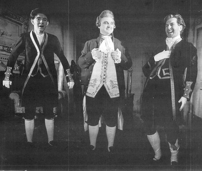
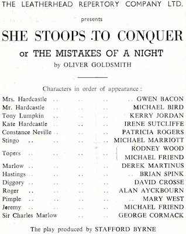
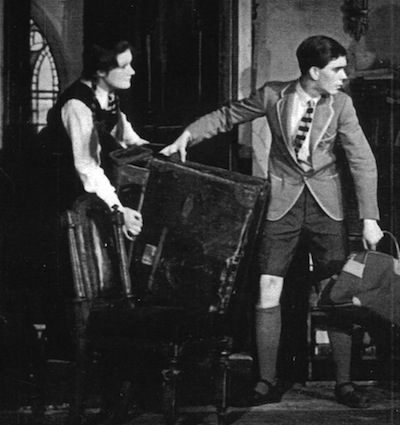
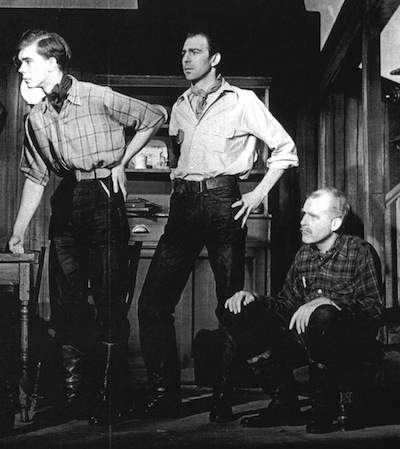

Prior to joining Stephen Joseph's **[Studio Theatre Ltd](http://thesjt.alanayckbourn.net/page1/styled-45/)** company at **[Theatre in the Round at the Library Theatre](/career/ayckbourn-and-sjt/sjt-venues/theatre-in-the-round-at-the-library-theatre)** in Scarborough in 1957, Alan worked professionally for several other companies.  
Having experienced professional acting for three weeks with Sir Donald Wolfit at the Edinburgh Festival, Alan was able to get a placement as a student **[Assistant Stage Manager](/career/stage-manager)** at the Connaught Theatre, Worthing during autumn 1956. From there, he worked at as an Acting ASM at Leatherhead Theatre Club during spring 1957 before joining Theatre in the Round at the the Library Theatre in Scarborough for the summer of 1957. He then worked at Oxford Playhouse for the winter 1957 season before rejoining the Library Theatre in 1958, choosing to set down roots there.

The following are quotes by Alan Ayckbourn about his experiences at Worthing, Leatherhead and Oxford.

### Connaught Theatre, Worthing

<aside>

*Alan (left) in She Stoops To Conquer at Leatherhead Theatre Club in 1957.  
© The Leatherhead Theatre Company Ltd*

*Programme details from She Stoops To Conquer at Leatherhead Theatre Club in 1957.  
© The Leatherhead Theatre Company Ltd*

*Alan (right) in The Happiest Days Of Your Life at Leatherhead Theatre Club in 1957.  
© The Leatherhead Theatre Company Ltd*

*Alan (left) in The Rainmaker at Leatherhead Theatre Club in 1957.  
© The Leatherhead Theatre Company Ltd*

</aside>

"I had another card up my street, thanks to **[Edgar Matthews](/life/influences/edgar-matthews)**, and that was another old boy of the school, Robert Flemyng, who had a contact at Worthing. So from earning three pounds a week at Edinburgh, I went down to no pounds a week at all as a student ASM at Worthing, where I also played a few roles."  
*(Imagine, 2011)*

"I pulled a few strings on leaving school and was lucky enough to make my stage debut as a spear-carrier in a play with Sir Donald Wolfit's company.  
"Immediately after this, I used the 'old school-tie' approach for the second and final time when I visited Robert Flemyng for possible work. He suggested Worthing's Connaught Theatre, then under the direction of Melville Gilham.  
"So, in the late 1950s, with little knowledge and almost direct from school, I arrived at the Connaught as an acting stage manager.  
"It was there that I learnt so many aspects of theatre. In just one season I worked behind stage, sorted out props and finally 'trod the boards'."  
*(Worthing Gazette & Herald, 1986)*

"It was the stuff of every young, aspiring actor's dream.  
"In the late fifties, at the age of 17 or 18 I was at Worthing as an (unpaid) assistant stage manager working in all departments but with my hopes always set on small-part stage appearances which occasionally cropped up. I knew that, given the right break, my innate star quality would immediately be recognised. Worthing in those days was a weekly rep.  
"The schedule was a punishing one - younger actors today, if you describe it to them, look at you in blank astonishment or shake their heads sadly at the tricks old people's memories can play.  
"I was working in the scenic workshop when it happened. The current show had opened on the Monday, the next production was already underway when one of the cast had 'done a runner'. The pressure had finally got to him and he had vanished overnight. I was summoned to the manager's office and offered the part. Could I learn it and be ready to go on that night? Of course, I replied, youthfully unhesitating. 'Yes, sir!' Six long months in show-business and a break at last!  
"In the event, I got through that Tuesday performance in a shallow trance. My voice, whenever I chanced to remember to speak, appeared to be coming from a deep well. Most of my lines, I seem to recall, were spoken by the leading man, Peter Byrne, who adroitly managed to hold long seamless conversations with himself. I was aware, throughout the show, of continuous, off-putting heavy breathing which I later identified as my own.  
"At the end of the performance the manager came to me, smiling, shook me by the hand, thanked me and told me that the good news was that a real actor would be arriving for the Wednesday matinee the following day.  
"I returned to the scene dock, chastened by the harshness of theatrical reality. It was seven years before the message finally sunk in and I finally gave up acting for ever."  
*(Publication and year to be confirmed)*

"I took a salary cut from £3 a week to nothing \[working at the Connaught Theatre\]. I went as a student assistant stage manager, and my mother sold her caravan, I remember, to pay for me. I was there for about six months. Weekly rep at Worthing had Dan Massey, Michael Bryant, Roland Curtain, Ian Holm, Elizabeth Spriggs - an extraordinary collection of young actors - not to mention Peter Byrne and people like that who were there at that time. There was a welter of experienced names there that I could learn off.  
"I learned all departments there. I worked for some weeks in the scenic department, didn't see the stage at all. I did a little bit of acting, two or three tiny parts. I got to be a lime operator, and I worked in the scene dock; I worked all around. I didn't do electrics but I learned a lot more about stage management, and I was, by the time the money ran out and the season finished, fairly proficient."  
*('Conversations With Ayckbourn', 1981)*

### Leatherhead Theatre Club

“Hazel Vincent took me under her wing bringing me to the Leatherhead Theatre Club and - along with a welter of ASM-ing work - gave me a swathe of acting opportunities in the whirlwind of weekly rep.  
"With her general manager, Michael Marriott, she gave me continuous employment for several important formative months of my fledgling career.  
"Those were the times when practically everyone working in the theatre, given the challenge of an occasional larger-cast production, got in on the act. ‘Very difficult to concentrate’ sniffed one ‘proper’ actor, ‘when during my big speech, one of them’s checking the lights and the other’s counting the bloody house!’”  
*(Correspondence, 2018)*

"I did quite a lot of acting \[at the Leatherhead Theatre Club\]: Percy in *Flare Path*, that boy in *The Rainmaker*, Jimmy Curry, and Sanyamo, in *South Sea Bubble*. It was weekly rep again, but I worked with a lot of good people there. Actors are quite generous people, really: they do tend to help. Sometimes it's terribly misguided help, but they're always there to say, 'If you take my tip, kid, don't enter that way, it doesn't look so good.' So I was learning."  
*(Conversations With Ayckbourn', 1981)*

"For five pounds a week, I went to Leatherhead. I got taken in by a wonderful woman called Hazel Vincent Wallace who used to run the Leatherhead Theatre and she, I think, took quite a shine to me and cast me in all the young boys’ roles."  
*(Imagine, 2011)*

### Oxford Playhouse

"At the end of that season \[his first summer season at the Library Theatre, Scarborough\] a certain director from Oxford, a man called Milos Volanakis, had been up to see a couple of the shows and had liked my performances - at least, I put it down modestly to the idea that that's what he'd liked. He wanted me to audition for Oxford Playhouse, which he ran with Frank Hauser. I was always to be fated like this, to be drifting from one job to another. I never, in all my years of acting, was ever unemployed. Once I started at Worthing, I didn't stop: Worthing, Leatherhead, Scarborough, Oxford, Scarborough....
