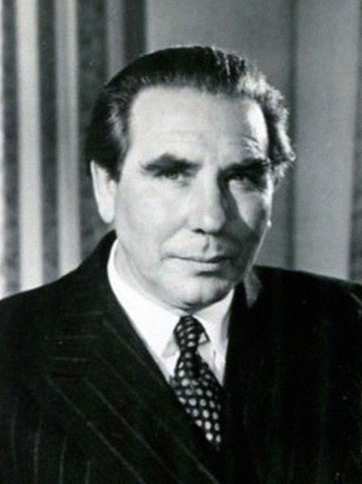

Upon leaving Haileybury in 1956, Alan's first professional job in the theatre was acting with Sir Donald Wolfit, CBE. He performed with Wolfit's company at the Edinburgh Festival for three weeks during the summer of that year, playing a soldier in ***[The Strong Are Lonely](/career/actor/the-strong-are-lonely)***. Some of Alan's reminiscences of working with Wolfit are reproduced below.

The production ran for the course of the entire three week festival - although interestingly it was not actually listed as part of the festival itself.

Also of interest is a letter held in the Ayckbourn Archive at the Borthwick Institute of Archives from Donald Wolfit to Alan Ayckbourn's school master - who had contacted Wolfit about acting opportunities for Alan. It contains details of what was expected from "the boy" and for how long he would be required.

<aside>

*Sir Donald Wolfit, CBE*  
*Copyright: To be confirmed*

### Resources

◦ The Ayckbourn Archive at Borthwick Institute for Archives at the University of York holds the original letter between Edgar Matthews and Wolfit discussing Alan's first employment as an actor. It can be found in the online catalogue **[here](http://borthcat.york.ac.uk/ayck-box-102/)**.  
◦ A recorded interview of Alan Ayckbourn talking about his experiences with Sir Donald Wolfit is held in the Theatre and Performances Archive at the V&A. Details can be found **[here](http://www.vam.ac.uk/archives/unit/ARC232517/)**.

</aside>

"As I was leaving \[Haileybury\], I went to **[Edgar Matthews](/life/influences/haileybury)**, the man who'd sent me off on tour, and said, 'I want to go into the theatre. Can you help me?' And he said, 'I have two contacts. One is Donald Wolfit; the other is an old boy of the school, Robert Flemyng. I'll give you letters of introduction to both. I don't know: I can do no more.' As it happened, Donald Wolfit was on the very point - I think the following Monday (I was leaving on a Friday) - of starting a revival of *The Strong Are Lonely*, a play he'd successfully had in London, I think, with Ernest Milton. He was reviving it with a slightly less starry cast and was looking for someone to play a sentry, an acting ASM \[**[Assistant Stage Manager](/career/stage-manager)**\], really. Edgar had assured him, I think, on the phone, that I had been in the school cadet force and could stand at attention without fainting for forty-five minutes. So, in the most extraordinary way I joined his company and was rehearsing at the YMCA in Tottenham Court Road, with one or two lads straight out of drama school saying, 'Where did you train?' I said, 'Train?' I was tremendously green. I sat around the rehearsal room and did what I was told and gawped at all these - it was an all-male cast - these wonderful old actors....

"He \[Donald Wolfit\] seemed very big. I don't think he could have been that tall, but he seemed enormous to me, in all directions. He used to wear cloaks and big black hats, and his hair was always brushed back, and there were his wonderful saturnine eyebrows, and this makeup line that was always in his hair, because it had been there since 1910. And everyone stood back and stood up when he came in, and he swept through. And his performances were majestic and huge, and they were all about acting, they weren't about anything to do with the character. By modern standards, it'd be quite a shock, I'm sure.

"I watched him very closely, because I was on stage. He'd fling himself on his knees at the end of the second act, after being excommunicated by the Pope's emissary. He began to kneel and say the Lord's Prayer, with tears rolling down his face - and he did genuinely move the audience. But as the curtain sank, he used to slowly turn his head upstage and just continue the prayer, but it became a vicious attack on the audience. 'Coughing bastards!' he'd say. And I was so shocked. I wasn't shocked by the blasphemy, I was shocked by the fact that a man could come out of such a moving moment with such apparent ease. And he could do that all the time. He'd fling lines upstage at you: 'Stand up!' he'd say, and carry on performing....

"I think I learned that theatre is show business. Some of the stuff he portrayed I didn't admire. But, eventually, it's what the audience wants. He played for them. I think some would say he played to them to the exclusion of everybody else. The fact is that he hated them at the same time - a lot of artists have a love-hate relationship with their audience. But there was no doubt you'd been to the theatre when you went to see Wolfit....

"I was three weeks at the Edinburgh Festival. But it was like three years simply because it was a holiday job and it did give me three weeks at the Festival. And I saw so much else, because all these wonderful old actors that he \[Wolfit\] employed were also past masters at getting into every show in the business without paying. So I saw all the operas and the ballets and the Piccolo Theatre of Milan - it was a very rich festival that year - not to mention all the orchestral stuff and the tattoo."  
*('Conversations With Ayckbourn', 1981)*

"I left school on a Friday and landed a job the following Monday - £3 a week as an ASM with Sir Donald Wolfit in Edinburgh. The main reason he employed me was that I'd been in the School Cadet Corps and could endure long periods on my feet without fainting. Part of the job, you see, entailed playing a silent Spanish soldier and the last guy had kept keeling over. So I'd stand on-stage for an hour watching the great man in action while he simultaneously addressed the audience and flung obscene comments about them upstage. The nicest thing I ever heard him say was 'slow-witted fools'; the rest is unprintable.

"That was my brutal initiation into the theatre. And absolutely marvellous it was too. No matter if I was only earning £3 a week. I was like someone in love. If I'd had any doubts about making the theatre my career, being in Edinburgh at festival time with a man like Wolfit would have totally dispelled them. One minute there'd been this strict school timetable; the next I was out in the big wide world. I don't think I ate for days because no one told me to take a lunch break.

"Most of the time, though, I spent polishing the furniture. He \[Wolfit\] gave me lots of good advice like, 'Drink the Guinness before the show and the gin afterwards'. All sheer magic to me, the closest thing to working with Irving.

"I must say though that I thought all theatre must be like that. When I went from there to Worthing and Leatherhead and Oxford and, finally, Scarborough, I really got quite a shock to discover that some people in it were normal after all. But as a first job, it really fired and inspired me. At that stage, I thought I was going to be an actor. Writing was just a means of propagating myself - coming up with dishy parts for myself to star in. Then it was time to get out - I was spoiling the plays."  
*(Over 21 magazine, 1977)*

"At 17, I decided to have a go at the theatre, although no one encouraged me very much. Through a French master at school, I was able to wangle an introduction to Sir Donald Wolfit, who I heard was looking for someone to polish his furniture. He was a most imposing figure, an actor of the old school who often wore a big, wide-brimmed black hat and a flowing cloak. He terrified me - but I got the job. He took me to the Edinburgh Festival and eventually I got the smallest of parts in a play he was starring in, *The Strong Are Lonely*, all about Jesuit priests in Spain. My job on the stage was to stand at attention for 45 minutes. I'll never forget when he decided to review his 'troops.' He had a parade of his soldiers and when he walked down in review, he looked at me and said: 'You're one of those people who looks funny in a hat.' I sank, but was soon revived. He made the decree that nobody was to wear a hat. The entire Spanish army went hatless."  
*(Sunday Star Ledger, 1979)*

**Alan Yentob: Let me ask you about Donald Wolfit, it must have been extraordinary to come across him.**  
**Alan Ayckbourn:** He was the first professional actor I met up close and I thought they were all like him and, of course, he was a complete leftover from another era. Meeting Wolfit, I was in direct touch with \[Henry\] Irving and \[Herbert Beerbohm\] Tree and all the way back. Here was the last of the great actor-managers; everything he said was law and he seemed to me nine feet tall; big, big face with pores the size of pot holes, full of make-up, which he’d never quite removed after generations of acting. He’d stick his finger in your face, very close to you and say, ‘What are you doing?’ - ‘Just bringing in…’ - ‘Well walk properly.’

**You were acting and ASMing at the time were you?**  
It was most important at the Edinburgh Festival because he took a revival of *The Strong Are Lonely -* which later became the film *The Mission* - which was a wonderful part for him. I played a walk-on sentry. I realised that afterwards, Edgar Matthews - who taught me at school and took those marvellous tours out - knew Donald very well and wanted me to go into the business, so he wrote to Wolfit - and I’ve still got the reply from Wolfit - which says, ‘I will take the boy for three pounds a week’ and ‘You say he is in the cadet force, which is good news because I need this man to stand to attention right the way through my long second act.’ Apparently the last guy had made the terrible mistake of crashing down and dropping his rifle and his three-corners hat falling off. So I got the job on account of I could stand to attention!
