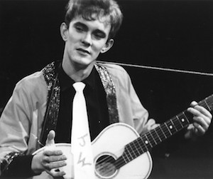
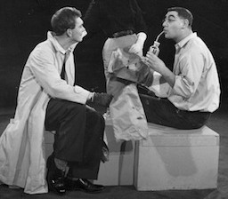
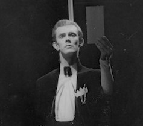

In 1957, Alan left the **[Leatherhead Theatre Club](/career/actor/connaught-theatre)** to join Theatre in the Round at the Library Theatre, Scarborough, as a **[Stage Manager](/career/stage-manager)** and actor. Theatre in the Round at the Library Theatre had been founded in 1955 by **[Stephen Joseph](/life)** and was the UK's first professional theatre-in-the-round company.

Alan joined the **[Oxford Playhouse](/career/actor/connaught-theatre)** for the Winter 1958 season but returned to Scarborough the next year and, between 1958 and 1962, he was employed primarily as an actor and became increasingly prominent within the company. He also became increasingly influenced by Stephen Joseph, who commissioned Alan to write his first play in 1959. Famously, the commission was offered after Alan complained about the quality of his roles to which Stephen responded, if he thought he could do better, he should write his own. He did and Alan's first four plays should be seen through the prism of writing himself good roles and showcasing himself as an actor.

Whilst in Scarborough, Alan acted in well over 35 productions making him - arguably - one of the most experienced theatre-in-the-round actors of the time. In 1961 he also began directing, a role which would eventually drive him away from acting.

Alan left Scarborough in 1962 as a founding member of the **[Victoria Theatre](/career/victoria-theatre)**, Stoke-on-Trent; another in-the-round venture created by Stephen Joseph. By the time he returned to Scarborough in 1965 as a writer and director, he had retired from professional acting.

<aside>

</aside>

The quotes below relate to Alan's acting experiences in Scarborough.

"At the end of that \[Leatherhead\] season, Rodney Wood, who thought for some reason that I wasn't bad at my ASM job, asked me and a part-time carpenter who was there if we'd like to come to Scarborough and form the stage team there, with me as stage manager and him as ASM. And that was the moment that I got to hear of Stephen Joseph and the Theatre in the Round. And one Sunday, we went up to town and we had a look at some of this man's work, although I wasn't to meet the man himself for quite a long time. We went to the Mahatma Gandhi Hall and saw a production of *Huis Clos*, which sticks out still in my mind as one of the most exciting things I've ever seen in the theatre."  
*(Conversations With Ayckbourn, 1981)*

"I'd been promised a small part, well, quite a big part really, in *An Inspector Calls* in the summer \[at the Library Theatre, Scarborough, in 1959\], so it was a good start to the job. I was acting in it and stage managing it so actually it was quite hard work. But that was my first introduction to 'in-the-round."  
*(Taking Steps programme, 2010)*

"I lacked an awful lot of technique, but what I lacked in technique, I made up an awful lot in sincerity and because I knew better than to show my lack of technique, I kept very still on stage. I got a lot of reviews: “His lizard-like stillness” and of course, as one knows later on, if you stop waving your arms around and you just sit still, just eyes flick round, you can pull focus that way, just as well."  
*(Imagine, 2011)*

"I went back \[to Scarborough the the 1958 summer season\] and I was again acting. But I was still lumbered with this stage management which I couldn't shake off. You can get any amount of bloody actors, but stage managers are terribly rare, and people who were actually able to understand all this machinery were like gold dust. I was beginning to get quite good at it because I'd been doing it at Oxford: they'd got a tape machine there, and none of them knew how to work it.  
"Stephen Joseph was beginning to introduce these winter tours, so my work pattern began to get established for the next couple of years in that I worked for thirteen weeks in the summer and then was unemployed again until about November. And then I worked through till February / March."  
*(Conversations With Ayckbourn, 1981)*

"Rather than being \[cast as\] Frankenstein, I was always his friend who got bumped off halfway through. In the end I complained to Stephen \[Joseph\] who said if I wanted better parts I should write them myself."  
*(The Guardian, 28 March 2014)*

"I was acting in a play in the theatre at Scarborough. It was a bloody awful play and I told the producer so. 'If you can do better get on with it,' he said. Angrily. I replied: 'Right, you're on.' I wrote a play, about a pop star with me in the lead and it was put on. But, for a time, writing was only a means of providing myself with parts. Then I began to realise that other actors were better than me. I assessed my abilities as an actor in time and moved into full-time writing and directing."  
*(Sunday Express, 14 September 1975)*

"As time passed, my acting wasn't getting any better. I was in a play directed by Stephen \[Joseph\] and I'd been complaining about the quality of the script. So Stephen challenged me to write a better one - on condition that I took the main role myself. He was a wise man. It's one thing to write a play and throw it to a bunch of actors to die in, but quite another to appear in it oneself"  
*(Elmbridge Magazine, January 2010)*

"I acted in most of my early plays, which I don't recommend because you can't blame anyone if it doesn't work. If you're the actor, you can always blame the script. If you're the playwright, you can blame the actors. If you're both, you can't blame anyone but yourself: I'm sorry, it's rotten - and it's my fault."  
*(Washington Star, 1976)*

"I was always worrying about the whole scene, when as an actor I should have been worrying about my part in it. But, being so objective, one reached the stage of looking at one's own acting abilities and saying 'I'm never going to be as good as I want to be.' However, when Stephen Joseph at Scarborough gave me my first writing opportunity on condition I act in my own play, I wrote myself a super part. In fact, my first plays were all plays attempting to further my career as an actor. They were all shameless vehicles."  
*(Vogue, 1975)*

"I stopped acting when I realised the best I could get was average."  
*(Washington Star, 1976)*

"I'd have got no further \[if he'd continued acting\] than perhaps playing second leads, although I did have ambition to be famous and mobbed by crowds. It would have all been very frustrating."  
*(Wigan Evening Post, 1981)*
