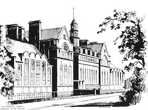
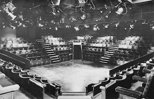

*This page features in in-depth history of the Stephen Joseph Theatre in the Round, Scarborough, preceded by a short introduction to Alan Ayckbourn's connection to the venue. In-depth details about the venue can be found at* ***[www.a-round-town.com](http://www.a-round-town.com/)***.

### Alan Ayckbourn & the Stephen Joseph Theatre in the Round

<aside>

### Related Pages

○ [Plays produced](/career/ayckbourn-and-sjt/plays-produced-at-sjt)

*Artist's impression of the Stephen Joseph Theatre in the Round  
© Don Micklethwaite*

*The interior of the Stephen Joseph Theatre In The Round. The stage featuring thee entrances and a design which was later replicated at the Stephen Joseph Theatre.  
© Scarborough Theatre Trust*

</aside>

Having been appointed Artistic Director of Theatre in the Round at the the Library Theatre in November 1972, Alan Ayckbourn was instrumental in finding a new home for the company and moving to what would become the Stephen Joseph Theatre In The Round. In the wake of **[Stephen Joseph](/life)**'s death in 1967, Alan continued Stephen's policy of encouraging new plays and new playwrights whilst championing theatre-in-the-round.

As Artistic Director, he was involved in every aspect of the theatre's work and as well as writing and directing his own plays, he directed the majority of plays produced at the venue between 1976 and 1996.

Between 1986 and 1988, Alan took a sabbatical from Scarborough to become a company director at the **[National Theatre](/career/national-theatre)**. During this period, Robin Herford was appointed Co-Artistic Director and responsible for the day-to-day running of the building as well as directing (Alan was still credited as Artistic Director throughout this period, even though many commentators wrongly believed he would not return to the venue after his work at the National).

In 1988, Alan returned to Scarborough reinvigorated and, during 1989, began formulating plans to move the company to the site of the Scarborough's former **[Odeon](http://theatre-in-the-round.com/page-41/page-189/page-19/)** cinema. Over the next seven years, he would be one of the driving forces in raising funds and organising the move to the company's first permanent home.

### A History Of The Stephen Joseph Theatre In The Round

The need to move the company to a new home had been mooted since the early 1960s largely due to the lack of facilities at the **[Theatre in the Round at the Library Theatre](/career/ayckbourn-and-sjt/sjt-venues/theatre-in-the-round-at-the-library-theatre)**. However, it was only in the 1970s that a move became an imperative both in the company's desire to expand its operations and the public library's desire to claim back the space used by the theatre. Things came to a head in 1975, when Alan Ayckbourn recalls he was infamously told by the library that the concert room was needed for 'cultural purposes'!

The company had been seriously looking at different premises in Scarborough since 1967 but to no avail. The situation was made imperative when in early 1975, the Libraries Committee announced the company would no longer be welcome in Scarborough Library from January 1976. Unexpectedly, in October 1975, a solution appeared to have been found when Scarborough Town Council announced it had been secretly making plans for a new home for the company to be built at the cost of £500,000 on a car park across the road from the company's current home at the public library. Despite a short extension to summer 1976 by the library, the company still needed a temporary home and this was provided by North Yorkshire County Council with the offer of the ground floor of the former Westwood County Modern School (colloquially known as Westwood), beneath the town's iconic Valley Bridge.

The company agreed and moved to Westwood in 1976 at an estimate cost of between £20,000 - £30,000 (It would actually cost £38,000) with the move completed as cheaply as possible as it was believed that Westwood would be a temporary home and that more funds would be needed soon for the move to a permanent home. The conversion from school to theatre took just a remarkable 60 days and concrete was still apparently being laid on the afternoon of the opening production's technical rehearsal! The 308-seat venue opened as Theatre In The Round At Westwood on 26 October 1976 with a revival of Artistic Director Alan Ayckbourn's *Mr Whatnot*; one of the few plays by the playwright which had not premiered or been seen in Scarborough.

The acting space itself though, built and designed from the ground up, was an improvement on the Library Theatre's space and set the template for the future. It was an approximate square with three voms (vomitoriums) or stage exits. Two in adjacent corners and one in centre of the opposite seating block (imagine a Y with the end points of the letter being the voms). There were five rows of seating and all access to the seats was via the stage through the centre vom. This space would be replicated when the company moved to its new home 20 years later.

The original lease for Westwood was for just three years, but it soon became obvious there was not going to be a new permanent home for the company. By 1977, the town council indicated the escalating costs of the new building meant it would no longer be prepared to build a new home (no explanation was given as to how costs had risen so dramatically in the space of just two years) and it was suggested the lease at Westwood be extended to allow time for the company to formulate new plans for a permanent home and to be able to apply for more funding. Still, no-one believed Westwood - which was essentially still a make-shift space - would be the long-term home for the company.

On 1 April 1978, the venue was renamed the Stephen Joseph Theatre In The Round in memory of its founder; a name that was initially planned for the new permanent home for the company. The following year, the Westwood lease was extended to 10 years and a grant of £105,000 from the local authority, English Tourist Board and the Arts Council offered an opportunity to make the building fit for purpose. A rehearsal room was finally created alongside a costume store, extra offices and other improvements including air conditioning in the main auditorium. With this, it appears to have been tacitly accepted Westwood would be the company's home for the foreseeable future and one shared with the town's technical college which occupied the basement floor of the building; during the early years it was not unusual for performances to be disturbed by the sound of metalwork lessons taking places directly beneath the auditorium.

Facilities at Westwood were not as basic as at the Library, but were still not ideal. However, the space proved to be flexible - the discovery that the floor was concrete led to Alan writing the water-bound play *Way Upstream*, working on the proposition that if the tank should split, the concrete floor would mean only the theatre would flood! The round auditorium took on its present shape at this venue - at the Library Theatre, the stage had only two entrances, both on the same side due to the nature of the concert room. The three-vomitorium design and shape was created for the move to Westwood in 1976 and was then reproduced exactly at the present **[Stephen Joseph Theatre](/career/ayckbourn-and-sjt/sjt-venues/stephen-joseph-theatre)** venue.

The development of Westwood over the years led to the creation of a kitchen area and cafe - which went through various itinerations before settling on the name *The Square Cat* - to supplement the bar which had opened in 1976. A small end-stage studio space was also created in 1977 and in which the world premiere of the extraordinarily successful play ***[The Woman In Black](http://thewomaninblack.theatre-in-the-round.com/)*** was held in 1987.

During the 20 years at the venue, the company's programme substantially expanded and it became - to all intents and purposes - a year-round venue. Touring was increased and saw the company undertake several extensive international tours in conjunction with the British Council. Lunchtime productions and concerts were introduced and proved to be very popular over the years; the lunchtime productions in the Studio also becoming the launching space for new writers, many of whom having had success in the studio graduated to full length productions in-the-round soon afterwards. The Library Theatre's strong relationship with the amateur community was largely sustained with frequent performances by many of the town's amateur communities and from 1977 to 1987, the popular Sunday night concerts highlighting established and up-and-coming regional musical talent.

Although the company largely flourished in its cramped and less than ideal quarters, its future was questioned in 1984 when a series of issues brought to light the still precarious nature of the company's position in Scarborough. The company had made a rare loss of £500 - which should not have had much impact. However, at the same time the Arts Council threatened to cut the theatre's subsidy and the town council refused another 10 year extension of the theatre's lease, claiming the building was far too valuable a property to be used as a practically permanent home for the Stephen Joseph Theatre In The Round. Artistic Director Alan Ayckbourn's response was simple and shocking, that the future of the theatre was on the line and he was prepared to take the company elsewhere, arguing there were many towns and theatres which would welcome both him and the company with open arms. The council relented and renewed the lease, although the Arts Council's budget cuts did lead to a slightly shortened season in 1985 and a production being cut from the schedule.

Although the company's future was secured for the short term, attention was once again focused on finding a new, permanent home for the company which yielded results in 1989, when Alan Ayckbourn suggested the recently closed Odeon cinema - one of Scarborough's most prominent landmarks - could become the new home for the theatre. The following year, a company was formed to secure the lease of the building and fund-raising began in earnest in 1993. After several delays, it was announced the company would leave Westwood in 1996 and finally, after 40 years, find a permanent home in Scarborough at the new **[Stephen Joseph Theatre](/career/ayckbourn-and-sjt/sjt-venues/stephen-joseph-theatre)**.
