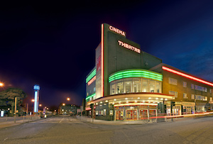

*This page features in in-depth history of the Stephen Joseph Theatre, Scarborough, preceded by a short introduction to Alan Ayckbourn's connection to the venue.*

*Note: This page only refers to the Stephen Joseph Theatre during Alan Ayckbourn's tenure as Artistic Director up to 31 March 2009. Details of the theatre and the company subsequent to this should refer to the theatre's own website.*

### Alan Ayckbourn and the Stephen Joseph Theatre

<aside>

*The exterior of the Stephen Joseph Theatre, Scarborough.  
© James Drawneek*

</aside>

The Stephen Joseph Theatre opened in 1996 - the project was delayed from the initially intended launch in 1994 which would have seen Alan Ayckbourn's play ***[Haunting Julia](/plays/haunting-julia)*** be the first production in The McCarthy auditorium.

When the project was delayed, Alan Ayckbourn turned - unexpectedly - to one of his biggest flops, the 1975 musical ***[Jeeves](/plays/jeeves)*** to relaunch the theatre. Alongside the composer Andrew Lloyd Webber, the two completely revised the musical and opened the theatre with the essentially new musical *By Jeeves*; an enormous success which transferred to London, toured the UK and eventually opened on Broadway.

Alan Ayckbourn was keen the entire venue was used to its maximum potential and that the smaller end-stage McCarthy Theatre would not be a second or studio theatre but as an equally important performing space as The Round. Unfortunately, within six months of opening there was a funding crisis due to the three-way funding deal between Scarborough Council, North Yorkshire County Council and the Arts Council - just one pulling out could jeopardise the entire subsidy agreement and North Yorkshire County Council was threatening to cut its funding. As a result, Alan Ayckbourn found himself fighting to secure the future of the Stephen Joseph Theatre in a story which received national media coverage. The funding was eventually secured but Alan Ayckbourn later revealed the venue was being run on practically the same sized subsidy as for the company's previous home, which was less than half the size of the new building.

On his 60th birthday in 1999, Alan announced he was going to step back to lighten his work-load and begin concentrating on his own work alongside his role of Artistic Director and to all intents and purposes ceased directing work by other authors (with the exception of Tim Firth's ***[The Safari Party](/career/director/the-safari-party)***in 2002). With funding a perpetual issue at the theatre, Alan looked to 'events' such as the 10x10 season in 1998 and the world premiere of ***[House & Garden](/plays/house-and)*** in 1999 - which marked his 60th birthday - to attract audiences. The latter production being two plays performed simultaneously in two auditoria by a single cast and which was a huge success and later transfered to the National Theatre.

In February 2006, Alan suffered a **[stroke](/career/ayckbourn-and-sjt/the-stroke)** and was out of action for six months. Although he returned to work in September 2006 to direct the world premiere of his new play ***[If I Were You](/plays/if-i-were-you)***, he would announce the following May his retirement as Artistic Director of the venue in 2009. To mark his final full year at the venue, 2008 saw five productions of plays by Alan Ayckbourn, culminating in the musical ***[Awaking Beauty](/plays/awaking-beauty)***.

On 31 March 2009, just shy of his 70th birthday, Alan Ayckbourn officially **[retired](/career/ayckbourn-and-sjt/retirement)** as Artistic Director of the Stephen Joseph after 37 years. Ironically, given the major events at the Stephen Joseph Theatre which had accompanied his 50th and 60th birthdays, the timing of his retirement meant the Stephen Joseph Theatre barely marked his 70th birthday during 2009 with the major Ayckbourn celebration taking place at Northampton's Royal & Derngate Theatre with the *Ayckbourn At 70* festival.

Since 2009, Alan has been employed as a guest director at the Stephen Joseph Theatre and continues to premiere new work at the venue. During 2018, he was appointed **[Director Emeritus](/career/ayckbourn-and-sjt/director-emeritus)** of the company to mark his contributions and achievements, although he has no actual involvement in the company or the running of it.

Alan considers one of his greatest achievements to have been the move of the Scarborough company into its first purpose-designed home, the Stephen Joseph Theatre, during 1996. In recent years, however, he has admitted his favourite home of the company was the smaller, more intimate second home of the **[Stephen Joseph Theatre in the Round](/career/ayckbourn-and-sjt/sjt-venues/stephen-joseph-theatre-in-the-round)** which cleaved closer to Stephen Joseph's intentions and legacy.

### A History of the Stephen Joseph Theatre (1996 - 2009)

A permanent home for the company **[Stephen Joseph](/life)** founded in 1955 did not begin to be realised until 1988, when the Rank Organisation closed Scarborough’s Art Deco **[Odeon](http://theatre-in-the-round.com/page-41/page-189/page-19/)** cinema. The building had been built by the architect Harry Weedon and used as a cinema until it closed; apparently at the time, the only single screen Odeon still operating in the UK aside from the Odeon Leicester Square.

Alan Ayckbourn, Artistic Director of the company, suggested the idea of converting the former cinema into a state-of-the-art home for theatre-in-the-round in Scarborough in 1989; the only other serious suggestion for the building being to turn it into a bingo hall. His enquiries into the possibility of acquiring the empty Grade II listed building led to the discovery the Rank company wanted £300,000 for the remaining 48 years of the lease. However, confident he had found the perfect home for the company and after much negotiation, Alan formed the ADMirable partnership in 1990 with Lord Downe and Charles ‘Mac’ McCarthy. They each put £50,000 of their own money together with a bank loan for £100,000 and managed to secure the lease of the building for £250,000; Scarborough Borough Council subsequently increased the lease to 99 years. With the lease for the building secured, work began on raising the funds needed for the extensive conversion of the building.

The initial aim was to open the theatre in 1994 although serious fund-raising did not begin until 1993 with the launch of a major financial appeal which included sponsoring the name of the venue for £800,000; although it was never really in doubt the eventual sponsor would name it after its founder. The Grade II listing of the building meant a complex series of negotiations with English Heritage, which eventually led to the agreement that the exterior of the building and the Front Of House areas would be restored and reflect the building's Art Deco origins when it opened in 1936. The rest of the building - particularly the Round auditorium - would be redeveloped from the ground up in order to create a state-of-the-art venue and facilities.

The conversion and move to the new building eventually cost £5.2m and involved refitting the top of the cinema’s circle to create the 165 seat McCarthy Theatre and cinema; the ground floor of the cinema was gutted and the supporting proscenium arch removed to create the space for the 404-seat Round auditorium with a stage-lift and trampoline mesh beneath the lighting rig (apparently the first of its kind in the UK and a clever solution to offering easy and quick access to lighting grids above in-the-round venues).

A hole was also punched through the roof, sinking from it a glass shaft - the ‘atrium’ - to allow natural light to reach the offices in the centre of the building. The building also incorporated a shop, conference room, full backstage and front of house facilities and a bar and restaurant retaining as far as possible the listed building’s 1930’s features. Even the carpet was a replica of the original carpet taken from a piece that had been found in the old cinema before the conversion. Using Harry Osborne of Henry Osborne Christmas Associates of Tunbridge Wells as the concept architect and Shepherd Design and Build of York, the conversion was finally completed just in time for the first performance on 24th of April 1996; the theatre's official opening night took place on 30 April.

To launch the theatre, Alan Ayckbourn turned - unexpectedly - to one of his biggest flops, the 1975 musical *Jeeves* which he had written with Andrew Lloyd Webber. Reuniting with the composer, the pair completely revised the musical and opened the Stephen Joseph Theatre with *By Jeeves*; which despite the doubters and naysayers proved to be an enormous success, later transferring to London before touring the UK and - several years later - opening on Broadway.

Alan Ayckbourn was keen that the entire venue was used to its maximum potential and that the smaller end-stage McCarthy Theatre would not be seen as a second or studio theatre, but as an equally important performing space as The Round. Unfortunately, within six months of opening there was a funding crisis due to the three-way funding deal between Scarborough Council, North Yorkshire County Council and the Arts Council - just one pulling out could jeopardise the entire subsidy agreement with first Scarborough Town Council and then North Yorkshire County Council threatening to cut its funding. Alan Ayckbourn found himself fighting to secure the future of the Stephen Joseph Theatre in a story which received national media coverage, even going so far as to state the theatre would close its doors in September 1997 if the subsidies was not restored. The funding was eventually secured but Alan Ayckbourn later revealed the venue was being run on essentially the same sized subsidy as for the company's previous home, which was less than half the size of the new building. Sadly, the insecurity of funding would constantly dog the venue over the coming years and it was never able to run year-round to its maximum potential as Alan Ayckbourn had hoped and envisaged.

Despite this, the theatre continued to place Stephen Joseph and his legacy of embracing new writing as the keystone of the theatre's vision throughout Alan Ayckbourn's tenure as Artistic Director. The lunchtime plays - so popular at Westwood - continued in The Restaurant and occasionally expanded into The McCarthy. The visiting programme was massively increased with popular companies such as the Northern Broadsides and Hull Truck Theatre becoming regular visitors alongside popular concert events such as the Hammonds Saltaire Band and Music In The Round concert series. Certainly during it first decade, every effort was to make the venue as vibrant and as a busy a venue as possible within the restrictions of funding and budget.

In 2005, the contribution of Stephen Joseph to Scarborough saw a blue plaque attached outside Scarborough Library to mark the 50th anniversary of Stephen Joseph opening the Library Theatre. An important milestone had been reached for the company in the town - with another unexpected one soon to follow.

In February 2006, Alan Ayckbourn suffered a stroke and was away from the theatre for six months. Although he returned to work in September 2006 to direct the world premiere of his new play *If I Were You*, it marked a period of transition for the theatre. The playwright and Artistic Director had previously announced a lightening of his workload in 1999, but in May 2007 he confirmed he would retire as Artistic Director in 2009.

The playwright has since remained connected to the theatre peripherally as a guest director and still premieres new work at the venue.

For information regarding the Stephen Joseph Theatre subsequent to 2009, please visit the Stephen Joseph Theatre's own website.

For details about the Odeon building in which the Stephen Joseph Theatre is based, click **[here](/career)**.
