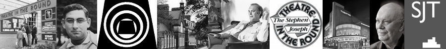

Alan Ayckbourn has been an intrinsic part of all three homes of the Stephen Joseph Theatre in Scarborough. From this page, you can click on a venue to find out details about Alan's history with each venue and well as a general history of each venue from the company's creation in 1955 to Alan Ayckbourn retiring as Artistic Director in 2009.

In-depth details of Theatre in the Round at the Library Theatre and the Stephen Joseph Theatre in the Round can be found at the website **[www.a-round-town.com](http://www.a-round-town.com/)**.

### The Venues (1955 - 1959)

**1955 - 1976**

**1996 - 2009**

**1976 - 1996**

*All research for this section by Simon Murgatroyd. Please do not reproduce the articles without permission of the copyright holder.*
