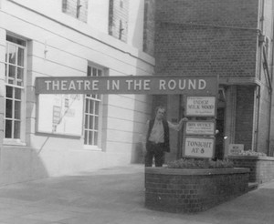
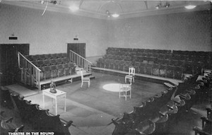
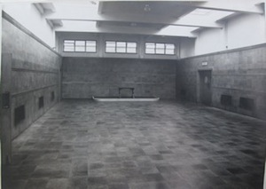

*This page features in in-depth history of Theatre in the Round at the Library Theatre, Scarborough, preceded by a short introduction to Alan Ayckbourn's connection to the venue. In-depth details about the venue can be found at* ***[www.a-round-town.com](http://www.a-round-town.com/)***.

***Note:*** *It has become common practise to refer to Theatre in the Round at the Library Theatre as just The Library Theatre - this is actually inaccurate as The Library Theatre is the name of the venue which was run by Scarborough Library and was used as a performance venue outside of the time when the in-the-round company (1955 - 1976) were based there. When referring to the venue with regard to Alan Ayckbourn and Stephen Joseph, the correct term - and advertised term for the company - is Theatre in the Round at the Library Theatre.*

### Alan Ayckbourn & Theatre in the Round at the Library Theatre

<aside>

*The interior of Theatre in the Round at the Library Theatre in 1955. Note the stage has just two entrances both on the same side.  
© Studio Theatre Ltd*

*A rare photograph of the large lecture room space where the 1957/58, 1974/75 and 1975/76 winter seasons were held. The size of the room precluded in-the-round performance and all productions were in a three-sided configuration.  
© To be confirmed*

</aside>

Alan Ayckbourn joined Theatre in the Round at the Library Theatre in 1957, two years after the company was founded, as an **[acting stage manager](/career/stage-manager)** (a stage manager with limited **[acting](/career/actor)** roles). He came at the invitation of Rodney Wood, a stage manager with whom he had been working at **[Leatherhead Theatre Club](/career/actor/connaught-theatre)**.

Considering the significance he was to have on Alan's life, Alan would not actually meet **[Stephen Joseph](/life)** until several weeks into his employment when, as a total stranger to Alan, he was instrumental in Alan bringing the lights down on a scene mid-performance at the venue!

By 1958, Alan was employed primarily as an actor and being encouraged to write by Stephen Joseph. He was commissioned to write his first play during December 1958 with ***[The Square Cat](/plays/the-square-cat)*** premiering in July 1959. A second play, ***[Love After All](/plays/love-after-all)***, would follow in December.

By 1961, Stephen had also encouraged Alan to try his hand at **[directing](/career/directing-career)** and the combination of writing and directing (alongside the realisation he wasn't a particularly good actor) led him to quit acting in 1964.

In 1962, Stephen Joseph set up the UK's first purpose built theatre-in-the-round venue at the Victoria Theatre, Stoke-on-Trent, and Alan moved with the Studio Theatre Ltd company away from Scarborough. There would be no Ayckbourn plays staged in Scarborough between ***[Standing Room Only](/plays/standing-room-only)*** in 1962 and *Meet My Father* (later retitled ***[Relatively Speaking](/plays/relatively-speaking)***) in 1965. In 1964, Alan quit the Victoria Theatre to work full-time for the **[BBC](/career/bbc-career)** as a radio drama producer, but continued to write plays for Scarborough.

After Stephen Joseph's death in 1967, Alan was instrumental in helping to keeping Theatre in the Round at the Library Theatre operating and as well as writing plays for the venue, he was also appointed the Director Of Productions for the summer seasons of 1969, 1970 and 1972 (in the aftermath of Stephen's death, the permanent position of Artistic Director was replaced by the annually appointed seasonal post of Director Of Productions, which was held by several people between 1967 and 1971). In November 1972, Alan was offered the permanent position of **[Artistic Director](/career/artistic-director)** which he accepted and held until 2009.

*"Theatre-in-the-rounds were completely unknown in England in 1955. It was an extraordinary idea to open a space in Scarborough. Stephen Joseph died very young actually in 1967 and I was persuaded - because I was the only person they knew really - to take it over and I started to try and develop it into a slightly more year round show. When it started it was just eight weeks - as soon as cricket week arrived we all packed up. We had an ambition to expand."  
Alan Ayckbourn, 2015*

### A History Of The Library Theatre

Theatre in the Round at the Library Theatre - now better known as the **[Stephen Joseph Theatre](/career/ayckbourn-and-the-sjt/sjt-venues/stephen-joseph-theatre)** - began life in 1955 in the seaside town of Scarborough in North Yorkshire. It was not the most obvious home for the country’s first professional theatre-in-the-round company, but its founder rarely opted for the obvious in anything he did.

Stephen Joseph was passionate about new writing and supporting new playwrights. He was also enthused by theatre-in-the-round which he had seen briefly in the UK and more extensively whilst studying in the USA. He believed theatre in the round offered a practical, exciting and financially viable way of presenting new drama. He just needed a venue.

Stephen initially searched for a venue for his idea in London, but found nowhere suitable. It was only while running a weekend playwriting course in Ravenscar, North Yorkshire, that a solution was offered. The Concert Room at Scarborough Library was suggested as a venue and Stephen (apparently riding his motor bike to Scarborough through dangerously heavy snow) came to the town, met the Chief Librarian William Smettem and saw the Concert Room for the first time. A decision was made and Stephen’s recently formed company Studio Theatre Ltd had found its first home, where it would reside for the first 21 years of its life.

Rehearsals for the first season took place in London, funded by the sale of Stephen’s motorbike, before the company moved to Scarborough for an eight week summer season. Theatre in the Round at the Library Theatre opened on 14 July with a season of four new plays by four new writers - three of whom were women. Obviously every aspect of this was a risk, the theatre was competing against a town replete with theatrical entertainment during the summer months, it was staging unknown plays by unknown writers and it was offering theatre-in-the-round, practically unknown in the UK at a time when the theatres were dominated by the proscenium arch. An early letter to the Scarborough Evening News illustrated the mixed reaction to the new theatre.

*“Sir, one factor of utmost importance. Theatre in the Round has no settings. How can a modern audience, conditioned to the detailed scenic sets of film and television, be expected to enjoy a play performed in limbo?…. The directors of the Theatre in the Round have only themselves to blame if the audience, cheated of the spectacle, prefers to spend its shillings on the latest cinema-scope epic.”  
Reginald Copper, 17 Lady Edith’s Avenue*

Stephen was determined to make theatre-in-the-round work, despite the limitations of his initial venture. Theatre in the Round at the Library Theatre was basic on every level: the single toilet was shared by both company and audience, the dressing room was minuscule and the stage only had two entrances - one of which was also the audience entrance. The seating was built on portable rostra specially designed by Stephen Joseph and which could be assembled and disassembled relatively quickly and easily. While a lighting box was eventually installed, facilities remained limited throughout the company's 21 year tenure at the venue. With little money to fund the venture, Stephen was dependent on all the help he could get and found an enthusiastic supply in the local amateur dramatic scene. Members of Scarborough Theatre Guild were heavily involved in front of house and behind the scenes work, most prominent of whom was Ken Boden, a local insurance agent, who was involved in the theatre from the start and would go on to play a pivotal part in the theatre’s future.

The design of the performance space was also not ideal. Due to the restrictions of the Concert Room, there were only two stage entrances, both on the same side of the oblong-shaped 'theatre-in-the-round'; one of which was the public entrance to the theatre and the other the entrance to the toilet / dressing rooms. The spacing of these entrances meant that one of the four seating 'blocks' was very small compared to the rest of the auditorium. There were five rows of seating all built upon collapsible rostra which could also be used for touring. Designs and photographs of Theatre in the Round at the Library Theatre can be found **[here](/career)**.

Within two weeks of opening, Theatre in the Round at the Library Theatre was in trouble. Stephen had calculated he needed to attract 100 people a night to break even - the theatre held 248 seats - but audiences had not risen above 75 and were frequently far fewer. Not helped by a blisteringly hot summer, Stephen made an impassioned plea to the local media for support. The future of the fledgling company was in the balance and just one thing contrived to save it. The weather. The heatwave broke and the rain fell, drawing crowds into Theatre in the Round at the Library Theatre and ensuring the company was able to survive its first season. At the end of the summer, a loss had been made but it was relatively small and enough to encourage Stephen to book the venue for the following year.

It should never be assumed that Scarborough was perceived by Stephen as the permanent home of the company. He had no particular loyalty to the town and over the next few years toured the company to various other towns - largely without municipal theatres - in the hope that a town council might support his desire to have a permanent theatre-in-the-round built.

By 1957, Theatre in the Round at the Library Theatre had become firmly established in Scarborough with good audience numbers leading Stephen to explore the possibility of a winter season. He had also made the decision to incorporate more established work and writers into his season to supplement the new writing - although the emphasis was always on the latter. That same year, a young actor / stage manager by the name of Alan Ayckbourn also joined the company.

Theatre in the Round at the Library Theatre was not without controversy though, most notably when Stephen Joseph decided in 1958 to stop playing the National Anthem at every performance; the first regional theatre to do so. An incensed minority - including the Mayor of Scarborough - unleashed a torrent of complaints which caught the attention of the national media and would cause debate and ructions over several years.

Of far longer term significance was the fruit of Stephen’s support of new writing. In December 1958, **[Harold Pinter](/career/actor/acting-alan-ayckbourn-in-harold-pinters-the-birthday-party)** made his professional directorial debut when he directed the second production of his play *The Birthday Party* for a Studio Theatre Ltd tour, following the play’s initial mauling in London. The success of the play - which was rehearsed at Theatre in the Round at the Library Theatre, but sadly never performed there - apparently restored Pinter’s faith in both the play and his abilities. Acting in the production was Alan Ayckbourn, who had also just been commissioned by Stephen Joseph to write his first play. In 1959, Alan Ayckbourn's *The Square Cat* received its world premiere, quickly followed in the winter season by his second play *Love After All*.

By 1961, Theatre in the Round at the Library Theatre could lay claim to being the country’s first professional and permanent theatre-in-the-round company although its future suddenly looked insecure when Newcastle-under-Lyme expressed interest in supporting Stephen creating a purpose-built theatre-in-the-round in the town. Although this plan fell through, it would eventually lead to the formation of the Victoria Theatre in 1962, a conversion of a former cinema in Stoke-on-Trent which became the country’s first permanent theatre-in-the-round venue and the new home of Studio Theatre Ltd.

To ensure the survival of Theatre in the Round at the Library Theatre in Scarborough, control of it passed to another of Stephen's companies, Theatre In The Round Ltd, between 1963 and 1964; although the venue's future looked bleak as most of Studio Theatre Ltd’s Arts Council subsidy followed the company to the Victoria Theatre and the Scarborough company had few finances to speak of. The winter seasons in Scarborough were abandoned and the summer seasons drastically shortened from 1962; Stephen was also increasingly convinced the library was not a suitable home for the theatre and in 1963 he sent an ultimatum to the Libraries Committee requesting better support. Despite this, a new company was formed in 1964 to run the theatre called Scarborough Theatre Trust which continues to operate the Stephen Joseph Theatre today.

The company continued despite its limitations and in 1965 Alan Ayckbourn premiered his seventh play, *Meet My Father*. Directed by Stephen Joseph, the play was quickly picked up by the producer Peter King. It would open two years later in London under the title *Relatively Speaking* and help establish Alan Ayckbourn as one of the 20th century’s most important playwrights. Ironically, Stephen declared that the 1965 summer season would be the venue's last due to a lack of support from Scarborough Town Council and the Libraries Committee.

The facilities at Theatre in the Round at the Library Theatre had always been limited and Stephen never realistically believed Scarborough’s public library could be a permanent home for the company. As a result, Stephen was constantly looking for new venues for the theatre. By 1963, Stephen had become frustrated by the position of the company; unable to find a new home for it, limited by the Library facilities and feeling Scarborough Town Council was at times unsupportive of the theatre, Stephen delivered the first of several ultimatums for the theatre to be supported. By 1965, Stephen felt his pleas for support had fallen on deaf ears and he announced there would be no season in 1966 (indeed, judging by Stephen’s book *Theatre In The Round*, it can be construed Stephen believed Theatre in the Round at the Library Theatre was permanently finished). Scarborough Theatre Trust was retained but with the task of finding a new home for the company, even if it was likely to be outside Scarborough.

At this point Ken Boden stepped in and persuaded Stephen to let him stage an amateur in-the-round season in 1966, hoping to keep the popular venue going. It was a good decision as Scarborough Town Council finally agreed to provide more solid support for the theatre in 1967 and professional theatre was able to resume in 1967, although by then Stephen was too ill to play an active role in the theatre’s life. Stephen tragically died on 5 October 1967 at his Scarborough home, aged just 46, and for the next few years, the theatre was run on a day to day basis by Ken Boden with the aid of people who had been influenced by and worked with Stephen such as Alan Ayckbourn, Alfred Bradley and Rodney Wood. In 1972, Alan Ayckbourn became the Artistic Director of the company (a position he would hold until his retirement in 2009), ensuring Stephen Joseph’s legacy would be preserved. His first years were met by the enormous challenge of trying to ensure the theatre’s immediate survival.

In the wake of Stephen Joseph's death, the search for a new home became even more pronounced. Between 1967 and 1972, Scarborough Theatre Trust considered venues throughout the town to no avail and even faced competition from an effort to restore Scarborough’s Opera House (further information about alternative considered venues for the theatre can be found **[here](/career)**). Everything came to a head in 1974, when North Yorkshire County Council - now in charge of the county's Libraries - refused the company permission to extend its operation to 40 weeks a year. Feeling the Council was not supportive of the theatre, Alan made it clear he would take the company away from the town. With support from Scarborough Town Council, the issue was temporarily resolved but the Libraries Committee announced the company was only being given a 12 month reprieve and would need to find new premises by January 1976. According to Alan Ayckbourn, the Libraries Committee cited to him the Concert Room was -ironically - needed for “cultural purposes”; contemporary correspondence indicates the Libraries Committee's 'official' reason was the space was needed for "administrative purposes" - either way it amounted to the same thing. The Libraries Committee did not want Theatre in the Round at the Library Theatre on its premises.

With its future uncertain, even the fact the theatre had the highest percentage attendance of any provincial theatre in England in 1975 was of little comfort. After numerous attempts to find a suitable new home, Scarborough Town Council made the surprise announcement in 1975 that a new theatre would be built opposite Scarborough Library for the company at a cost of £500,000. In the meantime, a temporary home at the former **[Westwood County Modern School](/career/ayckbourn-and-the-sjt/sjt-venues/stephen-joseph-theatre-in-the-round)** beneath Valley Bridge (better known as Westwood) was offered under the belief that the new theatre would be completed within three years. The move to Westwood took place at the end of the summer 1976, with the company knowing they had less than two months to convert a former school into a working theatre for the winter season.

The final performance at Theatre in the Round at the Library Theatre took place on 11 September with Alan Ayckbourn's latest play ***[Just Between Ourselves](/plays/just-between-ourselves)***. A truncated post-show party - Scarborough Magistrates having refused to extend the theatre's license to 1am for the evening - led immediately into work on dismantling the theatre in preparation for its move to Westwood.

The purpose-built venue never materialised. One temporary home of 21 years was swapped for a second temporary home of 20 years until the company moved to the **[Stephen Joseph Theatre](/career/ayckbourn-and-the-sjt/sjt-venues/stephen-joseph-theatre)** in 1996; a purpose-designed renovation of Scarborough's former Odeon cinema.

##### The Concert Room and the Large Lecture Room

During its tenure at Theatre in the Round at the Library Theatre, the company performed in two different rooms within Scarborough's public library. The vast majority of performances between 1955 and 1976 took place in the larger Concert Room at the venue, which is what had attracted Stephen to the site originally (and which he wrote extensively about in his book *Theatre In The Round*).

However, on certain occasions - specifically the company's first winter season in 1957 and its later revived winter programme in 1974/75 and 1975/76 - the Concert Room was not available and a smaller, oblong shaped room in the library was utilised. This was called the Large Lecture Room and was also frequently used by the town's amateur companies for their productions. The space in the second room was even more limited than the concert room and all performances had to be done traverse (two-sided) or three-sided rather than in-the-round. Of note is the fact two of Alan Ayckbourn's plays received their world premieres in this space, *Confusions* in 1974 and *Just Between Ourselves* in 1976.

### Studio Theatre

It should be worth noting that contemporary newspaper reports and articles frequently referred to Theatre in the Round at the Library Theatre as Stephen Joseph's Studio Theatre or just the Studio Theatre. This can cause confusion as it is not immediately obvious that the articles are referring to an organisation rather than a physical place. Studio Theatre was the name of Stephen Joseph's company and newspapers frequently referred to Studio Theatre rather than the name of the actual venue, Theatre in the Round at the Library Theatre. As a result, Studio Theatre - in the context of Stephen Joseph - never refers to a physical location or specific venue, it is only the name of his company.
