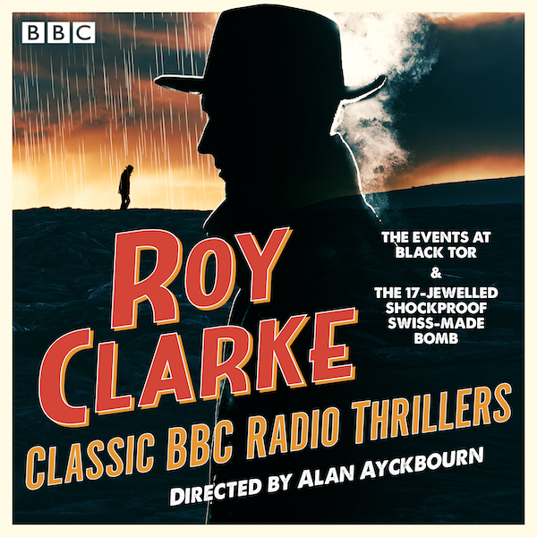

*Between 1965 and 1970, Alan Ayckbourn was employed as a Radio Drama Producer by the BBC. He was responsible for directing dozens of works for the radio, sadly details of the majority of which have been lost. These pages contain details for specific productions where known.*

### Production Details

**Author:**

**Broadcast from:**  
**Channel:**  
**Episodes:**  
Roy Clarke

18 April 1968 @ 7.45pm  
BBC Radio 2  
6**Director:**  
**Music:**Alan Ayckbourn  
Trevor Holroyd**Episode Titles:**○ Such As Sit In Darkness  
○ The Unquiet Dead  
○ The Fires Of Hell  
○ The Hounds Of Hell  
○ The Things That Emerge With The Dark  
○ The Deepest Dark  
**Character**  
Pam  
Jamie  
Sergeant  
Father Probert  
Radio Voice  
Vicar  
Maggie  
Coroner  
Brown  
The Tramp  
Superintendent  
Chief Inspector  
Spider One  
Spider Two / Palmer  
Spider Three**Actor**  
Juliet Cooke  
Brian Peck  
James Beck  
Bob Grant  
Heather Stoney  
Robert Wallace  
Ella Atkinson  
Laurence Bould  
Colin Edwynn  
Harry Markham  
David Mahlowe  
Ronald Harvi  
Douglas Fielding  
John Nettles  
Colin Bell

### Notes

○ *The Events At Black Tor* was released in July 2022 as an audio **[download](http://www.penguin.co.uk/books/1447777/roy-clarke-classic-bbc-radio-thrillers/9781529196177.html)** by Penguin Random House alongside *The 17-Jewelled Shockproof Swiss-Made Bomb*.  
○ *The Events At Black Tor* was a six-part serial with all episodes directed by Alan Ayckbourn.  
○ It's worth noting that although the music is credited to Trevor Holroyd, this is the music for the play itself. The recent repeats by the BBC have included an introductory and closing soundtrack which appears to have emerged directly from the '60s British disco scene. This was not part of the original broadcast nor approved by Alan Ayckbourn. Trevor Holroyd's actual theme incorporates the rather creepy sound of stones being dragged across the ground - like a grave being opened - which Alan proudly noted was achieved by dragging heavy stones across the BBC studio floor! Quite how the studios manager felt about this is unrecorded.       *All research for this page by Simon Murgatroyd.*
