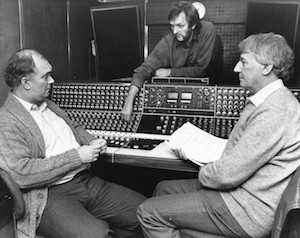

Between 1965 and 1970, Alan Ayckbourn worked as a Radio Drama Producer for the BBC, based in Leeds. It is an aspect of Alan's career which is not widely discussed - nor well-documented - yet it undoubtedly played a significant part in his career and had a huge influence on his work as writer, director and even the practicalities of running a theatre when he became the **[Artistic Director](/career/artistic-director)** of the**[Theatre in the Round at the Library Theatre](/career/ayckbourn-and-the-sjt/sjt-venues/theatre-in-the-round-at-the-library-theatre)** in Scarborough (later the **[Stephen Joseph Theatre](/career/ayckbourn-and-the-sjt/sjt-venues/stephen-joseph-theatre)**) in 1972.

<aside>

*Alan Ayckbourn (left) & Alfred Bradley (right) at the BBC.  
© BBC*

*[Roy Clarke: Classic BBC Radio Thrillers available from Audible](http://www.amazon.co.uk/Roy-Clarke-Classic-Radio-Thrillers/dp/B0B3S5G2ML/ref=sr_1_1/)*

</aside>

Although very little is recorded about this professional period of his life, this section (which includes **[Alan's thoughts on radio](/career/bbc-career/bbc-radio-ayckbourn-quotes)** and **[known radio productions he directed](/career/bbc-career/bbc-radio-productions)**) offers some insight into his role as a Radio Drama Producer.

○ Alan Ayckbourn worked as a Radio Drama Producer for the BBC in Leeds between 1965 and 1970. He was based at the BBC Woodhouse Lane Studios.

○ He worked with **[Alfred Bradley](/life/influences/bradley-alfred)**, a highly respected radio producer who championed northern writers and helped launch the careers of Alan Plater, Keith Waterhouse, Alun Own and Stan Barstow among others.

○ Alan joined the BBC after his first West End production, ***[Mr Whatnot](/plays/mr-whatnot)***, flopped. Alfred Bradley was apparently in Alan’s agent office at the moment Alan rang her for advice and Alfred told him to apply for a new post at the BBC.

○ Alan's position at the BBC was created to cope with the huge amount of scripts which had accumulated as a result of Alfred’s success encouraging new writers, but which he had neither the time nor the resources to produce.

○ Alan's appointment was carried in The Stage newspaper on 26 November 1964. It is probably the only article ever written to mis-spell both Alan's surname (printed as Ayckbourne) and that of his early writing pseudonym Roland Allen (printed as Roland Alan)!

○ Despite having no formal training as a radio producer, within his first year Alan believes he produced more than 50 radio plays (including individual serial episodes). These ranged from 30 to 90 minute pieces and were originally broadcast across the BBC Home Service and BBC Light Programme. Following the restructuring of BBC Radio in 1967, Alan's work would regularly appear on BBC Radio 2 and BBC Radio 4.

○ In 1968, he notably directed the radio drama debut of the writer Roy Clarke - who would go on to become a phenomenally successful writer for television behind such hits as *Open all Hours*, *Keeping Up Appearances* and *Last of the Summer Wine*. Alan directed Roy's two debut works, ***[The Events at Black Tor](/career/bbc-career/bbc-radio-productions/the-events-at-black-tor)*** and ***[The 17-Jewelled Shockproof Swiss-Made Bomb](/career/bbc-career/bbc-radio-productions/the-17-jewelled-shock-proof)***. Both were released as audio books in 2022.

○ During this period Alan also wrote for the comedian Ronnie Barker’s ITV television show ***[Hark At Barker](/career/recordings)***. However his BBC contract forbade him writing for other companies, so Alan wrote under the pseudonym Peter Caulfield.

○ Although very different mediums, Alan feels his work for radio - particularly its tight deadlines - was an asset to him when he subsequently devoted himself full-time to the theatre.

○ As a script editor, Alan read hundreds of new plays, the responsibility of which - as Alfred insisted every writer deserved a written response - demanded in Alan’s view objectively and articulacy, which he felt fed through to his own writing.

○ Alan estimates that during his first year alone, he directed more than 50 plays for the radio. Whilst it is unknown just how many plays he eventually directed at the BBC (although the website now has details of approximately 90 of them), it is not implausible to suggest it would have been well over 200 plays. Details of the known productions he directed can be found [here](/career/bbc-career/bbc-radio-productions).

○ Alan initially earned £38 a week from the BBC - more than double what he had been earning at the Victoria Theatre when he left in 1964.

○ Two of Alan's radio productions were nominated for the prestigious Prix Italia Award, both by Don Haworth. The first nomination was for *There's No Point Arguing The Toss* (first broadcast in April 1967) and *We All Come To It In The End* (first broadcast in July 1968).

○ During his tenure with the BBC, Alan still managed to write several plays including *Meet My Father* (later retitled ***[Relatively Speaking](/plays/relatively-speaking)***), ***[The Sparrow](/plays/the-sparrow)***, ***[How The Other Half Loves](/plays/how-the-other-half-loves)*** and *The Story So Far...* (later retitled ***[Family Circles](/plays/family-circles)***).

○ Alan directed a number of actors on the radio who would go onto significantly successful careers on stage and screen. Most famously, he was the first person to employ Bob Peck as a professional actor having met him in Leeds within the amateur dramatic circuit. He would also work with actors such as Ben Kingsley, Robert Powell, Joan Sims, Eileen Derbyshire, Stephanie Turner, Elizabeth Bell, Wilfred Pickles, James Bolam, Elisabeth Sladen and Leslie Sands among many others,

○ By 1969 and 1970, Alan was juggling two jobs as he was employed as the Director Of Productions at Theatre in the Round at the Library Theatre in Scarborough during the summer. Often his BBC secretary would pretend he was still in Leeds but out of the office and Alan would ring back from Scarborough, pretending to be in Leeds!

○ Alan left the BBC on 23 June 1970 in order to concentrate on his playwriting career. Within two years, he would accept the position of the Artistic Director of the Library Theatre in Scarborough, a position he would hold until 2009.

○ Despite working for six years with the BBC, perhaps surprisingly Alan never wrote a play for the radio during this period or subsequently - although he has frequently been asked to do so since.

○ In December 2011, Alan was asked to celebrate the 85th anniversary of Alfred Bradley's birth for the BBC Alfred Bradley Bursary Award. He wrote the following contribution.

*"In the mid-sixties, I worked alongside Alfred for five years as a fellow radio drama producer at the BBC Woodhouse Lane Studios in Leeds. Alfred was, I believe, instrumental in me getting the job. Indeed the post was only created in response to the enormous backlog of unproduced new play scripts that had accumulated on his desk, a victim of his own successful, self-generated, one man new play policy. Alfred was hugely influential and encouraging to this fledgling producer, who prior to his arrival in Leeds had never even set foot inside a sound studio."  
"Although only a dozen or so years older than I, Alfred turned out to be what I later referred to as one of my 'guardian uncles'; those remarkable people whom I was lucky enough to meet in my early years who subsequently shaped and informed my life. I remain indebted to him."*
