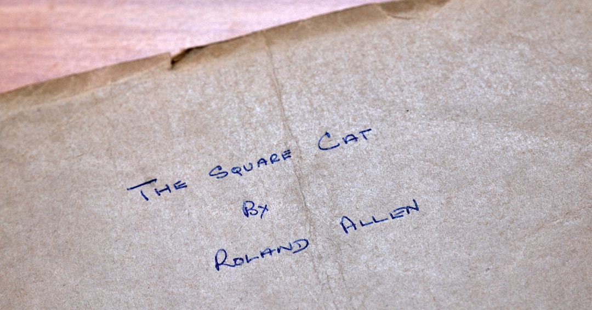
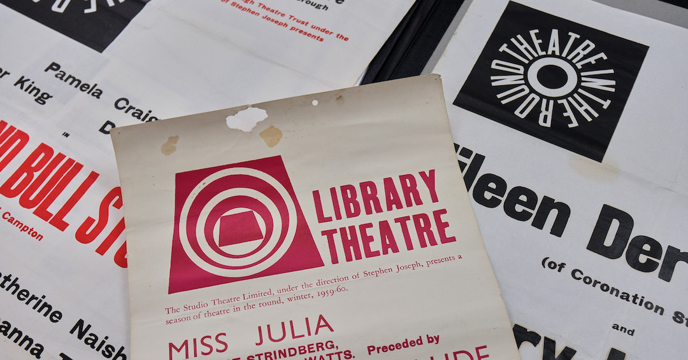

*These pages relate to the Ayckbourn Collection at Scarborough Museums & Galleries. This is a curated collection of material relating to Alan Ayckbourn, Stephen Joseph and the development of theatre in the round in Scarborough donated to the town by the playwright and his archivist, Simon Murgatroyd.*

### The Ayckbourn Collection Catalogue

*Please note, this is currently the basic catalogue and listings. A more detailed catalogue of the Ayckbourn Collection will be available soon.*      

### Related Pages

*Detail from the original manuscript for Alan Ayckbourn first play, The Square Cat, held in the Ayckbourn Collection (© Tony Bartholomew)*

*Details from some of the posters which are part of The Ayckbourn Collection (© Tony Bartholomew)*

   The Ayckbourn Collection pages of Alan Ayckbourn's Official Website have been created in partnership with **[Scarborough Museums and Galleries](http://scarboroughmuseumsandgalleries.org.uk/)**, home of The Ayckbourn Collection since 2023. Facilitated by Simon Murgatroyd M.A. and donated by Sir Alan and Lady Ayckbourn, this collection of material celebrates the contribution of Alan Ayckbourn, Stephen Joseph and theatre in the round to Scarborough's theatrical history and heritage.
