Alan Ayckbourn has had a strong relationship with the National Theatre and was a **[Company Director](/career/national-theatre/nt-company-director)** between 1986 and 1988. The National Theatre is the most important venue Alan Ayckbourn is associated with outside of his home theatre in Scarborough.

These pages look at Alan Ayckbourn's connection with the National Theatre with particular emphasis on his role as **[Company Director](/career/national-theatre/nt-company-director)** from 1986 to 1988. Click on the links above or in the right hand column to access the relevant pages.

To learn specifically about Alan's work as a Company Director at the National Theatre between 1986 and 1988, click **[here](/career/national-theatre/nt-company-director)**.

## Alan Ayckbourn & the National Theatre (1977 - present)

Alan Ayckbourn has been predominantly associated with one theatre during his entire professional career, the Stephen Joseph Theatre in Scarborough, North Yorkshire.

Yet, there is another theatre which has had a profound influence on his work and which he has had an association with for five decades. The National Theatre.

Alan first came to the attention of the National Theatre - or more precisely, its Artistic Director, Peter Hall - in 1973 thanks to the actress Sheila Hancock, who was appearing in the phenomenally successful West End production of *Absurd Person Singular* and who had contacted Hall, asking him to see the acclaimed show.

Hall was impressed by the play and wrote in his diary: “I think Alan Ayckbourn is much more likely to be in the repertoire of the National Theatre in fifty year’s time than most of the current Royal Court dramatists.” Hall wrote to Alan, congratulating him as well as planting the first seeds of him writing a play for the new National Theatre. At this point, construction on the South Bank home of the theatre was still underway with Hall keen for Alan to write a play for the planned opening in 1975.

Hall kept pushing Alan for a play and was particularly taken by his 1974 piece, *Absent Friends*, which he hoped Alan would let him have for the National; unfortunately it was already contracted for the West End. At this point, Alan met Hall for the first time where he agreed to write a new play for the National, thanks to some infamous flattery in which Hall said to Alan

"I met him and he said that classic remark to me: 'Alan, we know full well you can do without the National Theatre, but ask yourself this. Can the National Theatre do without you?' This was one of Peter's wonderful questions which floored me completely. It was only afterwards, when I was walking back home, I thought: 'well, of course, the National Theatre's done very well without me!' He had the effect of putting you bang in centre frame as the most important dramatist in the world at that point."

Later that year, Alan went to view the still under construction National Theatre to appraise the space he was to write for, the end-stage Lyttelton. It was a sobering experience and restored doubts in the playwright’s mind about his suitability. It also led to an arrangement that was essentially unique at this time. Every play - bar one - Alan was commissioned to write for the National Theatre, he was allowed to produce in Scarborough first.

Alan’s first play for the National was *Bedroom Farce* and it premiered at the Library Theatre, Scarborough, on 16 June 1975. Hall read it and wrote it was ‘a bit of a masterpiece.’ A month later he visited Scarborough for the first time to both see the play as well as where and how Alan worked. Both men already had a great deal of mutual respect for each other and Hall was impatient to see Alan - and *Bedroom Farce* - at the National, but delays in building and other issues postponed the production until 1977.

Alan hoped to direct *Bedroom Farce* at the National, but Hall was cautious as he had issues with other writers directing their own work. However, they came to a suitable compromise by agreeing to co-direct the piece. Rehearsals began with Hall directing the first two weeks whilst Alan was still in Scarborough and then stepping aside to direct *Volpone*, leaving Alan to direct the brunt of the show. The play previewed at the Alexandra Theatre in Birmingham before opening at the National on 16 March 1977. The response was above and beyond what anyone expected or hoped for and is regarded as the first bona fide hit at the National Theatre in its new home on the South Bank.

*Bedroom Farce* ran for 30 months at the National Theatre and then in the West End - it would also transfer to Broadway. Inevitably this success led Hall to almost immediately ask Alan for a second play for the National, which Alan was only too pleased to respond to, particularly when Hall offered the largest space in the building, The Olivier.

This has always been one of the enduring appeals to Alan about working at the National, the chance to work on a far larger scale than he could ever do in Scarborough. Alan’s home venue is an intimate theatre-in-the-round space whose audience ranged from 250 at the Library Theatre to 400 in the Stephen Joseph Theatre today. The stage comfortably holds six or so actors. It is Alan’s favourite performance space and he has written the vast majority of his work for it. But he also welcomed the opportunities the National gave him.

In The Olivier, Alan was working on a vast stage that could easily cope with a couple of dozen actors in front of an audience of more than 1,100 people. It was a completely different challenge to Scarborough and enabled Alan to write far larger works.

Alan’s second play for the National was *Sisterly Feelings*, a work which featured a random choice of second and third scenes allowing four permutations of the play. Hall read it whilst in a taxi queue and wrote: “*Sisterly Feelings* is brilliantly, wickedly funny, but the bleakness underlying so much of Alan’s view of life seems in a way to be increasing.”

Again, Alan co-directed the piece - this time with Christopher Morahan - as Hall was still not quite convinced to let Alan loose on his own. Having premiered in Scarborough in 1979, it opened at the National on 3 June 1980 and featured Michael Gambon, who would go on to work with Alan five times at the National with two of those roles would winning him Olivier Awards.

As with *Bedroom Farce*, Alan still had to contend with the National’s critics who deplored the fact that a successful, commercial playwright was being produced by the National despite Hall’s insistence the National’s remit should be to produce the best of everything.

And then came *Way Upstream* - a production whose story could easily fill its own video. Hall had first option of Alan’s new play in 1982 but Alan would not let him read it until it had opened in Scarborough, so nervous was he about the play and its change of direction for him. He needn’t have worried, Hall loved it and optioned it immediately, agreeing that Alan would direct it alone.

*Way Upstream* is, notoriously, a play set on boat on a river. The stage is flooded and the boat appears to float and move along it. It is a bravura piece of theatre with enormous technical challenges. What Alan’s tiny theatre in Scarborough coped with fairly seamlessly though proved to be too much of a challenge for the National.

Staged in the Lyttelton - astonishingly in repertoire - this was a phenomenally ambitious production in which Alan believed all he was told by the production team. He would later admit that away from his trusted team in Scarborough, ‘You can’t assume everyone knows what they’re doing.’ Advice on the technical challenges overcome by Scarborough were ignored by the better resourced, staffed and funded National. A rigid fibre-glass tank was installed, filled with water and on the technical rehearsal on 9 August, the boat collided with the tank and split it with disastrous consequences.

As Hall was away, Alan took the decision to close the entire National Theatre down that night. It was just one of many incidents that plagued the production throughout rehearsals and performance. Opening night was postponed several times from 18 August to 4 October and it made national headlines, achieving a notoriety it would take years to lose.

Despite all this, the play still achieved 75% of capacity and Hall later apologised to Alan for all that had happened. Alan said it was OK with Hall noting that Alan must be the most forgiving man in the world. He also commissioned another play from Alan for the Olivier - although this time set firmly on dry land.

Alan agreed and subsequently wrote his largest cast ever with *A Chorus Of Disapproval* which featured Bob Peck, Michael Gambon and Imelda Staunton in a production which opened on 1 August 1985. It was a phenomenal success and transferred into the West End - the first of Alan’s collaborations to do so since *Bedroom Farce*.

During rehearsals, Hall also made an enquiry which had huge ramifications for Alan. by asking him to come to the National Theatre as a company director.

This was a surprising and significant development. Alan had been Artistic Director in Scarborough since 1972 and associated with the company since 1957. Yet, even he admitted he needed a break to, as he said, recharge his creative batteries. Somewhat surprisingly to Scarborough, Alan agreed to take a two year sabbatical to run a company at the National Theatre.

His assembled a rep company of new and familiar faces from both Scarborough and the National Theatre, including Michael Gambon. Hall asked Alan to direct a play in each of the theatre's three spaces including a new play in The Olivier. For this, he wrote *A Small Family Business*, which premiered in 1987 featuring a massive two-floor house. He also directed Evans & Valentine’s farce *Tons of Money* for the Lyttleton before tackling Arthur Miller’s *A View From The Bridge* for the more intimate Cottesloe space.

This would be the stand-out success of his two years at the National. With Gambon in the lead role of Eddie, Alan crafted a production that has long been regarded as one of the definitive productions of Miller’s play; indeed, Miller himself said it was the best production he had ever seen. It brought recognition for Alan’s directing talents and transferred to the West End to cope with the huge demand to see the show after it achieved 97% capacity at the National.

Alan’s two years at the National were a revelatory success. He actually directed four productions eventually with a massive production of John Ford’s *’Tis Pity She’s A Whore* in the Olivier in 1988 to replace *A View From The Bridge* after it went into the West End. His productions were considered a great success and his reputation as a director - well known in Scarborough for years - was now cemented in London. Recharged, he would return to Scarborough and begin his most ambitious project yet of moving his Scarborough company into a new £5.2m home.

Peter Hall left the National Theatre in 1987 and was succeeded by Richard Eyre. Alan had a completely different relationship with Eyre, as to be expected given how well Hall and Alan had worked together. Eyre didn’t cut ties though with Alan and produced two of his family plays in the Cottesloe, *Invisible Friends* in 1991 and *Mr A’s Amazing Maze Plays* in 1993. Alan believes these productions were important for the National and its development of work for young people as he argued voraciously and passionately that productions for young people should be treated as seriously as those for adults with equal budgeting and strong casts and productions. He followed these up with a co-production between the National and his home theatre, the Stephen Joseph Theatre in the Round, directing an adaptation of Morris Gleitzman's young adult novel, *Two Weeks With The Queen*, which was performed in the Cottesloe in 1994.

Eyre’s successor was Trevor Nunn from 1997 and he facilitated Alan’s most ambitious National Theatre production yet. In 1999, Alan wrote *House & Garden* for the Stephen Joseph Theatre believing it would likely never be staged again. It is two plays running simultaneously with each other with a single cast moving between the plays and stages. Nunn saw it in Scarborough and loved it, pressing hard for a transfer to the National.

Nunn essentially gave Alan the National Theatre for a month during 2000. *House* played in the Lyttelton with *Garden* in the Olivier. Meanwhile, the foyer was extensively remodelled to hold the fete which followed every show and saw actors in character participating with the audience at stalls, games and even enjoying a beer tent! The run practically sold out and on one Saturday, 4,000 people saw an Ayckbourn play at the National Theatre - his largest ever audience in a single venue on the same day.

Nunn would later note that the National had badly needed a financial hit that year and that Alan had essentially saved the venue single-handedly with the phenomenal success of *House & Garden*.

This was Alan’s swansong as a director at the National, although it was not the final production of his works. During 2010, the National staged a revival of his 1982 West End hit *Season’s Greetings* and in 2014, a revival of *A Small Family Business*. In doing so, the National fulfilled a prediction Peter Hall made in 1973, four years before Alan had even had his first play produced at the National.

“I hope one day you will think of writing a play for the National Theatre. Otherwise, you’ll have to wait 40 years until your West End successes are revived here and you have become a classic. This will assuredly happen.”

Alan has always been grateful for the many opportunities Peter Hall and the National Theatre afforded him and the success he has enjoyed there. The National Theatre, indisputably, has played a hugely significant part in Alan Ayckbourn’s career and success as both playwright and director.

*Article by and copyright of Simon Murgatroyd. Please do not reproduce without permission of the copyright holder.*  
**Ayckbourn & The National**

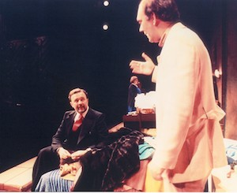

*Peter Hall & Alan Ayckbourn at the National Theatre in 1977.*  
*© National Theatre*

[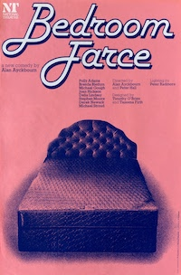](/plays/bedroom-farce)    [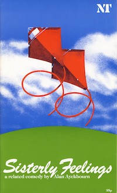](/plays/sisterly-feelings)    [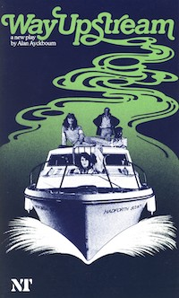](/plays/way-upstream)    [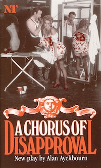](/plays/a-chorus-of-disapproval)    [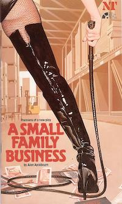](/plays/a-small-family-business)    [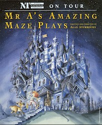](/plays/mr-as-amazing-maze-plays)    [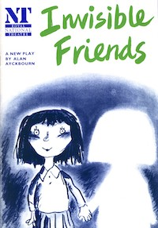](/plays/invisible-friends)    [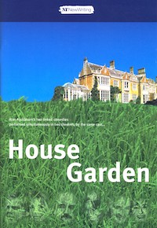](/plays/house-and)    [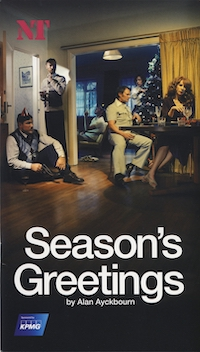](/plays/seasons-greetings)    [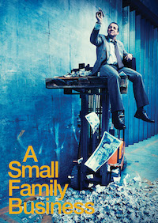](/plays/a-small-family-business)
