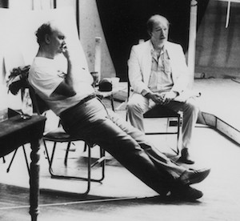
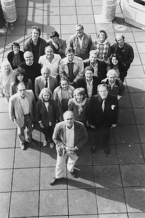
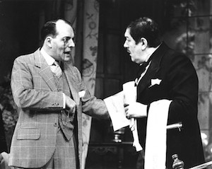
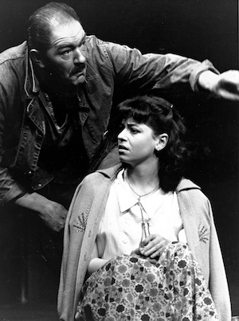
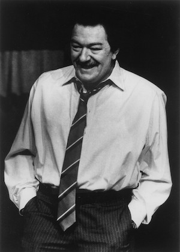
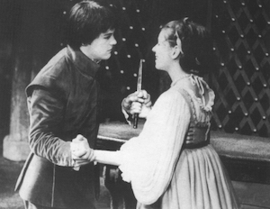

Alan Ayckbourn has had a strong relationship with the National Theatre and was a **[Company Director](/career/national-theatre/nt-company-director)** between 1986 and 1988. The National Theatre is the most important venue Alan Ayckbourn is associated with outside of his home theatre in Scarborough.

This page explores Alan's tenure as a Company Director at the National Theatre between 1986 and 1988 with an article by the playwright himself discussing the experience.

## Company Director at the National Theatre (1986 - 1988)

In 1984, **[Peter Hall](/career/advocates/alan-ayckbourn-advocates/peter-hall)**, the Artistic Director of the National Theatre, asked Alan whether he would consider coming to work at the National Theatre. This followed in the wake of the success of Alan's production of *A Chorus Of Disapproval* at the venue and several other productions at the National Theatre dating back to the London premiere of *Bedroom Farce* in 1977, when Alan directed for the first time in London.

It would not be until 1986 that Alan took up the offer when he agreed to form his own company at the venue for two years, feeling it was both an opportune moment to take a break from Scarborough as well as an extraordinary opportunity to work at the National Theatre and showcase his abilities as a director.

Peter Hall's only provisos were he would stage three plays (which later became four plays) in each of the National's spaces - the Olivier, the Lyttelton and the Cottesloe - and one of them would be a new Ayckbourn play. Alan agreed and formed an acting company, wrote a new play *A Small Family Business* and chose Will Evans & Valentine's Aldwych farce *Tons Of Money* and Arthur Miller's *A View From The Bridge* as his other plays. The success of the latter led to a West End transfer and Alan having to form a new company midway through his time at the National, which led to Peter Hall to ask Alan to direct a fourth play, which saw him chose John Ford's *'Tis Pity She's A Whore*.

As for why Peter Hall asked Alan Ayckbourn to the National Theatre, he famously once said to Alan: "No doubt you can do very well without the National Theatre, but can the National Theatre do without you?" In 2011, he expanded on his reasoning by adding: "Alan I thought was a very good director, but not sure of it himself. I think the test of him coming to the National and the test of me asking hime to come down to the National are both of them pretty dangerous moments, but theatre is like that."  
As for Alan's thoughts about his time at the National Theatre, he wrote of them in the article reproduced below from the Sunday Telegraph in 1988.

For further information about Alan's productions and time at the National Theatre, relevant links can be found in the right hand column.

### Alan Ayckbourn's National Service

by Alan Ayckbourn

It sounds rather rude to say so, since he is not much older than I am, but Peter Hall has always been what I choose to term one of my guardian uncles. During my life there have been several; none, alas, relatives.

He first ‘adopted’ me as a playwright while I was being very successful (and hence, in the eyes of most critics, rather down-market) in the West End. Peter invited me to write something for the newly built, as yet unfinished, National Theatre South Bank building. He suggested the Lyttelton Theatre.

I gazed at the empty concrete shell of the bare theatre. It seemed similar in scale to the Houston Astrodome - though admittedly lacking some of that vast indoor arena’s acoustic intimacy. I was used to working at the time in a 250-seat theatre in the small lecture room of the public library - nobody more than twenty feet from the centre of the action, and to avoid injury would patrons in the front row please keep their feet off the acting area.

So I wrote *Bedroom Farce* for Peter: it seemed to solve the Lyttelton problem by dividing the stage into three smaller stages. The announcement of the play caused a lot of flak. The NT was struggling to establish itself in its new home and was subject to a lot of sniping anyway. If it wasn’t the building, it was the productions. Basically, some critics asked what this temple of the arts was doing, presenting this commercial chappie from the West End. The short answer was that it was trying to bring to the place an audience that normally shied away from temples. It isn’t, in today’s climate, a question people ask; I think I have grown a little more respectable, though that is not what I have striven for. My last play, according to the playbills, was written by the Scarborough Building Society. Nice going, lads, is all I can say.

Peter and I co-directed the production. Later I did *Sisterly Feelings* with the equally avuncular Christopher Morahan, this time for the Olivier.

Then, in 1982, for my first solo voyage, *Way Upstream* which, thanks to an awful lot of flooding (real boat, real water), almost sank without trace. Ruefully wringing out his wellingtons, Peter asked me for another, and it was as a result of the next success, *A Chorus of Disapproval*, that he asked me if l would be interested in taking a longer break from Scarborough. He had recently formulated the idea of dividing the National into separate companies.

Would I like to form a group of my own? After twenty-five years, it struck me that a short break from Scarborough, and the Stephen Joseph Theatre-in-the-Round there, might not be a bad idea.

My terms of reference were generous and wide. Three plays, including a new one of my own for the Olivier; and, preceding that, one in the Lyttelton and another in the Cottesloe. The rest - casting, choice of plays - was left up to me.

I started by inviting Michael Gambon out to lunch to see if he would be interested and, if so, what plays he would fancy doing. We are both men of few words and large appetites. Before the soup had hit the table we had fixed the season and set about the serious business of downing the minestrone. We settled on Miller’s *A View From The Bridge* (which worried Michael a little because he seemed to recall that the hero had an awful lot of lines) and the 1925 Aldwych farce, *Tons Of Money*. This latter was much more to Michael’s taste as he was to play the supporting role of the butler, Sprules, with very few lines indeed; besides which, he had played the part before in a studio production and thought he could remember it. My own new play, after our long association together (since 1974 and *The Norman Conquests*), he agreed to take on trust. The NT contracts department was later quite incredulous. It must have been one of the few instances of a leading actor signing a contract for a play he hadn’t read and a part without a name. Gambon is no ordinary star.

After Gambon’s genuine ‘company’ approach agreeing to big and small parts - it was much easier to approach other actors and persuade them to do likewise. We stood a far better chance now of assembling a real company and not a West End two-stars-and-then-the-rest-of-them affair. Before assembling the rest of the company, though, I had the awesome challenge of writing my own new play.

I came up with a *A Small Family Business*. With its doll’s house set on two floors, it was really the first play I had written that could not be staged in the round at Scarborough. It is what I term a light-heavyweight piece. In the Olivier it is difficult to do ethereal plays with delicate messages conveyed by eyebrows; I think you need something with a bit of clout. It was good, as I started to build the company, to bring in actors who had worked with me over the years in Scarborough, many of whom had worked for so long and so hard up there for so little, but all of whom understood and. supported the company system. A critic said recently that the acting team seem to bat all the way to number eleven. We also bowl a bit, too. Mind you, we had out moments.

Like discovering, as we explored the text more carefully, that *Tons of Money* - to the modern ear and eye - was totally illogical in places. Whatever logic the play had once had seemed to have died with Tom Walls, Ralph Lynne and Yvonne Arnaud. When you tackle a farce you really earn your money. And the problem is that, beyond a certain level, you can rehearse no further until you have had an audience in to tell you what is funny. We did the equivalent of two weeks work over six weeks in the rehearsal room and then gained six weeks’ experience over nine preview performances in the theatre. Thus, while Gambon contented himself with slowly transforming Sprules the butler into Quasimodo, Diane Bull was developing something equally magical and bizarre as his bent kneed, myopic, parlour maid fiancee and Polly Adams, as the bemused wife, was holding the whole show impeccably together.

*A View From The Bridge* was almost a holiday by comparison. Being a Cottesloe production (and thus a lower budget) we were obliged to rehearse in church halls in freezing February. We assembled for rehearsal as late as we dared and went home as quickly as we could. Suzan Sylvester, who played the daughter Catherine fell and damaged her knee and rehearsed with a limp for a bit. We contemplated doing Williams’s *Glass Menagerie* with its crippled heroine instead but she got better.

We were into previews of *A Small Family Business* before the next disaster occurred. We were doing some tidying up sort of rehearsals one after noon. Gerald Scarfe was sitting in the stalls sketching away bringing out the less fortunate features of Michael Gambon and myself when Michael tripped on a backstage cable severely damaging his ankle. Being the man he is, we stood around for some moments enjoying this latest example of his sense of humour A few seconds later we realised how serious the injury was. He insisted on playing that night, a sort of one legged hopping performance We watched in horror as he turned grey and then yellow with pain. On the following was back again expecting to play. By now the pain of walking was so intense that it was actually difficult to make out what he was saying. Blessedly he agreed to go home. I sought out the understudy Allan Mitchell to inform him that he was to take on Gambon’s huge role that night I found him running his lines appropriately in the NT’s quiet room, an area generally reserved for meditation and prayer. Mitchell took over brilliantly but the official opening was delayed until Gambon’s return.

The first family broke up after a year - ironically the victim of its own success. Because *A View From The Bridge* was such an immensely popular show it became inevitable that it should transfer from a small theatre - which it did, in November 1987, to the Aldwych Theatre For those members of the company who left the National, starting with an Aldwych farce and finishing at the theatre itself, it was a case of almost full circle.

*A Small Family Business* was re-cast, with Stephen Moore (another frequent collaborator of mine from *Bedroom Farce* days) replacing Michael.  
Peter Hall, again, suggested that I might like to do another production, especially since this new group - with the departure of Bridge and the disappearance of *Tons* from the repertoire - would only have *Family Business* in its repertoire.

I looked around for another piece for the Olivier. Something big. Something gutsy. My associate artistic director in Scarborough, Robin Herford, who is far better read than I am, suggested *’Tis Pity She’s a Whore*. I liked it a lot. It is surprisingly simple and it is also about people I recognize (no dukes, no royalty): corrupt businessmen and difficult teenagers. There is a lot of blood and by the end of the evening very few characters left alive. We are doing it in period. I think you have to be very experienced (or bored) before you choose to clothe everyone in polythene bags and set them on a World War II bomb site: it is hard enough just doing the play.

Besides, I hate monkeying around with other people’s plays. I like to think that John Ford wouldn’t have gone around putting gratuitous murders into *How The Other Half Loves* either. It is a great company play with everyone getting a look in (before they die) and it reads very fast - less than two hours. A classical play with lots of action with a playing time of around two hours. Everyone in the pub by 9.30pm. What more could you ask for?

I suppose if you work in one place for any length of time, as I have in Scarborough, you begin to wonder if you can manage anywhere else. And faced with an auditorium like the Olivier, vou feel - as you would with the man himself - that this is the one to beat. If you can grab and hold an audience in a space that size... Bob Peck once described how, when a big laugh came in that theatre, it was like a shock wave breaking across the stage. The first time he experienced the volume of sound, he involuntarily took a step backwards.

I suppose what I have got from my time at the National Theatre is the excitement of playing in the big league. And a good deal of fun. I have proved to myself that I can play away from Scarborough and win. This time I have to prove that I can take up the reins again after two years. I think the board there expected that once I had gone they would never see me again. Well, I’m going back. l can’t say how things will be once I am there, but they are bound to be different: I dare say we are all in for a few surprises. I hope so.

*(This article was first published by the Sunday Telegraph on 21 February 1988).*

*Peter Hall & Alan Ayckbourn at the National Theatre in 1977.  
© National Theatre*

*Alan Ayckbourn & Michael Gambon during rehearsals at the National Theatre.  
© National Theatre*

*Alan Ayckbourn with his National Theatre company in 1986.  
© National Theatre*

*Simon Cadell & Michael Gambon in Tons Of Money.  
© National Theatre*

*Michael Gambon & Suzan Sylvester in A View From The Bridge.  
© National Theatre*

*Michael Gambon in A Small Family Business.  
© National Theatre*

*Rupert Graves in 'Tis Pity She's A Whore.  
© National Theatre*
