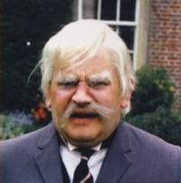

This page contains details of Alan Ayckbourn screen-writing contribution to Ronnie Barker's television series *Hark At Barker*.

### Television (1969 - 1970)

**Broadcast (first series):**  
9 April 1969  
**Broadcast (second series):**  
9 July 1970  
**Channel:** ITV  
**Duration:** 30mins

**Production:** LWT

**Availability  
Video:** Not available  
**DVD (R2):** 2008 (deleted)  
**Blu-ray:** Not available  
**Digital:** Not available  **Director**

**Character**  
Lord Rustless  
Mildred Bates  
Dithers  
Cook  
Badger  
Effie  Maurice Murphy

**Actor**  
Ronnie Barker  
Josephine Tewson  
David Jason  
Mary Baxter  
Frank Gatiff  
Moira Foot

*Ronnie Barker as Lord Rustless  
(Copyright: LWT)*

### Alan Ayckbourn & Hark At Barker

In 1964, *Mr Whatnot* became the first Ayckbourn play to transfer to London's West End. It starred Ronnie Barker as Lord Slingsby-Craddock, who would soon afterwards start on a path which would see him become one of the UK's most popular and well-remembered television comedians.

*Mr Whatnot* was a disaster; it was mauled by the critics and had the shortest run of any Ayckbourn play in the West End (shorter even than Alan's most notorious flop *Jeeves*). The bitter taste of its failure and the resoundingly negative reviews led Alan to make a decision to leave theatre and get a job at the BBC as a radio drama producer, based in Leeds. He would still write and direct the occasional play, but his full time employment between 1965 and 1970 was with the BBC. However, while *Mr Whatnot* might initially have made no waves in the theatre, it obviously had some impact with Ronnie Barker.

In 1969, Ronnie Barker's second television series was commissioned, *Hark At Barker* (following *The Ronnie Barker Playhouse* in 1968). It was a sketch show based around one of Barker's most famous creations Lord Rustless, an incomprehensible, cigar-smoking and sex-obsessed member of the aristocracy who lived at the stately home Chrome Hall. The character was so popular it would recur in the BBC series *His Lordship Entertains* and essentially re-appeared in *Futtock's End* and in several sketches for the popular comedy series *The Two Ronnies*; the character also appeared once in *The Ronnie Barker Playhouse*.

The character, according to Barker (see below) was unashamedly based on Lord Slingsby-Craddock from *Mr Whatnot* and when it came to *Hark At Barker*, the comedian approached Alan to write some material for the show. Alan was under contract at the BBC and not allowed to write for other organisations (and definitely not the BBC's competitor ITV!). However, he agreed to write material for the show under the pseudonym of Peter Caulfield. The show had a similar format each week with Barker first introducing the episode as a continuity announcer before switching to Lord Rustless at Chrome Hall, who would pontificate on a chosen subject for the week frequently interspaced with comedy sketches.

Surviving shooting scripts from the television series credit Peter Caulfield as the show's main writer with notable comedy writers such as Eric Idle, Graeme Garden, Bill Odie and Barker himself (writing under the pseudonym Gerald Wiley) contributing to the sketches. Without a doubt though, each show is built around Rustless and his household.

*Hark At Barker* ran for two series between 1969 and 1970 with Alan writing for every episode of both series. With the exception of his only screenplay, *Service Not Included*, this remains to date the only time that Alan has written specifically for television.

The show was BAFTA nominated in 1970 but Alan couldn't attend the ceremony due to the fact he was breaking his BBC contract by writing for *Hark At Barker.*

### Ronnie Barker on Alan Ayckbourn's involvement with Hark At Barker

"That \[*Mr Whatnot*\] was done at the Arts Theatre. It was about a piano-tuner who never spoke. I don't know if he was dumb, he was a young man, Chaplin-esque really, because a lot of it was physical. And everything was done without props. It was a very strange piece, it was lovely. Very funny. Certain props, action props, were left out. We had a tennis match on the stage and there was no ball. It took a lot of rehearsing. I was the umpire and at one point I'd picked up a newspaper and was reading it and Alan, who was directing, said it would be nice if the ball hit that paper. And I said, "Well, why doesn't it split it right down the middle?" It got a very good laugh. It was very strange and quite surreal. A bit *Alice in Wonderland* in places - we were having a picnic in the garden and suddenly war broke out, we were attacked by the enemy and we were lobbing buns over the hedge. No props of course."

Ask Barker if the role of Lord Slingsby-Craddock was a prototype for one of his most enduring creations, Lord Rustless, and he answers the question before it's finished.

"Yes he was. Absolutely. He was Lord Rustless mark one, definitely. I did a character at Oxford rep and it was a part that was supposed to be done by a woman and Frank Shelley, who was running Oxford rep and was God there, said, "No we won't play it as a woman, because we haven't any women. Ronnie, you can play it as an old man." So I started doing this old chap and it was very successful and it worked very well. That character stayed at the back of my mind and he became Lord Rustless, because I enjoyed playing him so much. He's also in *The Picnic* and *By the Sea*, but he just mutters in those. He's not called Lord Rustless, no-one's called anything. But to me he was Rustless. He was one of my favourite characters. When I did *Hark at Barker* - that was him, albeit with sketches. Alan Ayckbourn wrote all the links for that show but I don't think he admits it. He called himself Peter Caulfield, but I don't know whether he would like people to know that was him or not. He liked the character in *Mr Whatnot*, so he knew what the character was about. Rustless was really giving a lecture to the audience on a subject, such as "communication" or "servants" or something and he would illustrate it with sketches, which enabled me to pay lots of different parts.'  
*(extract from The Authorised Biography Of Ronnie Barker, Bob McCabe, BBC Books, 2004)*

### Alan Ayckbourn on Hark At Barker

“I was working for the BBC and *Hark at Barker* was a commission from commercial television. That was way outside my contractual obligations! I had to keep it very secret, so I wrote it under a pseudonym.  
“As it happens, the show was very successful. Ronnie \[Barker\] said ‘We’re up for a BAFTA, can you make it to the ceremony?’. I said ‘Ron, you’ll have to go without me. If I appear in front of a television camera I’m going to be fired from the Beeb. They’ll say What are you doing? You’re in complete breach of contract’. We’d made up this ridiculous story about Peter Caulfield being a reclusive writer who lived in Scotland and was very shy of publicity. I’ll never forget Peter Caulfield. He had a short, successful career. I’m sure people have been looking for him ever since: ‘Do you think Peter Caulfield would write another show for us?'’’  
*(Big Issue North, September 2022)*

*All research for this page is by Simon Murgatroyd and should not be reproduced without permission.*
