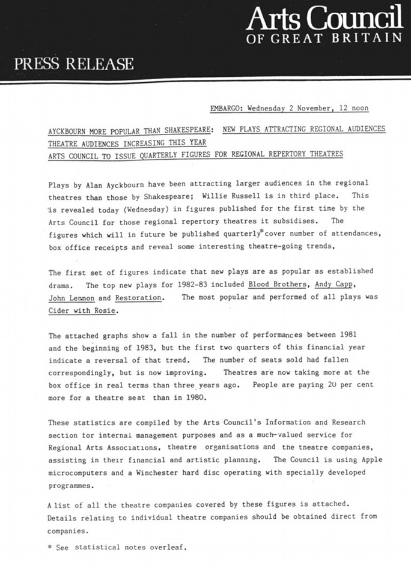

The press release printed below was issued by the Arts Council of Great Britain in 1983 and was the first poll of its sort that gave official credence to the popularity of Alan Ayckbourn's work. Also reprinted are a contemporary news report from The Times and a cartoon from the Sunday Mirror.

