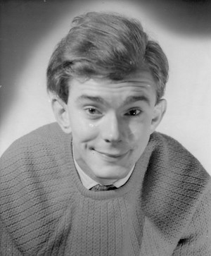

**[\<\<\< Previous page](/life/chronology/pre-1955)**

**[Next page \>\>\>](/life/chronology/1957)**

### Notable Events

During 1956, Alan Ayckbourn…

**○** toured eastern USA and Canada in a Haileybury school production of ***[Macbeth](/career/actor/macbeth)***, in which he played Macduff.

**○** left Haileybury with two 'A' Levels.

**○** first professional **[acting](/career)** job with Sir **[Donald Wolfit](/career/actor/donald-wolfit)**'s company at the Edinburgh Festival for three weeks with ***[The Strong Are Lonely](/career/actor/the-strong-are-lonely)***.

**○** worked as a volunteer student Assistant Stage Manager at **[Connaught Theatre](/career/actor/connaught-theatre)**, Worthing, gaining experience in various aspects of theatre and acting.

<aside>

</aside>

### Professional Acting

**○ *The Strong Are Lonely***  
(Sentry)  
Edinburgh Festival  
**○ *The Corn Is Green***  
(Unknown role)  
Connaught Theatre, Worthing  
**○ *It's A Wise Child***  
(Unknown role)  
Connaught Theatre, Worthing
