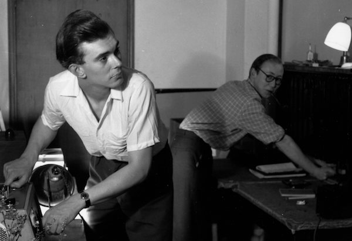

**[\<\<\< Previous page](/life/chronology/1956)**

**[Next page \>\>\>](/life/chronology/1958)**

### Notable Events

During 1957, Alan Ayckbourn…

○ worked at **[Connaught Theatre](/career/actor/connaught-theatre)**, Worthing, as an student Assistant Stage Manager and with the **[Leatherhead Theatre Club](/career/actor/connaught-theatre)**.

○ saw theatre-in-the-round for the first time with a performance of *Huis Clois* by **[Stephen Joseph](/life)**'s Studio Theatre company at the Mahatma Gandhi Hall, London, on 14 April. This marked his first encounter with the company he will be associated with for the majority of his life.

○ joined Studio Theatre Ltd at **[Theatre in the Round at the Library Theatre](/career/ayckbourn-and-the-sjt/sjt-venues/theatre-in-the-round-at-the-library-theatre)**, Scarborough, for the summer season as a stage manager and **[actor](/career)**.

○ joined **[Oxford Playhouse](/career/actor/connaught-theatre)** for the winter season.

○ wrote a number of unproduced plays (between 1957 and 1959) which included: ***[The Season](/plays/childrens-plays-index/early-writing-plays)***; ***[Relative Values](/plays/childrens-plays-index/early-writing-plays)***; ***[Mind Over Murder](/plays/childrens-plays-index/early-writing-plays)***; ***[The Party Game](/plays/childrens-plays-index/early-writing-plays)***. Most of these plays are now lost and none have been performed.

### Professional Acting

○ ***Flare Path*** (Percy)  
Leatherhead Theatre Club  
○ ***The Happiest Days Of Your Life*** (Hopcroft Mi)  
Leatherhead Theatre Club  
○ ***The Rainmaker*** (Jim Curry)  
Leatherhead Theatre Club  
○ ***South Sea Bubble*** (Sanyamo)  
Leatherhead Theatre Club  
○ ***She Stoops To Conquer*** (Roger)  
Leatherhead Theatre Club  
○ ***An Inspector Calls*** (Eric Birling)  
The are in the Round at the Library Theatre, Scarborough  
○ ***The Ornamental Hermit*** (Jack Bensted)  
Theatre in the Round at the Library Theatre, Scarborough  
○ ***Under Milk Wood*** (First Drowned / Willy Nilly)  
Oxford Playhouse  
○ ***Life With My Father*** (John)  
Oxford Playhouse  
○ ***Mademoiselle Jaire*** (Carpenter's Apprentice)  
Oxford Playhouse
