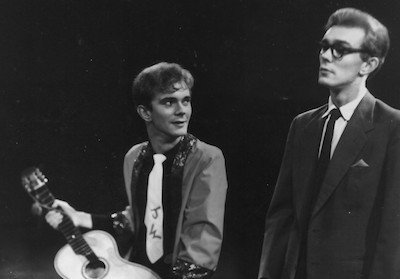

**[\<\<\< Previous page](/life/chronology/1958)**

**[Next page \>\>\>](/life/chronology/1960)**

### Notable Events

During 1959, Alan Ayckbourn…

○ wrote his first professionally produced play, ***[The Square Cat](/plays/the-square-cat)***, which opened at **[Theatre in the Round at the Library Theatre](/career/ayckbourn-and-the-sjt/sjt-venues/theatre-in-the-round-at-the-library-theatre)**, Scarborough, on 30 July. It was written under the pseudonym Roland Allen and directed by **[Stephen Joseph](/life)**.

○ took the lead role in *The Square Cat*, which was largely written to showcase his talents as an actor and featured him in a dual role of pop star Jerry Wattis and mild-mannered Arthur Brummage.

○ played Stanley in **[Harold Pinter](/life/influences/harold-pinter)**'s self-directed second production of ***[The Birthday Party](/career/actor/acting-alan-ayckbourn-in-harold-pinters-the-birthday-party)***, which toured with Studio Theatre Ltd to Birmingham and Leicester. The experience had a profound and influential effect on his future career and writing.

○ married the actress Christine Roland at Chelsea Old Church on 9 May.

○ and Christine had their first son, Steven.

○ was called up for National Service assessment, scoring 1/100; a ploy to avoid National Service flawed only by the fact his academic record was outstanding! He would be called for - a short-lived - National Service in 1960.

○ was commissioned to write a second play, ***[Love After All](/plays/love-after-all)***, for the 1959 winter season at the Theatre in the Round at the Library Theatre, following the success of *The Square Cat*. National Service prevented him taking the lead role as he had hoped.

### World Premieres

○ ***The Square Cat***  
30 July: Theatre in the Round at the Library Theatre, Scarborough  
○ ***Love After All***  
21 December: Theatre in the Round at the Library Theatre, Scarborough

### Professional Acting

○ ***The Birthday Party*** (Stanley)  
Studio Theatre Ltd tour  
○ ***Bell, Book & Candle*** (Nicholas Holroyd) \*  
○ ***Easter*** (Elis) \*  
○ ***Frankenstein*** (Henri) \*  
○ ***The Square Cat*** (Jerry Wattis / Arthur Brummage) \*  
\* Theatre in the Round at the Library Theatre, Scarborough

