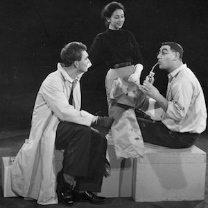

**[\<\<\< Previous page](/life/chronology/1959)**

**[Next page \>\>\>](/life/chronology/1961)**

### Notable Events

<aside>

*Alan Ayckbourn with Stephen Joseph*

</aside>

During 1960, Alan Ayckbourn…

○ did his National Service at RAF Cardington, Bedfordshire, in January; but was signed out after just two days.

○ returned to **[Theatre in the Round at the Library Theatre](/career/ayckbourn-and-the-sjt/sjt-venues/theatre-in-the-round-at-the-library-theatre)**, Scarborough, to join the winter (January - March) tour; became a permanent member of the company between 1960 and autumn 1962.

○ rewrote and starred in ***[Love After All](/plays/love-after-all)***, which had been premiered the previous December. Revived for the summer, the new director - Julian Herington - asked for substantial alterations to the play's setting and characters.

○ wrote first his family play, ***[Dad's Tale](/plays/dads-tale)*** - a notorious box office flop which is never produced again. It was directed by Clifford Williams with Alan playing seven roles.

○ wrote ***[Double Hitch](/plays/double-hitch)*** for the amateur Scarborough Theatre Guild.

### World Premieres

○ ***Dad's Tale***  
19 December: The Library Theatre, Scarborough  
○ ***Double Hitch*** ('Grey' play)  
Date unknown: The Library Theatre, Scarborough

### Notable Ayckbourn Productions

○ ***The Square Cat*** (Tour)  
9 February: Studio Theatre tour  
○ ***Love After All*** (Revival)  
30 June: The Library Theatre, Scarborough

### Professional Acting

○ ***Then...*** (Mr Phythick)  
Studio Theatre tour  
○ ***Viennese Interlude*** (Franz) \*  
○ '***Prentice Pillar*** (Prentice) \*  
○ ***Wuthering Heights*** (Heathcliff) \*  
○ ***Love After All*** (Peter Jones) \*  
○ ***The Ark*** (Japheth) \*  
○ ***Soldier From The Wars Returning*** (The Barman) \*  
○ ***Five Finger Exercise*** (Walter Langer) \*  
○ ***Dad's Tale*** (Various roles) \*  
\* Theatre in the Round at the Library Theatre, Scarborough
