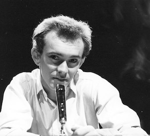

**[\<\<\< Previous page](/life/chronology/1962)**

**[Next page \>\>\>](/life/chronology/1964)**

### Notable Events

<aside>

*Alan Ayckbourn in The Rainbow Machine*

</aside>

During 1963, Alan Ayckbourn…

○ **[directed](/career/directing-career)** one of his own plays for the first time with a revival of ***[Standing Room Only](/plays/standing-room-only)*** at the **[Victoria Theatre](/career/victoria-theatre)**, Stoke-on-Trent.

○ directed the world premiere of one of his own plays for the first time with ***[Mr Whatnot](/plays/mr-whatnot)*** at the Victoria Theatre, Stoke-on-Trent.

○ directed a revival of *Standing Room Only*, which was credited as a play by Alan Ayckbourn - rather than the pseudonym Roland Allen to whom it was originally credited. As result, *Standing Room Only* is considered the earliest play to be attributed to Alan Ayckbourn.

○ had *Standing Room Only* optioned for a television play for ITV's *Armchair Theatre*; the play is never produced.

### Quotes

"I don't make a lot of money writing plays; in fact this one \[*Mr Whatnot*\] is the first I have sold. But I enjoy it and being an actor it helps me to understand playwriting from an actor's point of view."  
*(The Times, 20 November 1963)*

### World Premieres

○ ***Mr Whatnot***  
12 November: The Victoria Theatre, Stoke-on-Trent

### Professional Directing

○ ***Mr Whatnot*** \*  
○ ***Standing Room Only*** \*  
○ ***The Referees*** \*  
○ ***The Mating Season*** \*  
○ ***The Rainbow Machine*** \*  
○ ***Miss Julie*** \*

### Professional Acting

○ ***Teds's Cathedral***  (Anderson) \*  
○ ***The Rehearsal*** (The Count) \*  
○ ***Waiting For Godot*** (Vladimir) \*  
○ ***An Awkward Number*** (Robert) \*  
○ ***A Man For All Seasons*** (Thomas More) \*  
○ ***The Rainbow Machine*** (Jordan) \*  
○ ***Miss Julie*** (Jean) \*  
○ ***Two For The Seesaw*** (Jerry Ryan) \*  
○ ***The Dumb Waiter*** (Ben) \*  
○ ***The Collection*** (Harry) \*  
○ ***Gaslight*** (Mr Manningham) \*  
○ ***The Caretaker*** (Aston) \*  
○ ***The Prisoner*** (The Interrogator) \*  
\* The Victoria Theatre, Stoke-on-Trent
