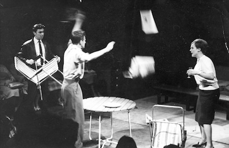

**[\<\<\< Previous page](/life/chronology/1964)**

**[Next page \>\>\>](/life/chronology/1966)**

### Notable Events

During 1965, Alan Ayckbourn…

○ began work as a Radio Drama Producer for the **[BBC](/career/bbc-career)**, based at Leeds. He worked closely with the producer **[Alfred Bradley](/life/influences/bradley-alfred)** and directed more than 50 radio plays during his first year.

○ wrote ***[Meet My Father](/plays/relatively-speaking)*** (subsequently retitled *Relatively Speaking*) for **[Theatre in the Round at the Library Theatre](/career/ayckbourn-and-the-sjt/sjt-venues/theatre-in-the-round-at-the-library-theatre)**, Scarborough, whilst still working for the BBC. It was written at **[Stephen Joseph](/life)**'s suggestion to write a 'well-made play'. The world premiere was directed by Stephen Joseph.

○ saw Theatre in the Round at the Library Theatre apparent permanently close at the end of the summer season, during which his most influential mentor and father figure Stephen Joseph had been diagnosed with cancer. The reason for the closure was given as lack of support from the Town Council, but the theatre manger Ken Boden made plans for an amateur season for 1966 whilst long-term possibilities were considered.

### World Premieres

○ ***Meet My Father*** (retitled: *Relatively Speaking*)  
8 July: Theatre in the Round at the Library Theatre, Scarborough

*A scene from the world premiere of Meet My Father*
