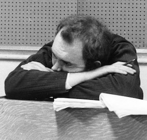
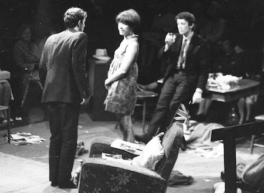

**[\<\<\< Previous page](/life/chronology/1966)**

**[Next page \>\>\>](/life/chronology/1968)**

### Notable Events

<aside>

</aside>

During 1967, Alan Ayckbourn…

○ mourned the loss of **[Stephen Joseph](/life)**, theatre pioneer and his most significant mentor and inspiration, who died from cancer on 5 October in Scarborough.

○ wrote ***[The Sparrow](/plays/the-sparrow)*** for **[Theatre in the Round at the Library Theatre](/career/ayckbourn-and-the-sjt/sjt-venues/theatre-in-the-round-at-the-library-theatre)**, Scarborough, which had reopened as a professional producing venue as a result of the Town Council offering financial support. This marked the first time he would **[direct](/career/directing-career)** the world premiere of one of his own plays in Scarborough. Subsequently he has directed the world premiere of all of his plays.

○ had his first West End hit when ***[Relatively Speaking](/plays/relatively-speaking)*** opened at the Duke Of York's Theatre, London, starring Celia Johnson, Michael Aldridge and Richard Briers.

○ had his first television exposure when a 50 minute extract from the West End production of *Relatively Speaking* was broadcast on BBC1.

○ was nominated for the Italia Prize for his radio production of Don Haworth's ***[There's No Point In Arguing The Toss](/career/bbc-career/bbc-radio-productions/theres-no-point-in-arguing-the-toss)*** for **[BBC](/career/bbc-career)** Radio.

### World Premieres

○ ***The Sparrow***  
13 July: Theatre in the Round at the Library Theatre, Scarborough

### Notable Ayckbourn Productions

○ ***Relatively Speaking*** (West End premiere)  
29 March: Duke Of York's Theatre, London

### Professional Directing

○ ***The Sparrow***  
Theatre in the Round at the Library Theatre, Scarborough

### Plays In Other Media

○ ***Relatively Speaking***  
Television: 21 July, BBC1

