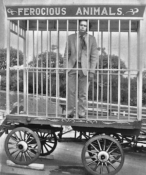

**[\<\<\< Previous page](/life/chronology/1969)**

**[Next page \>\>\>](/life/chronology/1971)**

### Notable Events

<aside>

</aside>

During 1970, Alan Ayckbourn…

○ resigned from the **[BBC](/career/bbc-career)** as a radio drama producer to concentrate on his playwriting career.

○ was appointed **[Director Of Productions](/career/artistic-director)** at **[Theatre in the Round at the Library Theatre](/career/ayckbourn-and-the-sjt/sjt-venues/theatre-in-the-round-at-the-library-theatre)**, Scarborough for the summer season.

○ saw the West End premiere of ***[How The Other Half Loves](/plays/how-the-other-half-loves)*** open at the Lyric Theatre starring Robert Morley. It was a huge success, but played a significant part in him being incorrectly labelled as a farceur for many years.

○ directed ***[Relatively Speaking](/plays/relatively-speaking)*** for the first time with an amateur production in Leeds for Leeds Arts Theatre.

### World Premieres

○ ***The Story So Far...*** (retitled *Family Circles*)  
20 August: Theatre in the Round at the Library Theatre, Scarborough

### Notable Ayckbourn Productions

○ ***Relatively Speaking*** (Revival) \*  
14 April: Leeds Civic Theatre  
○ ***How The Other Half Loves*** (West End premiere)  
5 August: Lyric Theatre

\* Amateur production directed by Alan Ayckbourn

### Professional Directing

○ ***The Story So Far…*** \*  
○ ***The Shy Gasman*** \*  
○ ***Wife Swapping - Italian Style*** \*

\* Theatre in the Round at the Library Theatree, Scarborough

### Quotes

"I started as a *farceur*, people really did lose their trousers. The light comedy style has evolved out of my own capabilities, my own particular experiences - which happens to be complicated relationships. And other people's are even more funny, so I try to help them laugh about it."  
*(The Guardian, 7 August 1970)*

"I'd like to finish up writing tremendously human comedies - Chekhovian comedy in a modern way."  
*(The Guardian, 7 August 1970)*

"Light comedy must be recognisable to people in the street. The difficulty is to make it relevant and still funny."  
*(The Guardian, 7 August 1970)*

"My output's too low. I'm pathologically lazy. I only write one a year and if that happens to flop…"  
*(The Guardian, 7 August 1970)*

"Until very recently, the fairest advice one could offer a would-be playwright who was contemplating writing his first play for the theatre was 'don't if you can possibly avoid it'. The odds against getting a production at all, let alone a successful one, were formidable. For the author lucky enough to land a repertory production the financial rewards were even bleaker, in most cases. If he could recoup the cost of script duplication and typewriter ribbons he was doing well."  
*(The Author, 1970)*

"It's in the comparative peace and calm of the provinces that the bulk of serious new work has to be carried out. This is not to presume that theatres in smaller county towns haven't got their own problems but the advantage they do have, if they're doing anything like a worthwhile job, is a positive, sometimes very personal, relationship with their audience."  
*(The Author, 1970)*
