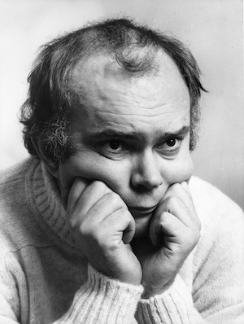

**[\<\<\< Previous page](/life/chronology/1973)**

**[Next page \>\>\>](/life/chronology/1975)**

### Notable Events

<aside>

</aside>

During 1974, Alan Ayckbourn…

○ was named Playwright Of The Year by the Variety Club Of Great Britain.

○ wrote his first - and only - produced screenplay, ***[Service Not Included](/plays/service-not-included)***, broadcast on 20 May on BBC2.

○ premiered two plays at **[Theatre in the Round at the Library Theatre](/career/ayckbourn-and-the-sjt/sjt-venues/theatre-in-the-round-at-the-library-theatre)**, Scarborough, with ***[Absent Friends](/plays/absent-friends)*** and ***[Confusions](/plays/confusions)***; the latter written to launch the theatre's first winter and touring seasons since the early 1960s.

○ threatened to quit Scarborough as a result of the County Council turning down a request to extend Theatre in the Round at the Library Theatre's season to 40 weeks a year; much of this comes from an attempt to re-open the Opera House theatre in the town and a conflict of interest with a County Councillor working on the same project.

○ saw ***[The Norman Conquests](/plays/the-norman-conquests)***, directed by Eric Thompson, open at the Greenwich Theatre having received little interest from the West End. The success of the Greenwich production led to the producer Michael Codron transferring it into The Globe for an acclaimed run in the West End.

○ saw ***[Absurd Person Singular](/plays/absurd-person-singular)***, again directed by Eric Thompson, open on Broadway. It goes on to become his longest running play in New York.

○ won his first Evening Standard Award for Best Play for *The Norman Conquests*, which also won the Play & Players Awards for Best Play.

○ was approached by **[Peter Hall](/life/influences/hall-sir-peter)**, Artistic Director of the **[National Theatre](/career/national-theatre)**, to write a play for the soon-to-open new South Bank home of the company. This would eventually result in ***[Bedroom Farce](/plays/bedroom-farce)***opening at the NT during 1977.

○ had his first dedicated television documentary with *Alan Ayckbourn* on BBC2 and he is also featured in ITV's *Aquarius*.

○ was a guest on the popular BBC Radio 4 programme, *Desert Island Discs*.

○ saw *Absurd Person Singular* published by Samuel French.

### World Premieres

○ ***Service Not Included***  
20 May: BBC2 (television screenplay)  
○ ***Absent Friends***  
17 June: Theatre in the Round at the Library Theatre, Scarborough  
○ ***Confusions***  
30 September: Theatre in the Round at the Library Theatre, Scarborough

### Notable Ayckbourn Productions

○ ***Time & Time Again*** (Tour)  
18 March: UK tour produced by Cameron Macintosh  
○ ***The Norman Conquests*** (London premiere)  
9 May: The Globe Theatre, London  
○ ***The Norman Conquests*** (West End premiere)  
1, 5, 8 August: The Globe Theatre, London  
○ ***Absurd Person Singular*** (New York premiere)  
8 October: Music Box Theater, New York

### Professional Directing

○ ***Confusions*** \*  
○ ***Absent Friends*** \*  
○ ***Albert*** \*  
○ ***Black Comedy*** \*  
○ ***Away From It All*** \*  
○ ***The Breadwinner*** \*  
○ ***But Fred, Freud Is Dead*** \*  
○ ***Frost At Midnight*** \*  
\* Theatre in the Round at the Library Theatre, Scarborough

### Plays In Other Media

○ ***Service Not Included***  
Television: 20 May, BBC2

### Awards

○ Evening Standard Award For Best Play  
*The Norman Conquests*  
○ Plays & Players Best Play Award  
*The Norman Conquests*  
○ Variety Club Playwright Of The Year

### Quotes

"It was an appallingly cynical start \[to his marriage\]. My wife Christine and I were both acting in rep and one week we were playing in Leicester where the bookings were very thin. The company manager had this bright idea. 'We need a good publicity stunt,' he said. 'Now, we've seen you two in the back of the van a few times, so why not announce your engagement. It would be wonderful for the papers.' So we duly got engaged and there was this lovely photo on the front page of the local rag saying 'Actors find love in Leicester'. The plan was that we should get 'disengaged' when we got to Newcastle, but somehow we never got round to it. We got married instead."  
*(Cosmopolitan, June 1974)*

"At the start I was too insecure and nervous to let my private life start shining in public. But lately I've been digging back and my plays are becoming more and more personal."  
*(Cosmopolitan, June 1974)*

"The greatest charm of marriage, in fact that which renders it irresistible to those who have once tasted it, is the duologue, the permanent conversation between two people which talks over everything and everyone until death breaks the record. I'm certain that this, above all, is what holds a marriage together. It sounds ridiculous to reduce it to the word 'familiarity', but that's what it is; something commonplace and marvellous. Occasionally - and sometimes more often than that - one is tempted to go off and start again with a new woman or a new man. But you're faced with the sheer effort of having to create a brand new relationship, and all this domestic shorthand you've absorbed - when you can actually grunt across a room and your partner knows what you mean and can grunt back - is immensely satisfying."  
*(Cosmopolitan, June 1974)*

"This \[Scarborough\] is the source. If you ever put your foot on the spring you'll never get a river. I've got to work here at everything. I had to learn my job as a playwright. I've written 16 now and the first 10 I'd like to forget. There are a few natural geniuses around but I'm not one. I had to learn my craft."  
*(Evening Standard, 6 June 1974)*

"When I was an actor in Stoke-on-Trent earning £12.50 a week and with two children, we could only afford a tiny flat and my eldest son slept in the bath. I was terrified the tap would spring a leak and flood him during the night so I'd block it all up with eiderdowns and mattresses."  
*(Evening Standard, 6 June 1974)*

"The first thing \[Donald\] Wolfit told me was 'Don't drink and act' and added, 'Go and get a dozen bottles of Guinness and a bottle of gin and get them wrapped up."  
*(Evening Standard, 6 June 1974)*

"We had this tiny little attic flat \[in Scarborough\]. I used to write all night because there were no interruptions and then sleep during the day. I used to take over the feeding of the children between 10pm and 6am. All my early plays have got bottled milk all over them. There was one occasion I'd gone off to bed having left the whole night's work on the top of a Baby Belling stove. I woke up to a scream from my wife. She'd switched on the stove for the kettle and the night's work went up in flames. She came in and said, 'This is your breakfast - your play'. Luckily I remembered most of it."  
*(Evening Standard, 6 June 1974)*

"I couldn't get this kind of freedom anywhere else. The audiences here \[Scarborough\] come straight up from the beach and if you write boring plays they'd simply go to sleep our go away. If they laugh here, they'll laugh in London."  
*(Sunday Times, 30 June 1974)*

"I'm worrying about it a bit \[being commissioned to write *Bedroom Farce* for the National Theatre\] because I've never written for the posh fellers before. It'll have everything about bedrooms but copulation, something which I believe is hardly practised in the British bedroom anyway."  
*(Sunday Times, 30 June 1974)*

"I just hope I can develop in the light comedy vein. And hope people will laugh. The nicest thing for me is when people come out looking a bit happy and say, 'We've had a wonderful laugh.'"  
*(Evening Standard, 6 June 1974)*

"Love is playing with gelignite. Someone always gets his hands blown off."  
*(Daily Mail, 6 October 1974)*

"I have lately tended take the saddest thing I can think of, then try to see how it can be made into a funny situation."  
*(Daily Mail, 6 October 1974)*

"It may sound paradoxical, but comedy is quite serious enough for me. As a writer, I am happy enough to remain in this métier. There's nothing that I want to say, at least to date, that I can't say - and would not prefer to say - in comic terms. One can deal with fairly serious human issues nonetheless."  
*(New York Times, 20 October 1974)*

"I really can't survive without people for more than about three hours, and I start to get terribly lonely and disorganised."  
*(Interview, November 1974)*

"It was another lesson I learnt very quickly: and that was that writing plays for companies was a very delicate business, and transferring them to London and then letting West End actors - however good - loose on them, often destroys the fabric of the play if it wasn't very strong."  
*(Interview, November 1974)*

"I'm not awfully good at funny lines, which is probably why I've kept away from television, which is much more immediate. I'm rather bad at writing jokes. I'm tending to like more and more the sort of development of character for humour, rather than just simple visual or verbal gags."  
*(Interview, November 1974)*

"I think every writer ought to have the right to fail."  
*(Interview, November 1974)*
