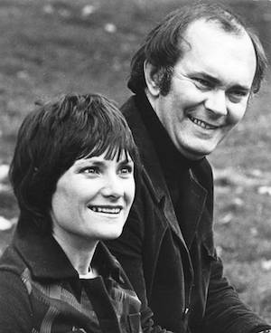
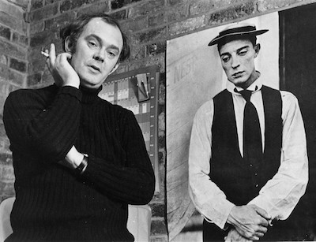

**[\<\<\< Previous page](/life/chronology/1974)**

**[Next page \>\>\>](/life/chronology/1976)**

### Notable Events

<aside>

*Alan Ayckbourn & Heather Stoney*  
*© Christopher Davies*

</aside>

During 1975, Alan Ayckbourn…

○ broke the record for having the most plays running in the West End simultaneously with five plays (***[The Norman Conquests](/plays/the-norman-conquests)*** trilogy, ***[Absurd Person Singular](/plays/absurd-person-singular)*** & ***[Absent Friends](/plays/absent-friends)***).

○ was listed in *Who's Who* and the *Encyclopaedia Britannica* for the first time.

○ collaborated with Andrew Lloyd Webber on his first musical, resulting in the West End flop ***[Jeeves](/plays/jeeves)***, which closed after just a month. The original cast recording, released the same year on vinyl, became an instant Ayckbourn collectible.

○ saw *Absent Friends* open at the Garrick Theatre, London, marking the final time Eric Thompson directed an Ayckbourn play in the West End.

○ had *The Norman Conquests* open on Broadway, directed by Eric Thompson.

○ wrote the one act comedy ***[Dracula](/plays/dracula-sketch-from)*** and the song *The Ghost Of 'Enry Albert* for the revue *What The Devil!* at **[Theatre in the Round at the Library Theatre](/career/ayckbourn-and-the-sjt/sjt-venues/theatre-in-the-round-at-the-library-theatre)**.

○ saw Chatto & Windus publish *The Norman Conquests*, the first mass market publication of his writing.

○ has the first radio adaptation of an Ayckbourn play with the BBC broadcasting ***[Relatively Speaking](/plays/relatively-speaking)***.

○ saw Samuel French publish *Absent Friends*, *Table Manners*, *Living Together* and *Round And Round The Garden*.

○ was featured on the BBC's *Summer Interview* and ITV's *Calendar People*.

### World Premieres

○ ***Jeeves***  
22 April: Her Majesty's Theatre, London  
○ ***Bedroom Farce***  
16 June: Theatre in the Round at the Library Theatre, Scarborough  
○ ***Dracula*** ('Grey' play)  
26 November: Theatre in the Round at the Library Theatre, Scarborough

### Notable Ayckbourn Productions

○ ***Absent Friends*** (London premiere)  
23 July: Garrick Theatre, London  
○ ***The Norman Conquests*** (New York premiere)  
7 December: Morosco Theater, New York

### Professional Directing

○ ***Bedroom Farce*** \*  
○ ***Angels In Love*** \*  
○ ***An Englishman's Home*** \*  
○ ***The Chimes*** \*  
\* Theatre in the Round at the Library Theatre, Scarborough

### Plays In Other Media

○ ***Relatively Speaking***  
Radio: 25 December, BBC Radio 4  
○ ***Jeeves***  
Original cast recording (London)

*© Christopher Davies*

### Quotes

"I seem to be getting more fertile rather than less - which is nice. But I never know whether ideas are any good until I get them down on paper."  
*(Daily Telegraph, February 1975)*

"I am very lazy. I need the pressure of a deadline. When I have an open-ended commission there are always so many alternatives that none get chosen, but a deadline forces me to take one of the alternatives."  
*(Daily Telegraph, February 1975)*

"It's no fun writing them \[the plays\]. It's just boring slog in the middle of the night. The pleasure is in creating with the actors, not re-writing the dialogue but shaping the play."  
*(Daily Telegraph, February 1975)*

"You learned to examine your craft \[whilst at the BBC\] because you had to explain to other writers submitting work what needed to be changed and why things didn't work."  
*(Daily Telegraph, February 1975)*

"I refuse to write small parts simply because I hated playing the things. I didn't mind parts where you are off for an act; that's lovely. But parts like postmen, where you have to get all the drag on and trudge on and deliver a letter and trudge off again and that was your life, I've always tried to avoid. In the same way I hated playing parts where you were sitting around with nothing to do in the scene. It's part of being a good technician to be able to write plays where that doesn't happen. But it was something that I always set out to do. Because, as soon as an actor can sit on a stage saying 'What the hell am I doing here?' the audience gets bored with him too."  
*(Vogue, April 1975)*

"When I was a sort of struggling writer my agent, bless her, would say there were some bread and butter jobs going like *Z-Cars* for television, but I could never get on to that level of writing. The cars would blow up or something. Now I've got to the stage when I don't even have to think about the comedy at all. I write what is for me perfectly serious and then the typist types it out and says that it's very funny and I say 'Oh, is it?'."  
*(Vogue, April 1975)*

"A great influence on me has been Harold Pinter. Not particularly what he's written about, but the way he's seen things and allowed his own viewpoint on something to warp it slightly. Then there's his love of picking up phrases, like a poet. He finds a phrase like 'going the whole hog'. There's one of those in *The Homecoming*. And he just keeps repeating this phrase, which people do in conversation. But then he puts in one too many, which just tips it over into being very funny. That's a trick in a way, but it's also a great ability to hear these phrases and isolate them."  
*(Vogue, April 1975)*

"Civic occasions are wonderful in small towns, too, because they don't quite have the Lord Chancellor to organise them. So vases of flowers fall over. Every summer in Scarborough I always go to the Mayor's tent. It always rains, and the Mayor and Mayoress sit there and nobody turns up. There's a great pile of sandwiches, the band's playing, the cricketers are cursing, and everything's a washout."  
*(Vogue, April 1975)*

"At any of my first nights you'll find me in the bar worrying about the next play."  
*(Daily Express, 30 April 1975)*

"One of two critics get a bit upset by my stuff because they think it pokes fun at the best of human nature. But I'm really showing how sad it is that people can try to be nice and it sometimes doesn't work. I'm saying that a lot of the worst things that happen in life are the result of well-meaning actions."  
*(The Scotsman, 24 May 1975)*

"My step-brother and myself would often conjecture what a Rotarian could possibly be. The nearest we got was that he must be a kind of helicopter pilot."  
*(Scarborough Evening News, 24 June 1975)*

"It is ironical that you can see here \[Scarborough\] for 80p a play which, when it is produced at the National Theatre next year, will cost you a great deal more; and I am not at all sure that it is worth four times more to see the London production."  
*(Scarborough Evening News 24 June 1975)*

"All I have when I start is the vague idea of a theme and the knowledge of the theatre I'm writing for. I know how many and what kind of actors I've got, so that dictates how many characters I write. I know what, ultimately, the play will say. But within that framework, anything can happen. And quite frequently does!"  
*(Plays & Players, September 1975)*

"I had two ambitions \[at school\]. One was to be a journalist, the other to be an actor. And in the latter years at school, the second ambition started to take precedence."  
*(Plays & Players, September 1975)*

"There's a sort of *mafiosi* in stage management. You rarely meet a good stage manager who's out of work; where as, of course, lots of good actors are frequently out of work. I'm surprised there aren't more stage managers."  
*(Plays & Players, September 1975)*

"In the later plays, I have been finding darker things, like women having nervous breakdowns over tea. The characters aren't necessarily getting nastier, but I do feel they're getting sadder."  
*(Plays & Players, September 1975)*

"I've always thought of comedies as tragedies that have been interrupted."  
*(Plays & Players, September 1975)*

"I had a stepfather and an ordinary father and, as a result, quite a complicated childhood involving the most traumatic scenes of flying bowls of rice pudding and things. I was probably emotionally starved at the time, but now I rather value the fact that I was subjected to that."  
*(Plays & Players, September 1975)*

"I write an average of a play a year - but I do all sorts of silly things to put off the dreadful day of writing. When I should be working I do things like fixing the bath taps and the cupboard doors. I even do jobs I dislike such as mowing the lawn. I also do futile time-wasting things. I catalogue my pencils and number sheets of paper from 1 to 180."  
*(Sunday Express, 14 September 1975)*

"I've noticed that when you're successful people tend to defer to your views - which I find rather alarming because nobody took any notice of me before."  
*(Sunday Express, 14 September 1975)*

"The satisfying thing is that you can be genuinely moved by a play and yet not be depressed by it. Being moved by a play can actually make you like humans a bit more. But there are a lot of plays around that make you like people less. I like to come out of a theatre feeling warm. It's just a personal taste."  
*(Los Angeles Times, 5 October 1975)*

"The plays are getting darker. There's something underneath the laughter."  
*(Sunday News, 14 December 1975)*

"If you have a road smash, you can look at the road smash and write something tragic. I tend to look at the periphery and see the reaction of people looking on, and their reactions may be funny."  
*(Sunday News, 14 December 1975)*

"People are always trying to behave the way they think other people want them to behave, and of course, that is not the way people want them to behave."  
*(Sunday News, 14 December 1975)*

"I have a rhythm of about one play a year. The first 11½ months are spent sketching - not with notes, but in my head - and the last two weeks, or one, are spent writing. I tend to let them turn over and over, and then, usually close to the first rehearsal, put it down. There's rarely more than a month between the final script and the first night."  
*(Sunday News, 14 December 1975)*

"Theatre is about actors meeting an audience. Ultimately, the audience haven't come to see a director, they haven't come to see a scene designer, they've come to see actors."  
*(Sunday News, 14 December 1975)*
