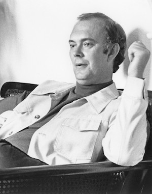

**[\<\<\< Previous page](/life/chronology/1976)**

**[Next page \>\>\>](/life/chronology/1978)**

### Notable Events

<aside>

</aside>

During 1977, Alan Ayckbourn…

○ directed at the **[National Theatre](/career/national-theatre)** for the first time with ***[Bedroom Farce](/plays/bedroom-farce)***.

○ saw ***[Just Between Ourselves](/plays/just-between-ourselves)*** open at the Queen's Theatre in the West End; this marked the first time he had plays running simultaneously in both the West End and at the National Theatre.

○ wrote his first new play, ***[Ten Times Table](/plays/ten-times-table)***, for the **[Stephen Joseph Theatre In The Round](/career/ayckbourn-and-sjt/sjt-venues/stephen-joseph-theatre-in-the-round)** inspired by his experiences moving the company to its new home.

○ was appointed Chair of the Drama Panel of the Yorkshire Arts Association.

○ was reported by the publisher Samuel French to have one of his plays performed somewhere in the world every 24 hours.

○ received the Evening Standard Award for Best Play with *Just Between Ourselves*; the second time he had won the prestigious award after *The Norman Conquests*.

○ saw *Bedroom Farce* nominated for Best Comedy at the Olivier Awards (then titled the SWET Awards).

○ saw ***[The Norman Conquests](/plays/the-norman-conquests)*** adapted for television marking the first time a British TV channel had dedicated six hours of prime time programming to a living playwright.

○ had ***[Absurd Person Singular](/plays/absurd-person-singular)*** and ***[Absent Friends](/plays/absent-friends)*** adapted for the radio by the BBC.

○ saw Samuel French publish ***[Confusions](/plays/confusions)*** whilst Chatto & Windus published a hardback collection called *Three Plays*.

○ was featured in the ITV documentary series *Northerners*.

○ quit smoking. A prolific smoker since the 1960s, Alan and several actors made a bet to quit during the autumn. Alan stopped on the first day and never smoked again.

### World Premieres

○ ***Ten Times Table***  
18 January: Stephen Joseph Theatre In The Round  
○ ***The Jubilee Show*** ('Grey' play)  
7 June: Stephen Joseph Theatre In The Round

### Notable Ayckbourn Productions

○ ***Bedroom Farce*** (West End premiere)  
16 March: National Theatre, London  
○ ***Just Between Ourselves*** (West End premiere)  
20 April: Queen's Theatre, London

### Professional Directing

○ ***Bedroom Farce***  
National Theatre, London  
○ ***Ten Times Table*** \*  
○ ***The Jubilee Show*** \*  
○ ***Dear Liar*** \*  
○ ***Fallen Angels*** \*  
○ ***Sleuth*** \*  
○ ***Pygmalion*** \*  
○ ***The Rehearsal*** \*  
○ ***A Man For All Seasons*** \*

\* Stephen Joseph Theatre In The Round, Scarborough

### Plays In Other Media

○ ***Absurd Person Singular***  
Radio: 5 March, BBC Radio 4  
○ ***The Norman Conquests***  
Television: 5 / 12 / 19 October, ITV  
○ ***Absent Friends***  
Radio: Date TBC, BBC World Service

### Awards

○ Evening Standard Award For Best Play  
*Just Between Ourselves*

### Quotes

"I feel the need to direct, very strongly. I write one play a year and if all I did was write I know I'd get very bored. I'm not a very disciplined writer. I mean, I'm not one of those people who can get up and start prompt on 8am and write 500 words before lunch. I find it far more difficult than that."  
*(Birmingham Post, 1 January 1977)*

"I don't believe those people who say they don't care about notices. You never have so much confidence in your own work that you can take massive criticism."  
*(Birmingham Post, 1 January 1977)*

"There is still, though, this belief that if it sounds easy to listen to it's somehow been easy to write, which is totally untrue. Good writing should look easy. It's not like making a chest of drawers where you can see the dovetailing and know it's been made by a craftsman."  
*(Birmingham Post, 1 January 1977)*

"I'm not really an urban creature but theatre people as a rule have to live near large population centres. Scarborough being smaller than a city but larger than a village is a happy compromise. Professionally, I have a theatre there to write for and a company I can run in relative calm and with plenty of sea air. Privately I feel an identity with the place."  
*(National Theatre, March 1977)*
