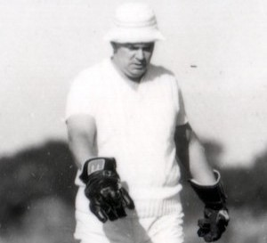

**[\<\<\< Previous page](/life/chronology/1978)**

**[Next page \>\>\>](/life/chronology/1980)**

### Notable Events

<aside>

</aside>

During 1979, Alan Ayckbourn…

○ wrote the first of his 'chance' plays at the **[Stephen Joseph Theatre In The Round](/career/ayckbourn-and-sjt/sjt-venues/stephen-joseph-theatre-in-the-round)**, Scarborough, with ***[Sisterly Feelings](/plays/sisterly-feelings)***; whose alternate two middle scenes are determined randomly.

○ wrote what he considers to be his only true farce with ***[Taking Steps](/plays/taking-steps)***.

○ stepped down from Yorkshire Arts Association citing work commitments.

○ directed ***[Men On Women On Men](/plays/men-on-women-on-men)***, for BBC North television.

○ received the Plays & Players Award for Best Comedy with ***[Joking Apart](/plays/joking-apart)***.

○ directed the Broadway transfer of the **[National Theatre](/career/national-theatre)**'s production of ***[Bedroom Farce](/plays/bedroom-farce)***.

○ saw Samuel French publish *Joking Apart* whilst Chatto & Windus released a hardback collection *Joking Apart & Other Plays*.

○ had *Mother Figure* (from ***[Confusions](/plays/confusions)***) adapted for BBC Radio.

### World Premieres

○ ***Sisterly Feelings***  
10/11 January: Stephen Joseph Theatre In The Round  
○ ***Taking Steps***  
28 September: Stephen Joseph Theatre In The Round

### Notable Ayckbourn Productions

○ ***Joking Apart*** (West End premiere)  
7 March: Globe Theatre, London  
○ ***Bedroom Farce*** (New York premiere)  
29 March: Brooks Atkinson Theatre, New York  
○ ***Ten Times Table*** (Tour)  
Date TBC: UK tour produced by Bill Kenwright

### Professional Directing

○ ***Joking Apart***  
Globe Theatre, London  
○ ***Bedroom Farce***  
Brooks Atkinson Theater, New York  
○ ***Sisterly Feelings*** \*  
○ ***Taking Steps*** \*  
○ ***Tishoo*** \*  
○ ***The Seagull*** \*  
○ ***Saint Trixie*** \*  
○ ***Double Double*** \*  
○ ***The Crucible*** \*

\* Stephen Joseph Theatre In The Round, Scarborough

### Plays In Other Media

○ ***Men On Women On Men***  
Television: 2 February, BBC1  
○ ***Mother Figure*** (from *Confusions*)  
Radio: 14 September, BBC Radio 4

### Awards

○ Plays & Players Award For Best Comedy  
*Joking Apart*

### Quotes

"I prefer, like Jane Austen, to stick to what I know. So I won't be writing about dockers. And although I have thought about it, I don't think I'm likely to embark on 'serious' stuff either. My forte is making people laugh. After all there are plenty of playwrights around who know how to make them miserable!"  
*(Richmond Herald, 22 February 1979)*

"Every day, increasingly, we're bombarded with images from the media - images of horrors going on in the world. And the natural reaction is to shut off - go away and do the washing-up - forget about it. The same thing can happen with a play. If you show people too much, too forcibly, the shutter comes down. My aim is to get at people so they don't realise it. At the time they laugh, and then, afterwards, they start thinking…"  
*(Richmond Herald, 22 February 1979)*

"I've usually spent three weeks brooding about it \[the play\] before I start writing. Then I write fast. But I'm finding it harder and harder. I know in advance the mistakes I can make and a great many avenues are closed to me because I've been down them before."  
*(The Scotsman, 24 February 1979)*

"I don't pry at people through keyholes. But I've been to plenty of dinner parties where the host and hostess are dying for you to go home so that they can really kill each other. Sometimes they get a bit twitchy when they realise I'm sitting there drinking it all in."  
*(The Scotsman, 24 February 1979)*

"If you write comedies, you've got to be serious about them and take the characters seriously; and all the best comedy is rooted in deeply serious things, and throws light upon aspects of life we're frightened to think about."  
*(The Observer, 4 March 1979)*

"I don't think I've made a single decision in my life, except possibly not to have the soup. I didn't give up acting - acting gave me up; I didn't want to write - Stephen Joseph made me."  
*(The Observer, 4 March 1979)*

"I think a lot of people live their lives on a very subjective level, and don't take stock of what they're doing; but if you showed them a film of them throwing plates at each other, they'd roll around."  
*(The Observer, 4 March 1979)*

"I've been in the theatre most of my life which people tend to think of as exciting: but nothing exciting ever happens in the theatre. But the stories you hear from outside it, about people's relationships and what they've done to each other! Good grief, you don't have to go far to find the utmost drama."  
*(The Observer, 4 March 1979)*

"I find that television brings out my second best ideas."  
*(Soho Weekly News, 5 April 1979)*

"I have a great obligation to actors to write stuff that they will find satisfying. If work is going to be in the repertory for nine months of the year, it's got to be work actors can continuously explore".  
*(Soho Weekly News, 5 April1 1979)*

"People loathe and love each other in all languages. Because I do deal with the primaries of life and death - the seven deadly sins come in quite a lot - the plays seem to have no particular boundaries. The things that have translated have been the human elements. I suppose I want less to dispense ideas than to dispense feelings, really understanding, towards people. Which I suppose is necessarily universal. My humour is not a matter of laughing at but laughing with or for people, saying, 'Oh God, I know how it feels.'"  
*(Standard Star, 15 April 1979)*

"Nobody was writing for me \[as an actor\] so I sat down to write myself a play. It was quite successful, as was the next and it wasn't until the third play that I realised that my writing was improving but my acting wasn't. There was only one flaw in my plays, which was that the leading man - me - wasn't really good enough to carry them. So I stood back, gave up acting, and settled down to be a director-writer, which is a much nicer occupation. You can actually see television in the evenings occasionally."  
*(Standard Star, 15 April 1979)*

"I try to limit my horizon to the little theatre I'm working in, in Scarborough, because I think if you start to worry about what The New York Times will think about your work before you've written it, you're not going to be able to write a word!"  
*(Standard Star, 15 April 1979)*

"The nice thing about radio is that technically it is the simplest of the technical media. In the radio you can concentrate on the play and the actors - though the difficulty is to get people to play into the microphones instead of playing to each other."  
*(Scarborough Evening News, 19 April 1979)*

"My ambition is to write a serious play that everyone laughs at."  
*(Sunday Star Ledger, 22 April 1979)*

\[To the question, does he believe in God?\] "Well, I hope in God. I would hate for the whole thing to be random."  
*(Unknown publication, 7 September 1979)*

"I am a terrible person to take out to dinner because I spend most of the time leaning backwards listening to the people on the next table. People take each other out to eat when they want to discuss all kind of personal relationships - should they break up, should they get married - and because they feel enclosed in their own world they forget they can be overheard."  
*(Northern Echo, 17 September 1979)*

"Interrupt tragedy and you'll often find comedy. Many situations that are devastating from the inside can be viewed from the outside as very funny."  
*(Readers Digest, 1 November 1979)*
