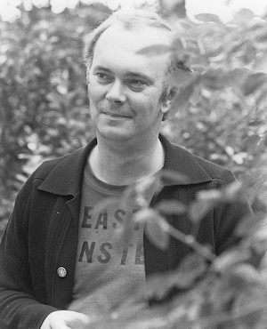

**[\<\<\< Previous page](/life/chronology/1979)**

**[Next page \>\>\>](/life/chronology/1981)**

### Notable Events

<aside>

</aside>

During 1980, Alan Ayckbourn…

○ wrote ***[Suburban Strains](/plays/suburban-strains)*** with Paul Todd, his first full length musical since ***[Jeeves](/plays/jeeves)*** in 1975; it premiered at the **[Stephen Joseph Theatre In The Round](/career/ayckbourn-and-the-sjt/sjt-venues/stephen-joseph-theatre-in-the-round)**.

○ announced a new play, a thriller *Sight Unseen*, but unforeseen difficulties subsequently led to him writing a completely different play ***[Season's Greetings](/plays/seasons-greetings)***.

○ was so unhappy with the London production of ***[Taking Steps](/plays/taking-steps)***, directed by Michael Rudman, he made the decision only he would direct future West End premieres of his work.

○ directed ***[Sisterly Feelings](/plays/sisterly-feelings)*** in The Olivier at the **[National Theatre](/career/national-theatre)**.

○ saw *Sisterly Feelings* nominated for Best Comedy at the Olivier Awards (then titled the SWET Awards)

○ saw the National Theatre's production of ***[Bedroom Farce](/plays/bedroom-farce)*** adapted for television and broadcast by Granada Television.

○ saw ***[The Norman Conquests](/plays/the-norman-conquests)*** released on video in the UK; the first Ayckbourn play adaptation to be released commercially. Unfortunately, the original television contract had no provision for video release and, as a result, the trilogy only received limited availability.

○ had the first book dedicated to his work published with Ian Watson's *Conversations With Ayckbourn*; Watson was the theatre manager at the Stephen Joseph Theatre In The Round from 1985 to 1988.

### World Premieres

○ ***Suburban Strains***  
18 January: Stephen Joseph Theatre In The Round  
○ ***First Course*** (Revue)  
8 July: Stephen Joseph Theatre In The Round  
○ ***Second Helping*** (Revue)  
5 August: Stephen Joseph Theatre In The Round  
○ ***Season's Greetings***  
25 September: Stephen Joseph Theatre In The Round

### Notable Ayckbourn Productions

○ ***Sisterly Feelings*** (West End premiere)  
3 / 4 June: National Theatre, London  
○ ***Taking Steps*** (West End premiere)  
2 September: Lyric Theatre, London  
○ ***Taking Steps*** (Tour)  
March: UK tour produced by Stephen Joseph Theatre In The Round

### Professional Directing

○ ***Sisterly Feelings***  
National Theatre, London  
○ ***Suburban Strains*** \*  
○ ***Season's Greetings*** \*  
○ ***First Course*** \*  
○ ***Second Helping*** \*  
○ ***Time & The Conways*** \*  
○ ***Taking Steps***  
UK Tour  
\* Stephen Joseph Theatre In The Round, Scarborough

### Plays In Other Media

○ ***Bedroom Farce***  
Television: 28 September, ITV

### Quotes

"I think sometimes I'm like a tape recorder. You know, I record bits and pieces and then, years later, they come up in one of my plays and I can't remember where I heard them."  
*(Woman's Weekly, 12 January 1980)*

"Scarborough discovered me. I just happened to be around then. A town of that size suits me far better. I must be provincial by nature but I like the size of a place like that because I can see the other side of it - almost. I love the winter up there. You have to like very wild, quite cold seas coming up about a hundred feet but, and it sounds corny, I like walking down there when I'm getting ready to write. It's really our town then, very quiet."  
*(Woman's Weekly, 12 January 1980)*

"I've done everything they \[the characters\] do and worse. And I'm very aware of other people's social embarrassments simply because I tend to hang back a lot. I'm alright in a one to one talk, but two to one...! A lot of comedy rests on social embarrassment."  
*(Woman's Weekly, 12 January 1980)*

"It takes me two weeks to write a play. I write it in long-hand. The only reason I do it so quickly is because I loathe it. I hate it. The only bit I enjoy writing is getting to the actors with it… I like the bit of reading the play, rehearsing it, and getting it on. I'm not very interested after that. I quite like the first few nights. But plays recede like galaxies into the distance."  
*(New Manchester Review, 22 February 1980)*

"I don't see them \[plays by other playwrights\]. I read them. I don't actually like going to the theatre very much. I spend so long sitting in an auditorium. I love going to the cinema. I love going to music, or anything but straight theatre. Sometimes I'm sitting there in the theatre thinking if I have to watch acting anymore, even good acting, I shall go barmy. I read what comes out, just to see what the opposition's up to."  
*(New Manchester Review, 22 February 1980)*

"I think I do work very hard. Certainly appears hard work to me. I haven't had a holiday for years. I don't actually like them, so it doesn't really bother me. I actually go barmy on holiday. My idea of a holiday is to sit at home."  
*(New Manchester Review, 22 February 1980)*

"Politicians drive me absolutely barmy. I'm an anarchist. I've sat through 15 General Elections and seen the same pattern going on every time. I used to vote. I voted alternately, Labour, Liberal, Conservative. I thought, one of them must be right. All of them were wrong. But this lot are worse than the last lot. The next lot'll be worse than this lot."  
*(New Manchester Review, 22 February 1980)*

"Most of my plays are about what people don't say, because I write about the English, who don't say very much. They imply a lot. And they hint at a lot."  
*(New Manchester Review, 22 February 1980)*

"Ultimately I'd like to tear the middle out of you at the same time as you laugh helplessly."  
*(Manchester Evening News, 13 March 1980)*

"I'm still bristling with ideas. More than ever in fact. At the moment I'm actually having to stop myself writing."  
*(Manchester Evening News, 13 March 1980)*

"Although in my early plays I made mistakes which I now hope I no longer make, I find each successive play harder to write. I suppose it is because I have narrowed my avenues for exploration. It is rather like being a motorist in a maze of city centre streets. I suddenly realise where I am and then I dance around saying 'I did this last time.'"  
*(Peterborough Evening Telegraph, 3 April 1980)*

"I am very lucky to be able to write comedy. It is a gift and when you have it, you shouldn't turn your back on it."  
*(Peterborough Evening Telegraph, 3 April 1980)*

"I was born in London but Yorkshire has adopted me or perhaps I adopted Yorkshire."  
*(Yorkshire Post, 14 October 1980)*

"I think it is true that any artist worth his salt, and certainly most dramatists, will reflect to some extent the age they live in. Otherwise, they must be writing purely from imagination and without any reference to the real world. One would hope that the work I do is reflective of the age of the sphere from which I come. I suppose in a sense I see myself nearer to Jane Austen than perhaps to Shakespeare."  
*(Student, 31 October 1980)*

"I have a slightly depressing view of human nature; it doesn't change very much, only the circumstances around it change. I have absolutely no doubt that in a couple of thousand years, assuming the human race survives, people will still be being pretty horrible to each other."  
*(Student, 31 October 1980)*

"I want them to get pleasure, to respond, and the most positive response one gets from an audience in terms of being able to see it, is laughter. I love laughter, laughter in the auditorium - I think that would be one thing I want to get from an audience."  
*(Student, 31 October 1980)*

"I hope they'll \[the plays\] last. Less as literature. Rather as a true reflection of our age. Something like the diaries of Pepys."  
*(Literary Review, 18 December 1980)*

"I allow my characters to dictate how the play goes. I would never these days bend the plot to suit a device if in doing so I thought I betrayed the characters."  
*(Birmingham Post, 27 December 1980)*

"I suppose I am a theatre writer. I live in theatres all the time. And besides being a writer, I am a director: I am fascinated by the whole mechanics and liveliness of theatre. It seems to me that there are things which are essentially theatre at a time when a lot of the extraneous trappings of theatre, the huge settings, have been stripped away by films and television. We are left with a liveliness and spontaneity. One had to ask the question: 'What argument can I put to people in this town, to persuade them to come to the theatre?' One cannot offer them spectacle. One cannot offer them *The Towering Inferno*. What we can offer them is spontaneous live performance."  
*(Birmingham Post, 27 December 1980)*
