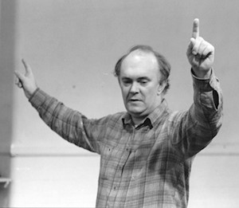

**[\<\<\< Previous page](/life/chronology/1981)**

**[Next page \>\>\>](/life/chronology/1983)**

### Notable Events

<aside>

</aside>

During 1982, Alan Ayckbourn…

○ began writing ***[Intimate Exchanges](/plays/intimate-exchanges)***, an epic play cycle with 16 permutations. It would take more than a year to write and produce in its entirety at the **[Stephen Joseph Theatre In The Round](/career/ayckbourn-and-the-sjt/sjt-venues/stephen-joseph-theatre-in-the-round)**.

○ toured with the Stephen Joseph Theatre In The Round company to the Alley Theatre, Houston, with ***[Absent Friends](/plays/absent-friends)*** and ***[Way Upstream](/plays/way-upstream)***, which opened without a hitch, unlike...

○ the **[National Theatre](/career/national-theatre)** production, which he also directed. This experienced several delays and technical difficulties which at one point saw the water tank burst, leading to the National Theatre temporarily closing.

○ adapted R.B. Sheridan's play ***[A Trip To Scarborough](/plays/a-trip-to-scarborough-sheridan)***, keeping the setting but adding plot strands set during World War II and the present day.

○ directed ***[Season's Greetings](/plays/seasons-greetings)*** at the Greenwich Theatre; the success of which led to a West End transfer.

○ saw *Season's Greetings* nominated for Best Comedy at the Olivier Awards (then titled the SWET Awards)

○ learnt that ***[Taking Steps](/plays/taking-steps)*** was the most performed play in Germany during 1982 with 462 performances.

○ saw Samuel French publish ***[How The Other Half Loves](/plays/how-the-other-half-loves)*** and ***[Suburban Strains](/plays/suburban-strains)***.

○ was featured in an edition of the BBC's *Omnibus* dedicated to his writing.

○ was a featured name alongside the likes of Glenda Jackson and John Cleese in a petition and letter-writing campaign to save the BBC Radio children's show *Listen With Mother* after the BBC announced it was to end after 32 years. The campaign was unsuccessful.

### World Premieres

○ ***Intimate Exchanges***  
3 June: Stephen Joseph Theatre In The Round  
○ ***A Trip To Scarborough*** (Adaptation)  
8 December: Stephen Joseph Theatre In The Round

### Notable Ayckbourn Productions

○ ***Way Upstream*** (North American premiere)  
24 February: Alley Theatre, Houston  
○ ***Absent Friends*** (North American premiere)  
16 March: Alley Theatre, Houston  
○ ***Season's Greetings*** (West End premiere)  
29 March: Apollo Theatre, London  
○ ***Way Upstream*** (West End premiere)  
4 October: National Theatre, London  
○ ***Making Tracks*** (Revival)  
3 November: Stephen Joseph Theatre In The Round

### Professional Directing

○ ***Way Upstream***  
National Theatre, London  
○ ***Season's Greetings***  
Greenwich Theatre, London  
○ ***Season's Greetings***  
Apollo Theatre, London  
○ ***Way Upstream***  
Alley Theatre, Houston  
○ ***Absent Friends***  
Alley Theatre, Houston  
○ ***Intimate Exchanges*** \*  
○ ***A Trip To Scarborough*** \*  
○ ***Saturday, Sunday, Monday*** \*

\* Stephen Joseph Theatre In The Round, Scarborough

### Quotes

"One can create a sort of tension which is at best a poetic tension between comedy and tragedy… I try to walk that tightrope between the two."  
*(Times Herald, 28 February 1982)*

"I think a lot of English people still feel that going to the theatre is somehow an admission that they have nothing better to do with their lives and if they are going to the theatre then at least it better be something that is going to do them good. It had better be pretty heavy and preferably long. But anything light and fun, they say, 'Well, I'm sorry, but I did enjoy it.' A great phrase. I hear it all the time."  
*(Times Herald, 28 February 1982)*

"I'm often asked, 'Don't you ever want to write a serious play?' I say, 'But I just did'… I think all plays ought to be funny. Just because they ought to be. If they're funny with no content, then they're not very good plays. You can have a serious play that isn't funny, but it's got to be better if it isn't funny. It's got to be really good."  
*(Times Herald, 28 February 1982)*

"Most of my plays will never be literary pieces to be studied in colleges, simply because they're written expressly to be spoken. I think of them as like the best blueprints."  
*(Times Herald, 28 February 1982)*

"At first, I was compared to the other writers the way everyone is. I guess I knew I had arrived when I read for the first time that some poor writer was said to be writing like me."  
*(Times Herald, 28 February 1982)*

"I never write a play unless I'm initially excited by the premise of finishing it."  
*(Times Herald, 28 February 1982)*

"What I've always thought about live theatre is that it lives in reality. The only thing we can really offer that TV or films can't do is the spontaneity. Every play is spontaneous and every play will differ from night to night. Sometimes all the people who have no sense of humour in Yorkshire turn up on the same night. Then another night you'll get people who'll howl all the way through. They're not a coach load, they just happen to be there together."  
*(Scarborough Evening News, 9 April 1982)*

"Stephen Joseph was a real anarchist. He preached the theory that all theatres should self-destruct after seven years. If we're going to do anything it should be to keep up-ending things."  
*(Scarborough Evening News, 9 April 1982)*

"If you boil down your themes they sound terribly banal. Mainly I want to say things about the fear and distrust people have for each other, the fact that men and women still don't seem to understand each other very well. There are too many people in the world who are likely to leave important decisions they should make until far too late. Then they let people - people whom I think are grossly irresponsible if more passionately convicted - do it for them. So people get caught up in war or whatever just because they didn't say things they should have said."  
*(The Times, 18 August 1982)*

"I used to think there was no such thing as evil - one used to think it was just bad upbringing or something - but some people are just plain horrible and they take delight and pleasure from it. There are some extremely evil people walking around and there are some extremely good people walking around. I suppose it's not a particularly startling revelation for a man of 42 - some kids of eight could tell you as much."  
*(The Times, 18 August 1982)*

"What the extreme left and the extreme right have in common is absolutely no sense of humour. Perhaps I can spread a sense of balance through comedy. I don't think it will do very much. It's like throwing a bucket of sand on a forest fire, but it might serve to save a small proportion."  
*(The Times, 18 August 1982)*

"I'll never forget that first glorious train journey from York to Scarborough. Like a giant-sized scenic railway, it was."  
*(Woman & Home, November 1982)*

"I never sit down and say, 'I am going to write a very funny scene.' I tell a story and try to illuminate every corner of a relationship or experience between people and it happens that I usually see it from a comical angle."  
*(Woman & Home, November 1982)*

"Writing is the worst bit, a most painful business, very lonely, very desolate. I tend to put writing into as short a time as I can."  
*(Woman & Home, November 1982)*
