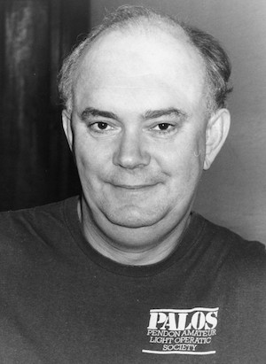

**[\<\<\< Previous page](/life/chronology/1983)**

**[Next page \>\>\>](/life/chronology/1985)**

### Notable Events

<aside>

</aside>

During 1984, Alan Ayckbourn…

○ saw ***[A Cut In The Rates](/plays/a-cut-in-the-rates)*** premiered on BBC2; this was a one act play - performed live at the Stephen Joseph Theatre In The Round in 1983 - written and recorded for a BBC educational series on theatre and the progress of a play from page to stage.

○ directed the revue *Deadly Virtues* for BBC1; an abridged version of ***[The 7 Deadly Virtues](/plays/the-7-deadly-virtues)***

○ was asked by **[Peter Hall](/life/influences/hall-sir-peter)**, Artistic Director of the **[National Theatre](/career/national-theatre)**, to consider working as a company director at the National Theatre.

○ allowed the first UK tour of ***[Way Upstream](/plays/way-upstream)***. Although written to be performed on a flooded stage, the tour presented the play on a dry stage with a gimbal system on the cabin cruiser to simulate movement on water.

○ directed the transfer of ***[Intimate Exchanges](/plays/intimate-exchanges)***, featuring the original Scarborough cast, to Greenwich Theatre before a transfer to the West End.

○ saw *Intimate Exchanges* nominated for Best Comedy at the Olivier Awards.

○ was featured in *The Levin Interviews* (BBC2) and *60 Minutes* (BBC1).

○ had ***[Just Between Ourselves](/plays/just-between-ourselves)*** adapted for BBC Radio.

○ saw the publication of *Alan Ayckbourn* by Sidney Howard White; this is the first significant academic appraisal of his work to be published.

### World Premieres

○ ***The 7 Deadly Virtues*** (Revue)  
12 January: Stephen Joseph Theatre In The Round  
○ ***A Chorus Of Disapproval***  
2 May: Stephen Joseph Theatre In The Round  
○ ***The Westwoods*** (Revue)  
29 / 31 May: Stephen Joseph Theatre In The Round

### Notable Ayckbourn Productions

○ ***Intimate Exchanges*** (West End premiere)  
14 August: Ambassador's Theatre, London  
○ ***Way Upstream*** (Tour)  
25 June: UK tour produced by Duncan Weldon

### Professional Directing

○ ***Intimate Exchanges***  
Greenwich Theatre, London  
○ ***Intimate Exchanges***  
Ambassador's Theatre, London  
○ ***A Chorus Of Disapproval*** \*  
○ ***The Westwoods*** \*  
○ ***The 7 Deadly Virtues*** \*  
○ ***Bricks 'n' Mortar*** \*  
○ ***Last Of The Red Hot Lovers*** \*  
○ ***The Dining Room*** \*  
○ **A Thousand Clowns** \*  
○ ***His Monkey Wife*** \*  
\* Stephen Joseph Theatre In The Round, Scarborough

### Plays In Other Media

○ ***A Cut In The Rates***  
Television: 21 January, BBC2  
○ ***Just Between Ourselves***  
Radio: 6 February, BBC Radio 4  
○ ***Deadly Virtues***  
Television: 2 March, BBC1  
○ ***The 7 Deadly Virtues***  
Original cast recording (Scarborough)

### Quotes

"What's kept me fresh is Stephen Joseph's maxim that one should constantly break routines and keep wrong-footing actors."  
*(Northern Echo, 21 April 1984)*

"Farce is a tragedy that's been interrupted. All you do is edit it at the right point. if you let a character's life run on before editing - let's say until he's been married ten years - then as a result you'll have a slightly darker, but I hope truer, picture. I've never had any trouble being funny. I spend most of the time taking out the jokes not putting them in."  
*(Yorkshire Post, May 1984)*

"There are marriages where people have never had a cross word at 70, but that's not very interesting in a play. What we want to see in a play is someone having a worse time than us."  
*(Yorkshire Post, May 1984)*

"I'm inept in some ways - rotten at woodwork but reasonable at electrics and cardboard. I'm not as organised as I might appear. I believe in mastering inactivity to let problems resolve themselves. I don't feel bad about just looking at a wall for three days because by being inactive things happen anyway."  
*(Yorkshire Post, May 1984)*

"It \[writing\] all gets quicker but it all gets harder. If I do try and honestly improve - and I've got this naive faith that the older I get the better I get - I suppose it's bound to get harder. I've done so much now and been down so many alleys."  
*(Yorkshire Post, May 1984)*

"I usually take about a month off work \[to write\] and for three weeks I wander around getting highly nervous and doing nothing. Then with a week to go I suddenly become aware there's a cast and a designer waiting for a script - and in that week it gets done. I don't think I could write without the deadline."  
*(London Mercury, 31 May 1984)*

"I've done every job in the theatre, which was a useful experience, and as an actor I was reasonable if never star worthy or first rate."  
*(Sunday Express, 5 August 1984)*

"I've just bought a word processor and find I can revise and revise. As for first nights, I've grown hardened to them. But I don't read the reviews until four years afterwards."  
*(Sunday Express, 5 August 1984)*

"You must forget such \[career\] disappointments quickly - but dine out on the story afterwards. all the best theatre stories are about disasters."  
*(Sunday Express, 5 August 1984)*

"Marriage can lead to deadly complacency. A relationship based on total insecurity might be even worse. A shade of insecurity - say ten per cent - is a good thing."  
*(Mail On Sunday, 12 August 1984)*

"I hate London. I go there under protest, shut my eyes, get through what I have to do and get away as soon as possible."  
*(Northern Echo, 21 August 1984)*

"If you're a people-watcher in a village, you run out of people. In a city it becomes very anonymous and you can't find the core to it. Everything that happens in Birmingham happens in Scarborough but on a small scale. You can see the rise and fall of the bright boys, you can watch the couples coming together, separating, re-shifting. And then you're struck by the nice people here. They really are lovely."  
*(Northern Echo, 21 August 1984)*

"I don't think I'm a pessimist but as you write more and more about people and less and less about situations it is inevitable you are going to rub up the dark side. People do have dark sides, they do tend to hurt each other."  
*(Northern Echo, 21 August 1984)*

"The more people take themselves seriously, the funnier they can be. Someone who is terribly angry can be terribly funny. The comedy is always there and I think it's quite chastening that we are funny."  
*(Northern Echo, 21 August 1984)*

"I hate writing. It's awful. So lonely. No-one can help you at all. And I'm not a confident writer. I'm beset by doubts. It's only the terror of the deadline that gets me there."  
(Northern Echo, 21 August 1984)

"We are catering to the souls and spirits of people. A country without art of any sort isn't worth living in."  
*(Northern Echo, 21 August 1984)*

"The thing about our theatre and any theatre is that if you have had a successful evening and the house has been big and responsive, it's like a giant party that you have thrown for 300 comparative strangers. They go out drunk on whatever they've seen and that a really lovely feeling."  
*(Northern Echo, 21 August 1984)*

"I don't really like plays where everybody is terribly witty - I like laughers with an 'ouch' of recognition."  
*(International Herald Tribune, 20 September 1984)*

"There's no fun in writing at all. My first love is directing."  
*(International Herald Tribune, 20 September 1984)*

"One knows instinctively, I think, when you're doing too much, because the ideas just aren't bubbling up and the enjoyment's gone. And I think that was happening a bit too. It was getting a bit of a slog. And I don't think writing in the end - it has to be a slog in the first bit of it, getting it all down - but doing it, directing it, interpreting it, and rediscovering it should always be a tremendous joy in that. And if there isn't suddenly, forget it. The theory of sports-car racing really - it's to do with the flash and panache. There's something so important and live about theatre which mustn't be lost."  
*(Kaleidoscope, 21 November 1984)*
