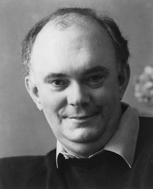
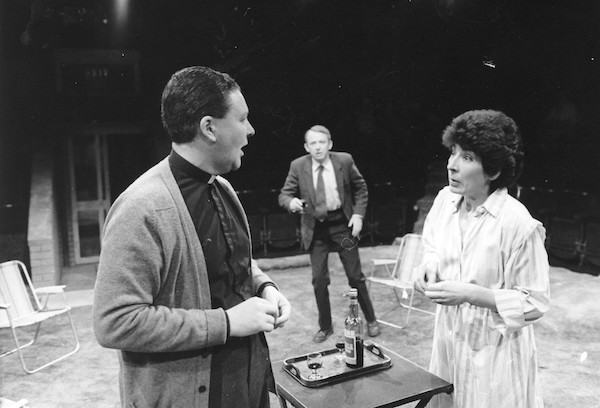

**[\<\<\< Previous page](/life/chronology/1984)**

**[Next page \>\>\>](/life/chronology/1986)**

### Notable Events

<aside>

</aside>

During 1985, Alan Ayckbourn…

○ directed ***[A Chorus Of Disapproval](/plays/a-chorus-of-disapproval)***at the **[National Theatre](/career/national-theatre)** starring Michael Gambon and Bob Peck.

○ received his first Olivier Award for *A Chorus Of Disapproval* (Best Comedy), which also received the Evening Standard and DRAMA Awards for Best Comedy as well as the Critics' Circle Award for Best New Play.

○ announced he would be taking a sabbatical from the **[Stephen Joseph Theatre In The Round](/career/ayckbourn-and-the-sjt/sjt-venues/stephen-joseph-theatre-in-the-round)** for two years from 1986 to 1988 to work as a company director at the National Theatre.

○ saw ***[Absent Friends](/plays/absent-friends)*** and ***[Absurd Person Singular](/plays/absurd-person-singular)*** adapted for television and broadcast on BBC1.

○ had ***[Confusions](/plays/confusions)*** and ***[Season's Greetings](/plays/seasons-greetings)***broadcast on BBC Radio.

○ saw ***[Intimate Exchanges](/plays/intimate-exchanges)*** published by Samuel French.

*Russell Dixon, Barry McCarthy & Ursula Jones in the world premiere of Woman In Mind.*  
*© Scarborough Theatre Trust*

### World Premieres

○ ***Boy Meets Girl / Girl Meets Boy*** (Revue)  
23 May: Stephen Joseph Theatre In The Round  
○ ***Woman In Mind***  
30 May: Stephen Joseph Theatre In The Round  
○ ***Tons Of Money*** (Adaptation)  
11 November: Stephen Joseph Theatre In The Round

### Notable Ayckbourn Productions

○ ***A Chorus Of Disapproval*** (West End premiere)  
1 August: National Theatre, London

### Professional Directing

○ ***A Chorus Of Disapproval***  
National Theatre, London  
○ ***Woman In Mind*** \*  
○ ***Tons Of Money*** \*  
○ ***Boy Meets Girl*** \*  
○ ***Girl Meets Boy*** \*  
○ ***The Brontës Of Haworth*** \*  
○ ***Imaginary Lines*** \*

\* Stephen Joseph Theatre In The Round, Scarborough

### Plays In Other Media

○ ***Absurd Person Singular***  
Television: 1 January, BBC1  
○ ***Confusions***  
Radio: 20 April, BBC World Service  
○ ***Absent Friends***  
Television: 29 September, BBC2  
○ ***Season's Greetings***  
Radio: 28 December, BBC Radio 4

### Awards

○ Olivier Award For Best Comedy  
*A Chorus Of Disapproval*  
○ Evening Standard Award For Best Comedy  
*A Chorus Of Disapproval*  
○ DRAMA Best Comedy Award  
*A Chorus Of Disapproval*  
○ Critics' Circle Best New Play Award  
*A Chorus Of Disapproval*

### Quotes

"I don't feel negative about marriage as such but just the way people love together, how men and women fail to understand each other. One does see so many sad marriages, and if people relate to my plays I presume it is because it must often be like that out there."  
*(The Standard, 2 July 1985)*

"I have a love of England's colloquial language, it's flexibility. No one word every means any one thing. Everything is rife with misinterpretation."  
*(The Times, 27 July 1985)*

"I've seen plays of mine on television but got little excitement from them."  
*(The Times, 27 July 1985)*

"I always consider myself much more a director. That's the bit I enjoy. I'd prefer to direct a play than to write one."  
*(The Times, 27 July 1985)*

"I've only to hear someone in the bar say, 'I don't like that' and I think they're talking about my play. Usually they're complaining about the drink."  
*(The Times, 27 July 1985)*

"Amateur dramatic societies have a very interesting class structure. They're a mixture of lonely hearts' club and a forum for frustrated would-be professionals."  
*(The Times, 27 July 1985)*

"I gained my expertise as a dramatist the hard way, on the shop floor."  
*(The Times, 27 July 1985)*

"I'm interested in people who aren't in control of their career. I've never been in control of mine. A lot of my obsessions are to do with the fact I've never taken a serious decision in my life."  
*(The Times, 27 July 1985)*

"I think that the Ayckbourn tradition is shifting. It is not as light or as naturalistic as it used to be: there is now an increased element of surrealism in my plays."  
*(Yorkshire Evening Press, 24 October 1985)*
