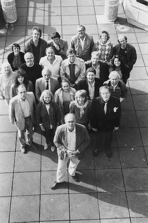

**[\<\<\< Previous page](/life/chronology/1986)**

**[Next page \>\>\>](/life/chronology/1988)**

### Notable Events

<aside>

*Alan Ayckbourn at the National Theatre with his company.*  
*© National Theatre*

</aside>

During 1987, Alan Ayckbourn…

○ was awarded his CBE (Commander Of The Order Of The British Empire).

○ directed ***[A Small Family Business](/plays/a-small-family-business)*** at the **[National Theatre](/career/national-theatre)**; his first play since 1975 (***[Jeeves](/plays/jeeves)***) not to have premiered in Scarborough.

○ received the Evening Standard Award for Best Play for *A Small Family Business*.

○ became - it is believed - the only writer to have ever had plays running simultaneously at the National Theatre (*A Small Family Business*), in the West End (***[Woman In Mind](/plays/woman-in-mind)***) and on the fringe (***[The Westwoods](/plays/the-westwoods-his-side)***).

○ directed Arthur Miller's ***[A View From The Bridge](/plays/miller-arthur)*** to critical acclaim at the National Theatre; Miller described it as the definitive production of the play. This production later transferred to the West End.

○ was nominated for Best Director for *A View From The Bridge* at the Olivier Awards.

○ directed the American premiere of ***[Henceforward...](/plays/henceforward)*** at the Alley Theatre in Houston with George Segal as Jerome, following its world premiere at the **[Stephen Joseph Theatre In The Round](/career/ayckbourn-and-the-sjt/sjt-venues/stephen-joseph-theatre-in-the-round)**, Scarborough.

○ saw ***[Ernie's Incredible Illucinations](/plays/ernies-incredible-illucinations)*** broadcast by BBC1.

○ wrote the one act sketch ***[An Evening With PALOS](/plays/an-evening-with-palos)*** for the Colin Blakely Memorial Evening.

○ saw Faber & Faber publish *Henceforward…* and *A Small Family Business*; Samuel French published ***[Relatively Speaking](/plays/relatively-speaking)*** and *Woman In Mind*.

○ had ***[Intimate Exchanges](/plays/intimate-exchanges)*** and ***[Confusions](/plays/confusions)*** broadcast on BBC Radio.

### World Premieres

○ ***A Small Family Business***  
21 May: National Theatre, London  
○ ***Henceforward...***  
30 July: Stephen Joseph Theatre In The Round  
○ ***An Evening With PALOS*** ('Grey' play)  
4 October: Lyric Theatre, London

### Notable Ayckbourn Productions

○ ***Time & Time Again*** (Revival)  
7 January: Stephen Joseph Theatre In The Round  
○ ***Henceforward...*** (North American premiere)  
8 October: Alley Theatre, Houston  
○ ***Me, Myself & I*** (West End premiere)  
31 October: National Theatre, London

### Professional Directing

○ ***A Small Family Business***  
National Theatre, London  
○ ***A View From The Bridge***  
National Theatre, London  
○ ***Me, Myself & I***  
National Theatre, London  
○ ***Time & Time Again***  
Stephen Joseph Theatre In The Round○ ***Henceforward…***  
Stephen Joseph Theatre In The Round  
○ ***Henceforward…***  
Alley Theatre, Houston

### Plays In Other Media

○ ***Confusions***  
Radio: 6 April, BBC Radio 4  
○ ***Intimate Exchanges***  
Radio: 12 July, BBC World Service  
○ ***Ernie's Incredible Illucinations***  
Television: 11 November, BBC 1

### Honours & Awards

○ CBE (Companion of the Order of the British Empire)  
○ Evening Standard Award For Best Play  
*A Small Family Business*

### Quotes

"I don't think I would have got anywhere without a lot of patience from Stephen Joseph at the beginning \[of Alan's career\] for there was absolutely no thought when I started that I was going to be a writer who was going to do as much as I have now. My first few plays served their purpose but they were not all that wonderful either. But that allowed me, the writer, to learn very quickly from what I saw as they were being put on."  
*(Plays International, February 1987)*

"I listen to a lot of music and like computer games. I like playing with my word processor and my games console."  
*(Plays International, February 1987)*

"I remember the times when one assumed, for better or for worse, that politicians knew what they were doing and were doing what they were doing for the public good: they were there because they were the best people to do the job. But now the political thing has gone full circle. They are regarded as scoundrels the minute they put MP after their names. There is such a feeling of scepticism about them. It is now assumed that they are all on the make. The truth, I imagine, is that there are bent MPs who are there for the wrong reasons but there are still MPs who are there to do their best. The greyness people feel about them today is another reason why people no longer feel quite sure where they are."  
*(Plays International, February 1987)*

"I think a very important thing for a writer is to keep doing it. And particularly for a writer in the theatre. Because if you do not keep writing plays, and do not go on working with actors and the stage in mind, it is terribly easy to get rusty. The longer you are away from theatre, the more difficult it is to do it again. I think the great problem of the British theatre at the moment is the dearth of new writers."  
*(Plays & Players, April 1987)*

"I can't understand any writer wanting to be psychoanalysed. I've always been terrified of being straightened out. The thing about all my phobias and angsts and things is that they fuel my plays, and I suppose if I were a healthy balanced person I wouldn't want to write."  
*(Sunday Express, 24 May 1987)*

"I think a big piece of us dies in marriage. Men and women, exposed to each other's personalities over the years, tend to drive each other nuts."  
*(Sunday Express, 24 May 1987)*

"I was so pressured when I was a kid with this idea that you had to have a career, I said to my sons, 'Look, if you don't want to do anything, don't do anything. I've put lots of money in trust for you and you can have it.'"  
*(Sunday Express, 24 May 1987)*

"The theatre is such an anti-social profession that you tend to work while other people are playing, and at the very time people are getting ready to go out to dinner, you're getting ready to work. And because you can start work a little later in the morning, it makes for a peculiar closed circuit of friends, either other people in the theatre or insomniacs."  
*(The Times, 27 June 1987)*

"My job is writing plays, and I always think people should ask themselves, 'What's the one thing that nobody else can do that I can do?'"  
*(The Times, 27 June 1987)*

"At the moment, touch wood, ideas just pop out; as soon as I get one out, another arrives, so that is nice, but there is always the fear that it won't happen, that there will be The Blank Sheet Of Paper."  
*(The Times, 27 June 1987)*

"I tend not to tell people I'm a writer, very much because they either become madly self-conscious and attempt to get themselves into your play by some devious trick of personality, or else they clam up completely and look extremely sheepish."  
*(The Times, 27 June 1987)*

"The best part of my work is not the clapping, it's the feeling at the end of the evening, that you have given the most wonderful party and those five hundred strangers who came in are feeling better."  
*(The Times, 27 June 1987)*

"I try and use the theatre. I'm very theatre-minded, I don't think I could write for any other medium. But people always tend to think of theatre as very much a verbal medium. Of course, it is that - but it's also very visual. I'm often quite disappointed if I see a play which could have been done just as well on the radio."  
*(Scarborough Evening News, 29 July 1987)*

"I hope that if I have a quality as a director it is the ability to make rehearsals as easy as possible; easy in the sense that actors feel free to create in them. I tend to lead from behind and act as a sounding board."  
*(Woman & Home, September 1987)*

"I dare not say how much of myself is in my plays, but it takes up am large proportion. Most of my characters are inspired by people to whom I am very close. I rarely write about strangers."  
*(Woman & Home, September 1987)*

"I learned to survive in an institution \[boarding school\]. I didn't have an obvious winning thing about me. I wasn't a champion soccer player or cricketer or scholar. I was reasonably average and made my own niche."  
*(Henceforward… programme, October 1987)*

"My training, which wasn't any training at all, turned out to be wondrous. Because I didn't know what I was doing I worked my way through all the departments: stage management, lighting, sound. It is such a technical medium in a funny way."  
*(Henceforward… programme, October 1987)*

"I must have been married at 18. I had a child at 19. Not so surprising, I suppose. I was an only child having gone to a public school, having never seen girls. My burning ambition, apart from being an actor, was to get married. I married the second woman I met, really."  
*(Henceforward.. programme, October 1987)*

"Quite a few writers start out writing very intense, very serious autobiographical plays and move onto more objective and lighter ones, but I suppose I tackled the most difficult first. If you're a nervous swimmer you jump in at the deep end."  
*(Henceforward… programme, October 1987)*

"If you hear the women's viewpoint quite a lot - which I did in my childhood - it tends to stick with you. You get slightly brainwashed."  
*(Henceforward… programme, October 1987)*

"In general, I'm the best person to direct my plays. Of course it is more demanding than directing someone else. I really am the bottom line."  
*(Henceforward… programme, October 1987)*

"I remember doing Pinter's *The Caretaker*, and was talking to the local bobby \[policeman\] afterward, I said 'did you enjoy that' and he said, 'No, I can get all of that at home.'"  
*(When & Where, 19 November 1987)*

"I've always said that you've got to have been in love once, and probably broken up once, before you can get anything out of my plays - they are about people who have been bitten by life a bit, and are just starting to sort themselves out again. People relate to them more. Most of us, unless we are very dishonest, have difficult relationships. We expect a lot from people and can't or don't understand or appreciate them."  
*(When & Where, 19 November 1987)*

"I've always been a little bit defensive about laughter - but I would be honest and say that a lot of my joy comes through making people laugh."  
*(When & Where, 19 November 1987)*

"The greatest laughter for me though is the laugh of recognition, not laughing at gag lines, but from getting the laughter of recognition."  
*(When & Where, 19 November 1987)*
