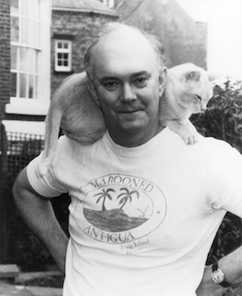

**[\<\<\< Previous page](/life/chronology/1987)**

**[Next page \>\>\>](/life/chronology/1989)**

### Notable Events

<aside>

</aside>

During 1988, Alan Ayckbourn…

○ directed the West End transfer of ***[A View From The Bridge](/plays/miller-arthur)*** and is asked to direct a fourth play at the **[National Theatre](/career/national-theatre)** to replace it in repertory, choosing to direct John Ford's ***['Tis Pity She's A Whore](/career)***.

○ returned to the **[Stephen Joseph Theatre In The Round](/career/ayckbourn-and-the-sjt/sjt-venues/stephen-joseph-theatre-in-the-round)**, following his two year sabbatical at the National Theatre.

○ directed ***[Man Of The Moment](/plays/man-of-the-moment)*** at the Stephen Joseph Theatre In The Round, a play which featured a swimming pool as part of the set.

○ wrote and directed his first family play, ***[Mr A's Amazing Maze Plays](/plays/mr-as-amazing-maze-plays)***; his first play aimed at younger audiences since 1961. Its success led to a series of 'family' plays between 1988 and 2005.

○ directed ***[Henceforward…](/plays/henceforward)*** at the Vaudeville theatre in the West End starring Ian McKellen and Jane Asher.

○ saw *Henceforward…* nominated for Best Comedy at the Olivier Awards.

○ saw the first West End revival of one of his plays with Alan Strachan's production of ***[How The Other Half Loves](/plays/how-the-other-half-loves)*** at the Greenwich Theatre which transfers to the Duke of York's Theatre.

○ saw ***[Woman in Mind](/plays/woman-in-mind)*** receive its New York premiere with a production by Manhattan Theatre Club starring Stockard Channing as Susan.

○ saw Faber publish an updated edition of Ian Watson's *Conversations With Ayckbourn*.

○ saw Samuel French publish ***[Henceforward…](/plays/henceforward)***, ***[A Small Family Business](/plays/a-small-family-business)*** and ***[The Norman Conquests](/plays/the-norman-conquests)***.

○ had ***[Way Upstream](/plays/way-upstream)*** adapted for television by the BBC with another adaptation of ***[Confusions](/plays/confusions)*** adapted for BBC Radio.

### World Premieres

○ ***Man Of The Moment***  
Stephen Joseph Theatre In The Round  
○ ***Mr A's Amazing Maze Plays***  
Stephen Joseph Theatre In The Round

### Notable Ayckbourn Productions

○ ***Henceforward...*** (West End premiere)  
Vaudeville Theatre, London  
○ ***Woman In Mind*** (New York premiere)  
Manhattan Theatre Club  
○ ***How The Other Half Loves*** (Revival)  
Duke Of York's Theatre, London  
○ ***Henceforward...*** (Revival)  
Stephen Joseph Theatre In The Round

### Professional Directing

○ ***'Tis Pity She's A Whore***  
National Theatre, London  
○ ***Henceforward…***  
Vaudeville Theatre, London  
○ ***Man Of The Moment*** \*  
○ ***Henceforward…***\*  
○ ***Mr A's Amazing Maze Plays*** \*  
○ ***Eden End*** \*  
○ ***The Parasol*** \*  
○ ***The Haunt Of Mr Fossett*** \*  
○ ***The Ballroom*** \*

\* Stephen Joseph Theatre In The Round, Scarborough

### Plays In Other Media

○ ***Way Upstream***  
Television: 1 January, BBC1  
○ ***Confusions***  
Radio: 28 August, BBC Radio 4

### Awards

○ Plays & Players Best Director Award  
*A View From The Bridge*

### Quotes

"My mother was a writer. We were a one parent / one child family for some time. So it was natural to see her, the breadwinner, writing to feed us. No rolling of pastry on our kitchen table. Just a typewriter. So to one extent it was imitative. And hereditary."  
*(Correspondence, April 1988)*

"Radio was and still remains the medium where the impossible can be made to happen once every second. The only limitation is the speed of the listener's mind itself in its ability to grasp events. And the average radio listener is quick. I know."  
*(Radio York Magazine, May 1988)*

"I had to go and try a few muscles in London \[with his two years at the National Theatre\]. One of my ambitions was to establish myself as a director. I was known as a writer although I have been directing longer than I have been writing." \*  
*(Northern Echo, 8 June 1988)*

"If I see people coming towards me I always assume they are going to complain. The fact that they sometimes say 'I enjoyed that' comes as a surprise."  
*(Northern Echo, 8 June 1988)*

"It was Stephen Joseph who lured me into directing, after six years of acting, and I knew it was what I wanted to do. To bring it all together, and to enjoy other people's talents. As a writer, I hope I'm innovative. One tries to explore the limits of theatre."  
*(The Stage, 8 August 1988)*

"Stephen Joseph had two concepts, both of which were fairly original in English theatre at that time. One was to stage plays in the round, which we still do, and the other was to encourage new writers as active participants in the creative process of playwriting. At that time in England, writers had become rather remote figures. Stephen actually reinvented the author back into the fold."  
*(Theater Week, 12 September 1988)*

"I started by writing very plot-oriented plays because I think at first one is a little bit nervous about technique. You think if you can at least keep the story going then people won't walk out. Then, as it dawns on you that, far from walking out, you are actually keeping them in their seats, the plot can be allowed to relax a little. You can now allow a lot more colour to bleed through into the characters. You actually stop pushing them in and out of doors, which I did originally. And of course of the nature of the comedy shifts - which is much more interesting - into a level where there isn't much use of gag lines or comedy situations. The nicest laugh I get in plays is the sort of sigh of recognition which comes out from some situations. People have either been there or know of it."  
*(Theater Week, 12 September 1988)*

"I have to restrain myself. I love playing with new shapes and forms. Audiences are really very quick. That is the joy of it."  
*(Theater Week, 12 September 1988)*

"I don't see why children's entertainment should unnecessarily bland, and loud, and vigorous. I remember in my childhood crying through *Bambi* - and then being scared by the witch in *Snow White*. Of course, I'm not saying that I want to scare the hell out of children - but young people's theatre should be more than people falling on a banana skin."  
*(Scarborough Evening News, 23 November 1988)*

"Creative artists often do detach themselves from the real world, and they plunder from it quite freely. People tell you things and then look at you reproachfully as they see it all trotted back."  
*(Country Homes & Interiors, December 1988)*
