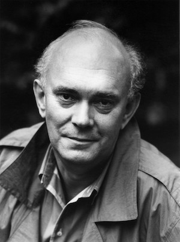

**[\<\<\< Previous page](/life/chronology/1988)**

**[Next page \>\>\>](/life/chronology/1990)**

### Notable Events

<aside>

*© John Haynes*

</aside>

During 1989, Alan Ayckbourn…

○ celebrated his 50th birthday by writing & directing the two part play ***[The Revengers' Comedies](/plays/the-revengers-comedies)*** at the **[Stephen Joseph Theatre In The Round](/career/ayckbourn-and-the-sjt/sjt-venues/stephen-joseph-theatre-in-the-round)**.

○ unfortunately saw the first film adaptation of one of his plays with ***[A Chorus of Disapproval](/plays/a-chorus-of-disapproval)***, directed by Michael Winner and starring Jeremy Irons and Anthony Hopkins; it is adapted by Winner who ignored Alan's input and the film title reflects the critical reaction to the adaptation of the acclaimed play.

○ received the Evening Standard Award For Best Comedy for ***[Henceforward…](/plays/henceforward)***.

○ directed a revival of ***[Absurd Person Singular](/plays/absurd-person-singular)*** at the Stephen Joseph Theatre In The Round, which transferred into the West End the following year.

○ saw a new television adaptation of ***[Relatively Speaking](/plays/relatively-speaking)*** broadcast on BBC2 on Christmas Eve.

○ is interviewed live via satellite link between Scarborough and London for the *Wogan* show; this was a very rare live link on what was then the most popular talk-show on British television.

○ saw Methuen publish Malcom Page's *File On Ayckbourn*.

○ saw Faber publish ***[Mr A's Amazing Maze Plays](/plays/mr-as-amazing-maze-plays)*** and Samuel French publish the revue ***[Me, Myself & I](/plays/me-myself-and-i)***.

### World Premieres

○ ***The Revengers' Comedies***  
13 June: Stephen Joseph Theatre In The Round  
○ ***The Inside Outside Slide Show*** (Children's play)  
22 July: Stephen Joseph Theatre In The Round  
○ ***Wolf At The Door*** (Adaptation)  
27 September: Stephen Joseph Theatre In The Round  
○ ***Invisible Friends***  
23 November: Stephen Joseph Theatre In The Round

### Notable Ayckbourn Productions

○ ***Absurd Person Singular*** (Revival)  
20 December: Stephen Joseph Theatre In The Round

### Professional Directing

○ ***Invisible Friends*** \*  
○ ***The Revengers' Comedies*** \*  
○ ***The Inside Outside Slide Show*** \*  
○ ***Wolf At The Door*** \*  
○ ***Absurd Person Singular*** \*

\* Stephen Joseph Theatre In The Round, Scarborough

### Plays In Other Media

○ ***A Chorus Of Disapproval***  
Film: 19 October, UK premiere  
○ ***Relatively Speaking***  
Television: 24 December, BBC2

### Awards

○ Evening Standard Award For Best Comedy  
*Henceforward…*

### Quotes

"Like all young dramatists I wanted to break moulds but I was economically under tremendous pressure, I had a wife and children very early on and I suddenly discovered that playwriting supplemented your acting income like mad. Playwriting started as a child benefit really. I wrote a play one summer and got £47.50 royalties for it which was something like six weeks wages. It seemed like fairy money for old rope, and I think my natural voice by some good fortune was a comic one and I found it no effort to say 'let's be funny'."  
*(Daily Telegraph, 15 April 1989)*

"People used to say 'Do you ever want to write a serious play?' and I used to get quite hurt. If I've done nothing else I hope I've managed to create an atmosphere where we can expect to laugh and cry in the same evening. I think there was a terrible division - 'are you a funny writer or are you a serious writer?'"  
*(Daily Telegraph, 15 April 1989)*

"I hate the dilution of theatre into purely message giving stuff, telling people that war is wrong, it's so much richer than that. The old Greek business of purging the emotions is so true. These dramatists are only giving people one course really, Ryvita, when you should be giving them this enormous banquet of pain and pleasure and joy."  
*(Daily Telegraph, 15 April 1989)*

"I think the board at the Stephen Joseph Theatre In The Round had been dubious about my two-year absence \[to the National Theatre\] and suspected it might be permanent. They were on the brink of getting me a farewell present, I believe."  
*(Yorkshire Evening Post, 8 May 1989)*

"One thing I enjoy is being able to walk across the deserted South Bay on a morning like today and getting my feet wet on the way to work. Not many people in the theatre can enjoy that kind of freedom."  
*(Yorkshire Evening Post, 8 May 1989)*

"There was some distance between writers and the theatre in those days \[the 1950s\]. Most playwrights were either famous and living in France, or dead. Stephen Joseph encouraged everyone to write, including me, and after a while the plays became more successful than my acting."  
*(Daily Telegraph, 2 June 1989)*

"You've got to keep surprising yourself. You have to try to break the mould of what made you successful. If you throw yourself into new worlds, new areas, new problems, you sharpen yourself. It's like mountaineering. If you keep climbing the same rock face you just wear out your boots. But if you say, let's go a different way up the Himalayas, it's exciting and maybe you convey some of that excitement in your work."  
*(International Herald Tribune, 5 August 1989)*

"Comedy is a good way to get behind an audience's defences and say something about their lives they'd find unpalatable in a more obviously serious play."  
*(International Herald Tribune, 6 August 1989)*

"I'd like to think I'm inching like an iceberg toward my aim. To write a completely serious play that makes people laugh all the time."  
*(International Herald Tribune, 5 August 1989)*

"I avoid all productions of my work other than things strongly recommended by people, whose judgment I trust. I get very steamed up if I see something I think is bad. It's usually not been the fault of the actors but of directors who've decided the whole thing should be done in bin-liners or something."  
*(Birmingham Post, 26 August 1989)*

"There's no denying that writing for younger audiences is more difficult. They have no tolerance for waffle, for faffing around with a story outline. It's a matter of adjusting your style; comedy should flow throughout, together with a more serious element."  
*(City Limits, 28 September 1989)*

"My view is that playwriting is an immensely practical craft. A successful playwright needs to have a working knowledge of all the many skills and ingredients which he has at his disposal. He need not be an expert in them (better not!) but he should have some idea of what's possible and, equally, what are the limitations."  
*(L'Espresso, October 1989)*

"If an artist resolutely ignores his live audience by ignoring its reaction or pretending it doesn't exist then he is failing to acknowledge the basic intention of theatre."  
*(L'Espresso, October 1989)*

"A playwright needs to be born, then needs to learn. Playwriting can be taught but not in the classroom. After a few brief discussions, the sooner a writer can have his dialogue 'up and running' before some sort of audience the better. I have very little time for theoretical playwriting. It's like theoretical furniture-making, not much good to sit on or eat your meals off."  
*(L'Espresso, October 1989)*

"I suppose my brand of comedy is comedy of disillusion. I get a bit depressed occasionally. Anyone who's lived more than thirty years tends to do so because you see the same things going round again."  
*(Daily Express, 16 October 1989)*
