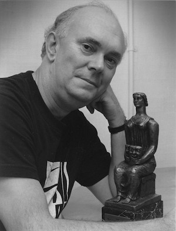

**[\<\<\< Previous page](/life/chronology/1989)**

**[Next page \>\>\>](/life/chronology/1991)**

### Notable Events

<aside>

*Alan Ayckbourn with his Evening Standard Award for Man Of The Moment  
© To be confirmed*

</aside>

During 1990, Alan Ayckbourn…

○ directed his first - and last! - production of a play by Shakespeare with ***[Othello](/career)*** at the **[Stephen Joseph Theatre In The Round](/career/ayckbourn-and-the-sjt/sjt-venues/stephen-joseph-theatre-in-the-round)**, starring Michael Gambon.

○ signed the lease for Scarborough's former **[Odeon](/career)** cinema to transform it into the new home of the **[Stephen Joseph Theatre](/career/ayckbourn-and-the-sjt/sjt-venues/stephen-joseph-theatre)**.

○ cast Michael Gambon, Ken Stott, Claire Skinner and Elizabeth Bell in the Scarborough company for *Othello* and ***[Taking Steps](/plays/taking-steps)***.

○ cast Michael Gambon as Douglas Beechey in the West End premiere of ***[Man Of The Moment](/plays/man-of-the-moment)***, for which he received an Olivier for Best Actor.

○ received the Evening Standard Best Comedy Award for *Man Of The Moment*.

○ saw *Man of the Moment* nominated for Best Play at the Olivier Awards.

○ directed the West End transfer of the 1989 revival of ***[Absurd Person Singular](/plays/absurd-person-singular)*** into the Whitehall Theatre.

○ is featured in the BBC1 flagship arts programme *Omnibus - Sex Politics & Alan Ayckbourn*.

○ is featured in the BBC documentary *Arena - Peggy And Her Playwrights*, looking at the life of the literary agent **[Margaret 'Peggy' Ramsay](/life/influences/ramsay-margaret)**.

○ had ***[Joking Apart](/plays/joking-apart)*** and ***[The Norman Conquests](/plays/the-norman-conquests)*** broadcast by BBC Radio.

○ saw Palgrave Macmillan publish an updated edition of Michael Billington's *Alan Ayckbourn - Modern Dramatists*.

○ saw Faber publish *Man Of The Moment*.

### World Premieres

○ ***Body Language***  
21 May: Stephen Joseph Theatre In The Round  
○ ***This Is Where We Came In***  
4 August: Stephen Joseph Theatre In The Round  
○ ***Callisto 5***  
12 December: Stephen Joseph Theatre In The Round

### Notable Ayckbourn Productions

○ ***Absurd Person Singular*** (Revival)  
27 January: Whitehall Theatre, London  
○ ***Man Of The Moment*** (West End premiere)  
14 February: Globe Theatre, London  
○ ***Taking Steps*** (Revival)  
4 December: Stephen Joseph Theatre In The Round

### Professional Directing

○ ***Man Of The Moment***  
Globe Theatre, London  
○ ***Absurd Person Singular***  
Aldwych Theatre, London  
○ ***Taking Steps*** \*  
○ ***Body Language*** \*  
○ ***This Is Where We Came In*** \*  
○ ***Callisto 5*** \*  
○ ***Othello*** \*  
○ ***Three Men In A Boat*** \*  
○ ***Abiding Passions*** \*

\* Stephen Joseph Theatre In The Round, Scarborough

### Plays In Other Media

○ ***Joking Apart***  
Radio: 9 February, BBC Radio 3  
○ ***The Norman Conquests***  
Radio: 30 August, BBC Radio 4

### Awards

○ Evening Standard Award For Best Comedy  
*Man Of The Moment*

### Quotes

"I hope my plays hold up in 400 years, that's the real test."  
*(American Theater, January 1990)*

"That national repression is something I bless and curse at the same time. As a writer, I like the fact that the English saunter in at an oblique angle to everything they say and do to each other. Whether it's love or hatred, they manage for a lot of time to hide or conceal it - or to show it without being aware that they're showing it."  
*(American Theater, January 1990)*

"I think the time is right for morality plays. In my last few plays, I've taken the audience by the hand and led them down a path a lot of them would not normally have taken."  
*(American Theater, January 1990)*

"After 30-something plays you need to hide in the cupboard and jump out and frighten yourself a little. I have to put myself on the line again with each one, to make me nervous. Not to be nervous is a bad sign."  
*(Sunday Times, 4 February 1990)*

"I'm getting bolder at interweaving the comic and the serious. My characters strobe between them so that people are laughing and stopping. There are moments when I can hear an audience turn in its tracks and back again. That's the tension I want to develop. But I still have a great desire to hear them laugh."  
*(Sunday Times, 4 February 1990)*

"Although I wanted to be an actor originally, I found that all aspects of the theatre attracted me. A whole new world opened up. Lighting, sound, costume - they were all fascinating."  
*(Bishop's Stortford Gazette, 16 February 1990)*

"I carry my ideas around in my head for months. I incubate them. Then I closet myself away and let all out at once."  
*(Bishop's Stortford Gazette, 16 February 1990)*

"It's more interesting to try and find themes of laughter through serious scenes. I call it theatrical Optrex - it keeps the eyes open. People tend to shut their eyes too quickly if something is painful to watch. I know I do - I hide behind my seat."  
*(Bishop's Stortford Gazette, 16 February 1990)*

"Generally being interviewed is a conspiracy between the one asking the questions and the one answering them. Both know what is required of them. There is a tacit understanding that both will play the game. But as an interviewee if you want to spoil things for the interviewer, it is really easy to do."  
*(Western Daily Mail, 24 February 1990)*

"I don't normally like to go back on my old work, but there is now a whole generation of theatre-goers who have no idea what I had done in the past."  
*(Western Daily Mail, 24 February 1990)*

"My plays have got more serious, but I hope the laughter still runs through them."  
*(Evening Advertiser, 24 February 1990)*

"There are ominous signs that theatre must get its money from sponsorship. We are becoming more reliant on independent sponsors. For me, this is not a very good sign. If these sponsors have put their money in they want to see results."  
*(Evening Advertiser, 24 February 1990)*

"I thought writing was just what people's mothers did. My writing was inherited from her. While she typed out her stories at the kitchen table, I typed out mine underneath it. If she'd been a wonderful cook instead, I'd probably be rolling pastry at the Savoy now."  
*(She, March 1990)*

"Domestic drama has always interested me, but it was really all I knew about when I started writing. I had only lived in marriage and the theatre."  
*(She, March 1990)*

"I thought his \[Stephen Joseph\] work was the most encouraging thing I had ever seen. Stephen was a tremendous encourager and told me to write my first play."  
*(She, March 1990)*

"Jonathan Swift said that satire is a mirror in which you behold everyone but yourself. I don't think I lift directly from life. Most of my characters are actually me in disguise."  
*(She, March 1990)*

"There has always been this desire to label me. I used to call my plays comedies. Now I just call them plays."  
*(She, March 1990)*

"I never choose political themes for my work, I feel politics (party politics) have no special place in theatre. Well, let's say no more nor less than anything else has. Any activity of human existence should be reflected in theatre occasionally, so why not politics? Along with stamp collecting and vintage car rallying."  
*(Correspondence, 5 April 1990)*

"I grew to like Shakespeare over the years because of seeing his work in the theatre, where he really comes alive. Sadly, many people don't go to see him, they have been put off by some dusty teaching."  
*(Scarborough Evening News, 25 September 1990)*

"I mistrust happy relationships very much. I think a big piece of us dies in marriage. I don't think it's for me."  
*(Sunday Correspondent, 30 September 1990)*

"I've always worked on Clint Eastwood's principle. I don't know if it's original but it's a good line. 'Take the work seriously, but never yourself.'"  
*(Sunday Correspondent, 30 September 1990)*

"I think that the young dramatist starting out today would find it very tough going to make a living in theatre. It does concern me quite a lot. Young playwrights should be able to work in theatre but, alas, often can't."  
*(Evening Plus, 24 October 1990)*

"My personal feeling is that plays should be written quickly. The more you write, the more assured you become, and once you've decided on the route it's best to get the journey done as quickly as possible."  
*(West Australian, 27 October 1990)*

"I never tell anyone my income but that doesn't stop journalists from guessing. Of course, they always get it wrong."  
*(West Australian, 27 October 1990)*

"My work is about man's inhumanity to woman and woman's inhumanity to man. It is about the whole physical world's inhumanity to us all."  
*(West Australian, 27 October 1990)*
