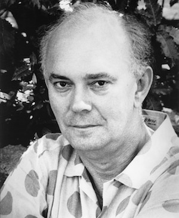

**[\<\<\< Previous page](/life/chronology/1990)**

**[Next page \>\>\>](/life/chronology/1992)**

### Notable Events

<aside>

*© To be confirmed*

</aside>

During 1991, Alan Ayckbourn…

○ lost his long-time agent Margaret Ramsay, better known as Peggy, when she died on 4 September. She became Alan's first agent in 1961 and her role was taken on by Tom Erhardt.

○ was named as one of the '1,000 Makers Of The 20th Century' by the Sunday Times.

○ directed the two part ***[The Revengers' Comedies](/plays/the-revengers-comedies)*** in London's West End. It was produced by Michale Codron after Alan declined to shorten the plays for the National Theatre.

○ directed ***[Invisible Friends](/plays/invisible-friends)*** at the **[National Theatre](/career/national-theatre)**; the first of the 'family plays' to open in the West End.

○ saw ***[Taking Steps](/plays/taking-steps)*** receive its New York premiere in an acclaimed in-the-round production directed by Alan Strachan.

○ saw Manhattan Theatre Club stage the New York premiere of ***[Absent Friends](/plays/absent-friends)*** with Brenda Blethyn as Diana and - in her first major stage role - Gillian Anderson as Evelyn.

○ appointed Malcolm Hebden as director of ***[Confusions](/plays/confusions)*** for its revival at the **[Stephen Joseph Theatre In The Round](/career/ayckbourn-and-sjt/sjt-venues/stephen-joseph-theatre-in-the-round)**; the first revival of his work at the venue he had not directed.

○ saw the academic exploration of Alan Ayckbourn's work *Alan Ayckbourn - A Casebook* by Bernard F Dukore published.

○ saw Faber & Faber publish *Invisible Friends* and *The Revengers' Comedies* and Samuel French publish ***[A Cut In The Rates](/plays/a-cut-in-the-rates)*** and ***[Man Of The Moment](/plays/man-of-the-moment)***.

### World Premieres

○ ***Wildest Dreams***  
6 May: Stephen Joseph Theatre In The Round  
○ ***My Very Own Story***  
10 August: Stephen Joseph Theatre In The Round

### Notable Ayckbourn Productions

○ ***Absent Friends*** (New York premiere)  
29 January: Manhattan Theatre Club  
○ ***Taking Steps*** (New York premiere)  
20 February: Circle In The Square, New York  
○ ***Invisible Friends*** (West End premiere)  
13 March: National Theatre, London  
○ ***The Revengers' Comedies*** (West End premiere)  
16 October: Strand Theatre, London  
○ ***This Is Where We Came In*** (Revival)  
28 November: Stephen Joseph Theatre In The Round  
○ ***Confusions*** (Revival)  
4 December: Stephen Joseph Theatre In The Round

### Professional Directing

○ ***Invisible Friends***  
National Theatre, London  
○ ***The Revengers' Comedies***  
Strand Theatre, London  
○ ***Wildest Dreams*** \*  
○ ***My Very Own Story*** \*  
○ ***Breaking Legs*** \*  
○ ***Augustus Carp Esq.*** \*  
○ ***The Village Fete*** \*

\* Stephen Joseph Theatre In The Round, Scarborough

### Awards

○ Drama-Logue Critic Award  
*Henceforward…*

### Quotes

"When I started writing, at about 25, I was angry, partly because I felt very bad about not being able to carry on with my marriage. For anybody who marries under 20, it is a miracle if it survives 'til they are 30. It's because you haven't really grown or formulated your own personality. Adults seem to encourage you into marriage but they never tell you just what it means to promise yourself to someone for the next 85 years. It is a hell of a promise. I was a solemn young man and I took it rather seriously, so I was rather ashamed of myself for having to break it."  
*(Theater Week, 25 February 1991)*

"I just think we do such terrible things to each other in the name of love. Of course it has to be said that bad relationships make good theatre. I always say that audiences like my plays because they have a gentle feeling of superiority - they say 'Well, we have got problems but nothing like those.'"  
*(Theater Week, 25 February 1991)*

"We have actually come to the conclusion, Samuel French Inc. and I, that we don't need Broadway that much. We have never pushed any of the plays to be done there and just release them \[to regional theatres) without waiting for the Broadway production. If you have a play done on Broadway you give away a fair amount of rights to a producer for about 50 years, a huge gift. The rewards from a successful production for a producer are enormous. If he gets a mega hit that is going to run round the country for the next 20 years he probably can retire on it. I don't mind doing that provided I am pretty sure that the show is going to do better than it will if it was released, otherwise why bother?"  
*(Theater Week, 25 February 1991)*

"I am not quite sure, but I suppose I come down so often on the side of the women because I was brought up in a single-parent family for a long time. I tended to see my mother's point of view more than that of my absent father and she had fairly strong opinions about the male sex. A little of that probably rubbed off. I guess there is the balance of male and female in all of us, I tend to swing that way when I write."  
*(Theater Week, 25 February 1991)*

"I think it is possible I am a more serious person than I was. A lot of people at my age start writing lighter plays. It's like they have shot their bow when they were angry teenagers and they are now mild old men. I am going sort of sour."  
*(Theater Week, 25 February 1991)*

"A lot of my plays are about people who attempt to find alternative existences outside their real lives, because their real lives are so boring or sad."  
*(The Independent, 6 March 1991)*

"They seem to be running rather close. Children's plays are about the basics. And a lot of my adult plays these days, when you boil them down a bit, are about the basics - about good and evil."  
*(The Independent, 6 March 1991)*

"I think in a way, without false modesty, that writing for children requires truly phenomenal experience. You have to do everything you do for adults, only you have to do it slightly better. Adults will give you about five minutes. They say, 'Well, it's a bit slow, but it'll probably warm up.' Children will give you quarter of a second. Then they say 'Boring!' and turn round to talk to the person behind. It's a very good, refresher course in writing drama. You can get a bit sloppy writing for adults because you can get away with a lot.  
*(The Independent, 6 March 1991)*

"I've been slowly moving towards a much more graphic narrative style and the plays have got much bigger in their field, much darker, and more fantastic, and for fantastic, read child-like."  
*(Evening Standard, 8 March 1991)*

"I still hold tremendous conversations with myself. When people overhear and ask who I'm talking to I say I'm just trying out some dialogue."  
*(Evening Standard, 8 March 1991)*

"I always consider serious plays to be comedies that haven't worked: I think any good play must have some comedy in it, and if it hasn't it's either because it's being directed badly or because it's a lousy play."  
*(Theatre Monthly, May 1991)*

"I've always tried to express the fact that theatre is live. If that means two people tossing a coin to decide which way they're going - well it keeps up the adrenaline of the actors and makes the audience think, 'Hey this play really is live!'"  
(Theatre Monthly, May 1991)

"Plays get more difficult, because you're always trying to challenge yourself. There's a very high expectation now for a play of mine - people waiting to see you fall over, and perhaps other people who've enjoyed your stuff before and hope to repeat the experience. The easiest play to write is the first one, where you're just grateful to finish it."  
*(Theatre Monthly, May 1991)*

"At the moment it is the fantastic that interests me; the fantastic that is not out of our grasp. I mean, I wouldn't want to write plays that no longer had a relevance. I do think there is a magic to be explored in the 'what if.'"  
*(Yorkshire Evening Press, 7 May 1991)*

"Possibly the saddest thing is, as you get older, you rather touchingly believe you'll get wiser, but I'm not actually sure that is right. I think you just get to recognise certain patterns that repeat themselves."  
*(Yorkshire Evening Press, 7 May 1991)*

"It seems in this country \[the UK\] you can't be commercially successful and good. You're either one or the other."  
*(The Times, 24 May 1991)*

"I tend to get to know actors quickly, because they have to use aspects of themselves for the part. I don't know much about their personal life outside, but by the time we've finished I know a lot about their psyches, inside. Actors need to be strong, they need a solid centre or they won't survive, and somehow you've got to make them all work in one room and respect each other and spark each other. Directing's half psychiatry and half diplomacy."  
*(The Times, 24 May 1991)*

"To hold eight people in your mind, with distinctive characters and voices, for more than a week is very hard. It begins to send you slightly barmy."  
*(The Times, 24 May 1991)*

"I started with farce, then moved on to comedy, then more towards sort of tragedies. Now they are somewhere in between."  
*(The Times 25 July, 1991)*

"Either you say in the same area, marital disharmonies exposed and all that, or you look outside and explore other levels of human emotion, the hidden agony under the skin. I like to get closer to then characters and see them on more levels. I have started to write thematic plays, more heavily symbolic with wider moral issues."  
*(The Times, 25 July 1991)*

"When I started I was being subsidised to write plays. It took seven years for me to get a success - I can't think of any business that would be prepared to wait that long."  
*(Salisbury Journal, 22 August 1991)*

"A play is drawing together so many disparate elements and making them all apparently happen effortlessly at the same time. When I am writing a play I always think that I am designing a structure in which events happen effortlessly. When the structure is up you can then be quite creative within it, but without that structure the narrative can just run away and it becomes rather boring. Stage plays are highly constructed artefacts and the very good ones do not show that. If a play is described as contrived then something is wrong."  
*(Writers' News, September 1991)*

"I just wish I had done a lot of things sooner. I think I am so incredibly lucky. I cannot claim to have planned my life with extreme care, but I had the luck to have been in the right place in England with Stephen Joseph who was passionately devoted to the encouragement of new works. He saw in me someone he wanted to encourage, and did so, and took huge chances. I happened to be around when he died and inherited a theatre I did not really want. In retrospect, these were the best things that happened to me."  
*(Writers' News, September 1991)*

"The biggest problems writers face is getting their work performed, but I have never had a play turned down. Mainly because they are all submitted to me."  
*(Evening Post, 11 September 1991)*

"Many of my plays have been stolen from films. I have spent a lot of time decanting my plays off the cinema screen. I never went to the theatre as a child. I passed my misspent youth in the cinema."  
*(Evening Post, 11 September 1991)*

"I do get a bit of a frown when people say the early plays are the best thing I wrote. I must have spent 30 years getting progressively worse."  
*(The Sunday Times, 29 September 1991)*

"I used to think up a title and if it had any bearing on the play, it was pure chance. An American once wrote a very long thesis on the significance of the title *Absurd Person Singular*, but in fact it has nothing whatsoever to do with the play."  
*(Evening Standard, 30 September 1991)*

"I make the marriages as happy as I see them. I think a little piece of us dies in marriage. We can't keep the initial spark. Once the little blaze of kerosene that started the bonfire settles down to a gentle crackle, we wonder whether we've got enough fuel to keep it going. Sometimes we look around and there's absolutely nothing left."  
*(Evening Standard, 30 September 1991)*

"Love often goes wrong, is misguided, misplaced. It fires at totally unsuitable people, people who often belong to other people. I'm talking about sexual love. Spiritual love between the sexes, platonic love, I don't really believe in. People may find they come to a deep friendship, but only after the blood-letting has occurred."  
*(Evening Standard, 30 September 1991)*

"Why does the theatre survive? Because it's people watching other people, being involved with other people. And for that reason it's absolutely irreplaceable."  
*(Evening Standard, 30 September 1991)*

"Revenge is a terribly strong emotion, it's a dangerous emotion, it's as strong as love. It's based on love which turns to hate. It's obsessive, it refuses to see reason. The revenge of normal people lasts about 20 minutes. You have an instinctive fury about what someone's done to you, but with most of us, thank God, the emotion passes. Otherwise there would be very few people left alive. I've never had any desire for revenge, but I have a tremendously fiery temper, particularly when I was a child. I used to attack everybody, kick park-keepers, punch passers-by, doctors, people in shoe shops. I was a really wild kid, I'd take on anybody."  
*(Daily Mail, 7 October 1991)*

"In order to write plays, you have to have quite a bit of anger. You use anger as a motor and from writing you sometimes find peace with the world."  
*(Daily Mail, 7 October 1991)*

"I'm a director who writes. I spend 95 percent of my time directing plays and running a theatre and only about five percent writing."  
*(Western Morning News, 15 October 1991)*

"My plays do appear to be terribly English and indeed the trimmings are, but underneath, they deal with basic human relationships. People do a lot of damage to each other with the best intentions. And I seem to write mostly about that. Love can do a lot of unintended damage."  
*(Western Morning News, 15 October 1991)*

"All the old stuff about everyone being related under the skin is probably true. Birth, death and marriage are things that affect us all. We all strike up some relationships, we're all born and we all die. Those tend to appear in my plays much more than, say, the dismantling of the Berlin Wall."  
*(Los Angeles Times, 10 November 1991)*

"I'm a bit dull really. I just get on with the next job. I don't consciously remember having celebrated any of the successes. On the other hand, the nice thing is that I've never really been hung up by the failures. And there have been some."  
*(Christian Science Monitor, 4 December 1991)*
