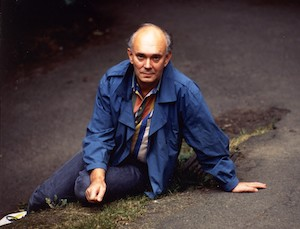

**[\<\<\< Previous page](/life/chronology/1991)**

**[Next page \>\>\>](/life/chronology/1993)**

### Notable Events

<aside>

*© John Haynes*

</aside>

During 1992, Alan Ayckbourn…

○ was appointed the **[Cameron Macintosh Visiting Professor Of Contemporary Theatre](/career/oxford-university)** at Oxford University.

○ saw the New York premiere of ***[A Small Family Business](/plays/a-small-family-business)*** at the Music Box Theater produced by Manhattan Theater Club.

○ saw ***[Mr Whatnot](/plays/mr-whatnot)*** published by Samuel French, almost thirty years after it was first produced; initial plans to include a sound mix long abandoned due to the progress of technology during the time it had taken to come to print.

○ collaborated with the composer John Pattison for the first time on the musical ***[Dreams From A Summer House](/plays/dreams-from-a-summer-house)*** at the Stephen Joseph Theatre In The Round.

○ had ***[Man Of The Moment](/plays/man-of-the-moment)*** broadcast by BBC Radio.

### World Premieres

○ ***Time Of My Life***  
21 April: Stephen Joseph Theatre In The Round  
○ ***Dreams From A Summer House***  
26 August: Stephen Joseph Theatre In The Round

### Notable Ayckbourn Productions

○ ***A Small Family*** ***Business*** (New York premiere)  
27 April: Music Box Theater, New York  
○ ***My Very Own Story*** (Revival)  
3 December: Stephen Joseph Theatre In The Round

### Professional Directing

○ ***Time Of My Life*** \*  
○ ***Dreams From A Summer House*** \*  
○ ***One Over The Eight*** \*  
○ ***My Very Own Story*** \*  
\* Stephen Joseph Theatre In The Round, Scarborough

### Plays In Other Media

○ ***Man Of The Moment***  
Radio: 10 May, BBC World Service  
○ ***Dreams From A Summer House***  
Original cast recording (Scarborough)

### Quotes

"I've suddenly realised that unless some of us start to write for children - not just for children, but for the family audience - we're not going to have an audience, except by fluke."  
*(Toronto Star, 27 June 1992)*

"They say there is no point coming to a play of mine unless you've had at least one unhappy love affair or experienced unrequited love."  
*(Scarborough Evening News, 15 August 1992)*

"I never dreamed then \[1957\] that I'd still be in Scarborough. Never dreamed that I'd be a director, still less an author. Always thought I'd be an actor."  
*(Yorkshire On Sunday, 16 August 1992)*

"One writes about one's own particular area. I'm not religious, I have a distaste for politics and find relationships endlessly fascinating. Some writers go out and look for a theme, but my characters just stagger in and start behaving."  
*(Cosmopolitan, September 1992)*

"Women treat me like a kind of honorary girlfriend. I remember a lunch a couple of years ago. After it the women sat on the grass with the children. The men stayed on the terrace: drinking, discussing royalties. Someone pointed out that I was on the grass, too. It wasn't a conscious decision. I just found myself sitting there enjoying it."  
*(Cosmopolitan, September 1992)*

"I was surrounded \[as a child\] by relationships that weren't stable. I used to hit my stepfather and once pushed him off his chair."  
*(Cosmopolitan, September 1992)*

"Affected by the insanity of physical love, you may find yourself with somebody who in saner moments you wouldn't even consider having dinner with."  
*(Cosmopolitan, September 1992)*

"I had a French woman writing a thesis on me. She said: 'I can't understand why so many people say they don't like your work when they've never seen or read any.' I said: 'That's called innate prejudice. Don't worry. It's a strangely British thing.'"  
*(Daily Mail, 5 November 1992)*

"Theatre is a performing art and the whole thing starts when the audience arrives and if it doesn't arrive it is no good. You have to take risks and you may offend. The problem at the moment is that we can't afford even to risk offending."  
*(The Times, 20 November 1992)*

"Playwriting is an intensely practical craft and the only way you can learn about it is by having your plays put on. In time you know the audience, you know what they will take and provided it is done right, it's quite extraordinary what they will take."  
*(The Times, 20 November 1992)*

"Every time I finish a play, there is a terrible emptiness for about three weeks and I tell Heather \[his now wife\] I will never write again. Then slowly the ideas start coming back."  
*(Daily Telegraph, 1 December 1992)*

"It's true that not much of my stuff finished on an up-curve. On the other hand, I hope it doesn't finish dismally desolately - maybe one or two of them do."  
*(Daily Telegraph, 1 December 1992)*

"Somebody once wrote that George Bernard Shaw and myself were the most prolific English writers for the stage. I don't know why Shaw wrote, but for me 45 plays is all to do with being attached to one tiny theatre. One of the things I treasure is having this place to write for."  
*(Daily Telegraph, 1 December 1992)*

"I try and leave the door open in my children's plays: I have this naive hope that children might have a solution to things locked inside them. So I try to say that anything is possible - within reason of course."  
*(Stage Write, December 1992)*

"We often assume children want to laugh their heads off. But often they're at their happiest when they're sitting seriously, or even in tears."  
*(Stage Write, December 1992)*

"I once coined a phrase that might be original; that a comedy is just a tragedy interrupted. You stop the action at the point where they lived happily ever after, not when he wakes up the next morning to find she eats cornflakes off her knife."  
*(Oxford Today, 1992)*

"Drama is a matter of strife. I don't think people are evil or malign. They usually intend well, but people harm each other entirely by accident - by loving them too much, like parents, or by marrying them."  
*(Oxford Today, 1992)*
