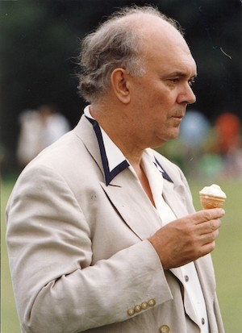

**[\<\<\< Previous page](/life/chronology/1992)**

**[Next page \>\>\>](/life/chronology/1994)**

### Notable Events

<aside>

</aside>

During 1993, Alan Ayckbourn…

○ received the Writers' Guild Of Great Britain Lifetime Achievement Award.

○ directed the first Royal Shakespeare Company production of one of his plays, ***[Wildest Dreams](/plays/wildest-dreams)***.

○ directed productions for the Royal Shakespeare Company, the **[National Theatre](/career/national-theatre)** (***[Mr A's Amazing Maze Plays](/plays/mr-as-amazing-maze-plays)***) & in the West End (***[Time Of My Life](/plays/time-of-my-life)***) all during the same year; it is believed he is the only person to have directed his own plays in all three places within the space of 12 months.

○ received the TMA / Martini Regional Theatre Award For Best Show For Young People & Children (*Mr A's Amazing Maze Plays*), the Birmingham Press Club Personality Of The Year and the Joan Ederyn Hughes Rural Wales Award For Literature.

○ revived one of his most famous works, ***[The Norman Conquests](/plays/the-norman-conquests)***, at the **[Stephen Joseph Theatre In The Round](/career/ayckbourn-and-sjt/sjt-venues/stephen-joseph-theatre-in-the-round)** for the first time; this marked the first time he had directed the trilogy since its world premiere in 1973.

○ saw *Laughter In The Dark - The Plays Of Alan Ayckbourn* by Albert E Kalson published.

○ saw Faber & Faber publish *Time Of My Life* and *Wildest Dreams*.

○ had ***[The Norman Conquests](/plays/the-norman-conquests)*** released on audio cassette by BBC.

### Notable Ayckbourn Productions

○ ***Mr A's Amazing Maze Plays***  
4 March: National Theatre, London  
○ ***The Norman Conquests*** (Revival)  
21 April: Stephen Joseph Theatre In The Round  
○ ***Time Of My Life*** (West End premiere)  
3 August: Vaudeville Theatre, London  
○ ***Mr A's Amazing Maze Plays*** (Revival)  
23 November: Stephen Joseph Theatre In The Round  
○ ***Wildest Dreams*** (West End premiere)  
14 December: RSC at The Pit, London

### Professional Directing

○ ***Mr A's Amazing Maze Plays***  
National Theatre, London  
○ ***Wildest Dreams***  
RSC at The Pit, London  
○ ***Time Of My Life***  
Vaudeville Theatre, London  
○ ***Table Manners*** \*  
○ ***Living Together*** \*  
○ ***Round & Round The Garden*** \*  
○ ***Love Off The Shelf*** \*  
\* Stephen Joseph Theatre In The Round, Scarborough

### Awards

○ Writers' Guild Of Great Britain Lifetime Achievement Award  
○ TMA / Martini Regional Theatre Award For Best Show For Young People & Children  
*Mr A's Amazing Maze Plays*  
○ Birmingham Press Club Personality of the Year Award  
○ John Ederyn Hughes Rural Wales Award For Literature

### Quotes

"I guess I'm old fashioned. I think art should elevate as well as educate. If you do write a play or make a movie which says that everything is terrible, full stop, you are simply adding to the world's misery. It would be equally irresponsible to pretend that everything is wonderful, but so many modern films seem to have a dreadful feeling of hopelessness. Cynicism is a very dangerous disease. It erodes genuine emotion very quickly. You become rather ashamed of admiring people or expressing any positive emotions."  
*(Scarborough Evening News, 1 April 1993)*

"The whole style of my writing has changed. I haven't written a comedy in a long time. I have written plays with a lot of humour in them. But the later plays have balanced humour with sadness and fear and darkness."  
*(Western Mail, 31 May 1993)*

"I never believed a play was worth doing unless there was an audience to see it. I always try to balance intelligent and reasonably intuitive theatre with a degree of entertainment. I want to reach people when writing plays. There is a misapprehension that comedy is easy, but anyone in the business knows comedy is harder to act, write and direct."  
*(Western Mail, 31 May 1993)*

"Dialogue is for me the easiest. It tends to develop as I get to know them. In an ideal play each person would have their own specific speech pattern."  
*(Writers' Monthly, July 1993)*

"I've got a fear of drying up. I have been writing since 1959, a lot of very good writers tend to pack it into a decade. In my case, the reason I kept going is this theatre (the Stephen Joseph Theatre). Having a theatre of one's own to run means you have an outlet."  
*(Writers' Monthly, July 1993)*

"Most of my favourite plays have something to say about the human condition."  
*(Writers' Monthly, July 1993)*

"The writer is an integral part of the whole play-making process."  
*(Writers' Mostly, July 1993)*

"It sounds cynical, but if you live long enough you can see the cycles happening. You can date the days people bound through the door of your house and say 'We're in love', then if you cut 10 years you can see them saying 'I never knew it was going to be like this.' Next you see them with an identical version of the person the type they've just got rid of. People are like lemmings and seek out the very person who is worst for them."  
*(Writers' Monthly, July 1993)*

"It would be terrible to sit down, watch a play and declare it to be perfect. That's the day you stop writing."  
*(Writers' Monthly, July 1993)*

"I don't think of myself as only writing comedy, I think of myself in the act of turning up occasional comic moments. I've always been fascinated by the tension between the comic and the tragic, sometimes in a single moment."  
*(International Herald Tribune, 20 July 1993)*

"I think the comedy adds to the tragedy and the tragedy adds to the comedy - the awful things happen to us in the most critical moments of our existence. You lose the buttons off your trousers and you hope God will have granted you some vestige of dignity."  
*(International Herald Tribune, 20 July 1993)*

"I find much of writing, although it has occasional moments of joy, rather tedious which is why I cut it down to the shortest periods of my life that I can mange."  
*(International Herald Tribune, 20 July 1993)*

"I'll tell you what theatre does in a general way. It brings together and that's why it's theatre and not cinema. It brings people together who realise that there are other people out there like them. And I think the best of my plays can unite a group of people and cause them to realise that their perception of it is shared by other people, and there's something very consoling in that."  
*(International Herald Tribune, 20 July 1993)*

"How you tell a story is important but it is sometimes not considered by new playwrights so you say to them, yes, what you're saying is terribly important but could you get a more interesting *how* because two men in an armchair doesn't make for terribly good watching. if they're trying to bolt together a section of the Eiffel Tower while they're talking, it becomes worth watching in case one of them falls off. And we suddenly become tense."  
*(International Herald Tribune, 20 July 1993)*

"The table next to me is an invaluable source of insights into my character."  
*(The Standard, 27 July 1993)*

"Women often seem to use restaurants to talk things over. They know that there's nothing much to hide behind except the menu when they ask the inevitable 'what is going to happen to us?'"  
*(The Standard, 27 July 1993)*

"When I left school I would have married any women who walked up to me. All the streetwise day boys had experience, but as a boarder I hadn't met any women. I was grateful for anybody and fell in love immediately."  
*(The Observer 12 December 1993)*

"I'm prepared to believe there may be the odd fluke where two strangers meet and find they have common interest, just sufficient differences to make it a little bit exciting and a tremendous on-going sexual relationship, but for most people it doesn't work like that. You make promises you have no right to make - that you should be legally stopped from making. At 19 I believed you should stand by what you said, but there was no way I could have stood by those promises until I was 70. Then comes a tremendous feeling of failure. First you think there is a flaw in you, then, later on, you notice practically everyone you know has broken up. It isn't you: it is the rotten institution."  
*(The Observer, 12 December 1993)*

"I do get a feeling from the grass-roots audience that I write for, that people don't just want escapist work. They're not looking for pat answers but a spark of affirmation that there are good forces out there. You must leave doors open. My remaining duty, I suppose is to spread a little light around."  
*(Sunday Express, 12 December 1993)*

"I sort of like my earlier plays, but I'm much more interested in what I'm doing next."  
*(1993)*
