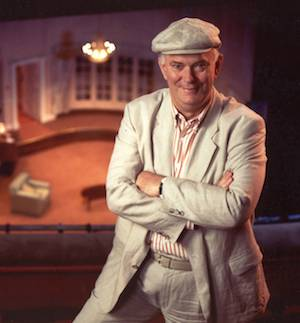

**[\<\<\< Previous page](/life/chronology/1993)**

**[Next page \>\>\>](/life/chronology/1995)**

### Notable Events

<aside>

*© To be confirmed*

</aside>

During 1994, Alan Ayckbourn…

○ received the Montblanc de la Culture For Europe.

○ wrote the three-hander ***[Haunting Julia](/plays/haunting-julia)*** for the **[Stephen Joseph Theatre In The Round](/career/ayckbourn-and-the-sjt/sjt-venues/stephen-joseph-theatre-in-the-round)** as a last minute cost-saving addition to the schedule due to Arts Council funding cuts.

○ saw French film director Alain Resnais adapt ***[Intimate Exchanges](/plays/intimate-exchanges)*** into two César Award winning films *Smoking / No Smoking*.

○ appeared in the first of two dedicated *The South Bank Shows* on ITV with *The Plain Guide To Playwriting*.

○ was named Yorkshire Man Of The Year - despite the fact he is not from Yorkshire!

○ saw *Time Of My Life* nominated for Best Comedy at the Olivier Awards.

○ toured the world premiere production of ***[Communicating Doors](/plays/communicating-doors)*** to the Chicago Drama Festival.

○ saw Duncan's Wu's *Six Contemporary Playwrights* published by Palgrave Macmillan.

○ saw Samuel French publish ***[Man Of The Moment](/plays/man-of-the-moment)***, ***[The Revengers' Comedies](/plays/the-revengers-comedies)***, ***[Time Of My Life](/plays/time-of-my-life)*** and ***[Wildest Dreams](/plays/wildest-dreams)***.

○ had *Man Of The Moment* published as an audio play by LA Theatre Works.

### World Premieres

○ ***Communicating Doors***  
2 February: Stephen Joseph Theatre In The Round  
○ ***Haunting Julia***  
20 April: Stephen Joseph Theatre In The Round  
○ ***The Musical Jigsaw Play***  
1 December: Stephen Joseph Theatre In The Round

### Notable Ayckbourn Productions

○ ***Communicating Doors*** (North American premiere)  
25 May: Chicago Drama Festival

### Professional Directing

○ ***Two Weeks With The Queen***  
National Theatre, London  
○ ***Communicating Doors***  
Merle Reskin Theater, Chicago  
○ ***Communicating Doors*** \*  
○ ***Haunting Julia*** \*  
○ ***The Musical Jigsaw Play*** \*  
○ ***Two Weeks With The Queen*** \*  
○ ***Conversations With My Father*** \*  
\* Stephen Joseph Theatre In The Round, Scarborough

### Plays In Other Media

○ ***Smoking / No Smoking (Intimate Exchanges)***  
Film: 15 December, world premiere

### Awards

○ Yorkshire Man Of The Year  
○ Montblanc de la Culture Award For Europe

### Quotes

"My German agent tells me there is an enormous debate going on about whether Ayckbourn is serious or not. The options seem equally rather gloomy: one is that I am second only to Schiller in my seriousness, the other is that I'm the silliest writer since God knows who. I would rather like to be somewhere in the middle."  
*(The Observer, 20 February 1994)*

"The middle ground is gone in the West End. Unless the critics are 100% in saying this is wonderful, you don't have a chance for a good run. The less-then-perfect play just doesn't get done anymore."  
*(Chicago Tribune, 30 March 1994)*

"As soon as anybody stands up and says 'I've thought of something new,' someone else stands up and says, 'No, Webster did that 400 years ago.' I was rather proudly crediting myself at one stage of my career on writing this peculiar blend of the dramatic and the comic running together. It was only when I directed a Jacobean play for the National Theatre that I realised that this was what they had been doing back then. We'd lost it. What fuels my approach at the moment is an attempt not to write a genre play, but to embrace them all."  
*(Stagebill, April 1994)*

"A lot of theatre underestimates audiences. You can present something very sophisticated and hard to follow and if you give audiences the right clues they can follow you."  
*(River North News, 21 May 1994)*

"We were friends in a way that the average eight-year-old boy seldom was with his mother. And she had a lot of female friends so I got very used to the company of women. I was a child among adults much of the time, and female adults at that. Those years formed me as a writer. I've lived in the North, on and off, since the end of the fifties. I've written 46 plays now and all but one has been set in the South. You go back to your roots, don't you?"  
*(OK, September 1994)*

"I hope that in a decade that I shall have retained the ability constantly to surprise myself. Like Stephen Joseph, I never want to settle into a rut."  
*(OK, September 1994)*
