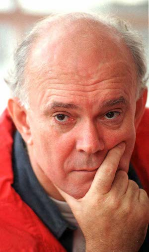
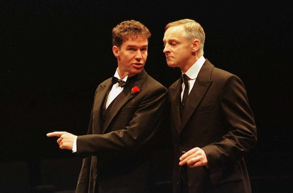

**[\<\<\< Previous page](/life/chronology/1995)**

**[Next page \>\>\>](/life/chronology/1997)**

### Notable Events

<aside>

*© Tony Bartholomew*

</aside>

During 1996, Alan Ayckbourn…

○ moved the Scarborough company to its first purpose-designed venue, the **[Stephen Joseph Theatre](/career/ayckbourn-and-the-sjt/sjt-venues/stephen-joseph-theatre)** (SJT).

○ revised and revived the musical *Jeeves* as ***[By Jeeves](/plays/jeeves)*** with Andrew Lloyd Webber to open the SJT.

○ directed the transfer of *By Jeeves* in the West End and its American premiere later in the year.

○ received the TMA Regional Theatre Award for Best Musical for *By Jeeves* & the Writers' Guild of Britain Best Play award for ***[Communicating Doors](/plays/communicating-doors)***.

○ saw *Communicating Doors* nominated for Best Comedy at the Olivier Awards.

○ appeared in the second Ayckbourn dedicated *The South Bank Show* is broadcast on ITV, *The Plain Guide To Playwriting Part 2*.

○ featured in the BBC documentary *Ayckbourn's Ambition*.

○ revised and revived the random murderer thriller ***[It Could Be Any One Of Us](/plays/it-could-be-any-one-of-us)*** - this version actually included a murder.

○ saw ***[The Revengers' Comedies](/plays/the-revengers-comedies)*** broadcast by BBC Radio.

○ saw Samuel French publish *Communicating Doors* and ***[A Word From Our Sponsor](/plays/a-word-from-our-sponsor)***.

○ directed the BBC Radio broadcast of *By Jeeves*.

*Steven Pacey as Bertie Wooster & Malcolm Sinclair as Jeeves in By Jeeves.  
© Tony Bartholomew*

### World Premieres

○ ***By Jeeves***  
1 May: Stephen Joseph Theatre  
○ ***The Champion Of Paribanou***  
4 December: Stephen Joseph Theatre

### Notable Ayckbourn Productions

○ ***By Jeeves*** (West End premiere)  
2 July: Duke Of York's Theatre, London  
○ ***It Could Be Any One Of Us*** (Revival)  
20 August: Stephen Joseph Theatre  
○ ***It Could Be Any One Of Us*** (Revival)  
2 October: Chichester Festival Theatre  
○ ***By Jeeves*** (North American premiere)  
17 October: Goodspeed Opera House, Connecticut

### Professional Directing

○ ***By Jeeves***  
Duke of York's Theatre, London  
○ ***By Jeeves***  
Goodspeed Opera House, Connecticut  
○ ***By Jeeves*** \*  
○ ***The Champion Of Paribanou*** \*  
○ ***It Could Be Any One Of Us*** \*  
○ ***Wild Honey*** \*

\* Stephen Joseph Theatre, Scarborough

### Plays In Other Media

○ ***The Revengers' Comedies***  
Radio: 1 June, BBC Radio 4  
○ ***By Jeeves***  
Radio: 14 December, BBC Radio 2  
○ ***By Jeeves***  
Original cast recording (Scarborough)  
○ ***By Jeeves***  
Original cast recording (London)

### Awards

○ TMA Regional Theatre Award for Best Musical  
*By Jeeves*  
○ Writers' Guild Of Britain Best Play  
*Communicating Doors*

### Quotes

"Farce must be played straight to be funny."  
*(The Gazette, 23 March 1996)*

"Although my plays are directed frequently by other people I don't usually go and see them unless I get a strong recommendation from a friend. All too often I find dialogue that is meant to be overlaid has got separated and the whole pace has slowed down. It's what I call the woolly jumper effect. A little thread gets pulled and the next thing you know the jumper is just a pile of wool on the floor. Many actors don't give proper attention to the lines because they are too used to the sort of 'wallpaper' dialogue used so often now on television."  
*((The Gazette, 23 March 1996)*

"I'm always early when I'm meeting people, and I do tend to listen in to others' conversations. I don't write anything down - it just seems to roll into my mind. The best places are restaurants. About 80 percent of people in restaurants always seem to be having life-sorting conversations. The women have decided that this is the only way they are going to get their men to sit down and listen."  
*(The Gazette, 23 March 1996)*

"When I started in theatre, the heavy play was always underlit and played slowly, and the comedy would have bright lights and be played faster. I didn't see why you couldn't have a slow, underlit comedy with a serious point to make. I don't believe in the apartheid of the theatre that rigidly operates plays into different categories."  
*(The Gazette, 23 March 1996)*

"In years of theatre, one has seen so many basic stupid mistakes, normally because nobody who's involved in the running of the place has ever been asked. You sometimes go to new theatres and think: 'I wonder if anyone ever spoke to an actor about this?'"  
*(Yorkshire Post, 8 April 1996)*

"I inherited a theatre by default, and it was only later I realised I had fallen on my feet. I had this wonderful clear road to a writing career. There was no middle man telling me it was not suitable."  
*(The Times, 10 April 1996)*

"Most of the best theatre stories derive from flops. Nobody ever tells a funny theatre story that begins 'I was in this tremendously successful show that got 15 curtain calls."  
*(The Guardian, 24 April 1996)*

"If you're very lucky, you meet influential people in your life and one of my great mentors was a man called Edgar Matthews, who ran the school Shakespeare every year and was, again, one of these completely demented amateur producers who taught French but really lived for his theatre."  
*(East Anglian Daily Times, April 1996)*

"There are lots of new plays about worthy subjects, things that need to be aired. Plays should have content and have something to say about society or individuals but we have got so tied up with content that we have forgotten how to tell it. It is surely possible to say important things about the community and still retain dramatic structure and sense - and a sense of humour. The British don't like being preached at."  
*(East Anglian Daily Times, April 1996)*

A lot of my writing, funnily enough, is informed by film and film writing. Much of my mis-spent youth was in the cinema and I think the shapes and structures of a lot of my plays owe a lot to film, transferred into theatrical terms. This is maybe why they don't make terribly good movies, because you have to translate them back again!"  
*(East Anglian Times, April 1996)*

"The best thing Stephen Joseph ever did for me was to shove my first play into the main house, and demand that it made money or we close."  
*(Light & Sound, May 1996)*

"It may sound odd but my idea of a break is to go away and write. I like that. Sitting and getting to know the characters is really rather nice. That's my idea of a mischievous musing."  
*(Daily Express, 11 July 1996)*

"I also have a writer's permanent fear of drying up. I have certainly gone way past what I should have written, so I am always other thankful now if I get another play out."  
*(Daily Express, 11 July 1996)*

"They say a person is tired of life if he is tired of London. I love it for short spurts but, after I've been there three of four weeks, I begin to miss the sea, my cat and my home."  
*(Daily Express, 11 July 1996)*

"Going to the seaside when I was small meant that you had been good. When I got the job here \[Scarborough\], it was like a reward. I arrived in early June and the place was full of people with buckets and spades."  
*(Country Living, August 1996)*

"Yorkshire people are exceptionally non-intrusive. They respect privacy and there is an actual pride in being effusive. Just about the only time I get approached is if I stop to look in a shop window, and someone thoughtfully decides: Ah, he's waiting to be recognised and comes up to say, 'Hello, excuse me, but aren't you Alan Ayckbourn?'"  
*(Country Living, August 1996)*

"The most rewarding remark I ever heard came from a man who told me after a show 'If I'd known what I had been laughing at in there, I wouldn't have laughed.'"  
*(The Scotsman, August 1996)*
