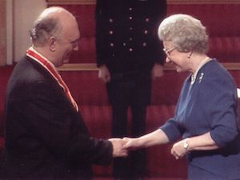

**[\<\<\< Previous page](/life/chronology/1996)**

**[Next page \>\>\>](/life/chronology/1998)**

### Notable Events

<aside>

</aside>

During 1997, Alan Ayckbourn…

○ was knighted 'for services to theatre'; the first playwright to be knighted since Sir Terence Rattigan.

○ was named the eighth most influential person in British theatre in the annual The Stage 100 listing.

○ married Heather Stoney.

○ received the Lloyds' Private Banking Playwright Of The Year & his first Molière Award for ***[Communicating Doors](/plays/communicating-doors)***.

○ directed ***[By Jeeves](/plays/jeeves)*** at the Kennedy Center, Washington, and ***[Things We Do For Love](/plays/things-we-do-for-love)*** at the Palais des Beaux Arts, Belgium.

○ directed *Things We Do For Love* at the **[Stephen Joseph Theatre](/career/ayckbourn-and-sjt/sjt-venues/stephen-joseph-theatre)**; the first production to run for more than 100 performances at the venue.

○ saw *By Jeeves* nominated for Outstanding Musical Production at the Olivier Awards.

○ saw the Stephen Joseph Theatre become the focus of national media attention with the 'Luvvies vs Lavvies' funding crisis; it was incorrectly alleged the theatre was diverting public money from public facilities when - in fact - it wasn't as they were funded from different council budgets.

○ had ***[Way Upstream](/plays/way-upstream)*** broadcast by BBC Radio.

○ saw Samuel French publish ***[Dreams From A Summer House](/plays/dreams-from-a-summer-house)*** and ***[Family Circles](/plays/family-circles)***.

### World Premieres

○ ***Things We Do For Love***  
29 April: Stephen Joseph Theatre

### Notable Ayckbourn Productions

○ ***By Jeeves*** (Revival)  
4 June: John F. Kennedy Centre, Washington  
○ ***Absent Friends*** (Revival)  
9 October: Stephen Joseph Theatre  
○ ***Things We Do For Love*** (Revival)  
TBC: Palais des Beaux Arts, Belgium

### Professional Directing

○ ***By Jeeves***  
The Kennedy Centre, Washington  
○ ***Things We Do For Love***  
Palais des Beaux Arts, Belgium  
○ ***Things We Do For Love*** \*  
○ ***Absent Friends*** \*  
○ ***Fool To Yourself*** \*  
○ ***They're Playing Our Song*** \*  
○ ***Near Cricket, St Thomas*** \*  
\* Stephen Joseph Theatre, Scarborough

### Plays In Other Media

○ ***Way Upstream***  
Radio: 14 June, BBC World Service

### Honours & Awards

○ Knighted 'for services to theatre'  
○ Lloyds' Private Banking Playwright Of The Year  
○ Molière Award for Best Comedy  
*Communicating Doors*

### Quotes

"I have a knack of being able to step away from the play when I'm directing. Occasionally - this sounds like a delusion of grandeur or madness - I'll talk about the writer in the third person."  
*(Back Stage West, 13 March 1997)*

"I’m always amazed that some of the worst behaviour is propagated by people who are in love. We seem to save our worst behaviour for those we love. The reason is, of course, a desperation to communicate, to be loved."  
*(Scarborough Evening News, 16 April 1997)*

"The thing about love is that it never leaves you. You got through life thinking, 'it's over now. I've been through my teens, 20s, 30s.' Then, wallop."  
*(Yorkshire Post, 26 April 1997)*

"Love is a subject that's never far away from our thoughts, I've observed that we often save the best of ourselves, but also the worst of ourselves, for the ones we fall in love with. For every happy couple coming together, there is often a jilted lover in the background; some betrayed husband or wife who has lost out."  
*(Yorkshire Evening Press, 26 April 1997)*

"The most important thing in theatre is not so much the play itself, as the fact that you are also aware that there are another 200 people there. It's a common bond; to be pompous, a common assertion of our humanity. On the Internet you don't get a sense of humanity. You get a sense of some very weird people writing. Even in movies you are sort of cut off. Film makers go to enormous trouble to make the screen surround you."  
*(Artscene, April 1997)*

"It happens. At the age of 35-45, you decide all that sex is over. You say, 'let's settle down like civilised human beings' - and then *blam*, the old glandular machine kicks in again. People who've been terrific to their partners through every difficulty are suddenly brushed aside. History is littered by people who have trampled over lovers, wives, best friends to get at each other."  
*(Artscene, April 1997)*

"There are people who sit there and laugh at my plays quite unconcernedly; I look at them rather quizzically and wonder where they've been. I always say you enjoy my plays more if you've been round the circuit a couple of times. People who have been in and out of love are going to say 'Ouch!', where it may not mean much to the lucky five per cent who got married at 18 and have never had a cross word."  
*(Birmingham Post, 6 September 1997)*

"I'm always cautious about going to see my plays. As a director and a writer, I've got rather precise views about how they should be done. I won't say that everything I've seen has been dire, but I'm always nervous. Unless someone I trust rings up and tells me that I'll really like something, I don't go. I'd just sort of bubble with discontent. I've seen two or three productions where I've wanted to go and strangle the director."  
*(Bulletin, 11 September 1997)*

"I could quite happily write all the time. But I don't - I 'starve' myself, then approach it all the more eagerly when the time comes."  
*(Bulletin, 11 September 1997)*
