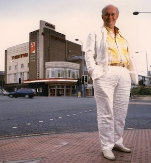
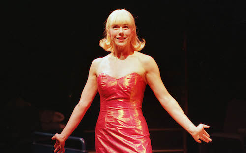

**[\<\<\< Previous page](/life/chronology/1997)**

**[Next page \>\>\>](/life/chronology/1999)**

### Notable Events

<aside>

*© To be confirmed*

</aside>

During 1998, Alan Ayckbourn…

○ led the resignation of the entire Drama Advisory Panel of the Arts Council in protest at the Government's new arts policies.

○ directed ***[Comic Potential](/plays/comic-potential)*** at the **[Stephen Joseph Theatre](/career/ayckbourn-and-the-sjt/sjt-venues/stephen-joseph-theatre)** with Janie Dee playing Jacie Triplethree.

○ wrote ***[The Boy Who Fell Into A Book](/plays/the-boy-who-fell-into-a-book)*** to mark the National Year Of Reading.

○ directed ***[Things We Do For Love](/plays/things-we-do-for-love)*** in the West End at the Gielgud Theatre starring Jane Asher.

○ saw *Things We Do For Love* nominated for Best Comedy at the Olivier Awards.

○ saw ***[The Revengers' Comedies](/plays/the-revengers-comedies)*** adapted into a film by the BBC; the five-hour running time reduced to 82 minutes.

○ had *Things We Do For Love* broadcast by BBC Radio.

○ saw Faber & Faber publish the collection *Alan Ayckbourn - Plays 2* as well as *Things We Do For Love*.

*Janie Dee in Comic Potential*  
*© Tony Bartholomew*

### World Premieres

○ ***Comic Potential***  
4 June: Stephen Joseph Theatre  
○ ***The Boy Who Fell Into A Book***  
4 December: Stephen Joseph Theatre  
○ ***Cheap And Cheerful*** (Revue)  
18 December: Stephen Joseph Theatre

### Notable Ayckbourn Productions

○ ***Things We Do For Love*** (West End premiere)  
3 March: Gielgud Theatre, London

### Professional Directing

○ ***Things We Do For Love***  
Gielgud Theatre, London  
○ ***Comic Potential*** \*  
○ ***The Boy Who Fell Into A Book*** \*  
○ ***Cheap & Cheerful*** \*  
○ ***Baby On Board*** \*  
○ ***Figuring Things*** \*  
○ ***Love Songs For Shopkeepers*** \*  
○ ***Later Life*** \*  
○ ***A Doll's House*** \*  
○ ***Baby On Board***  
UK tour

\* Stephen Joseph Theatre, Scarborough

### Plays In Other Media

○ ***Things We Do For Love***  
Radio: TBC, BBC World Service  
○ ***The Revengers' Comedies \****  
Film: Release date TBC  
**\*** Released as *Sweet Revenge* in North America.

### Quotes

"I'm well over - what they call in rugby - the dead ball line. Playwrights on the whole have short writing spans. They go on to write autobiographies, sit around, get drunk and complain about younger playwrights. To be able to carry on writing is a bonus."  
*(Time Out, 25 February 1998)*

"Once I have an idea, my next step is to think how to present it in an interesting way, and then how to tell my story. That's something that isn't awfully stressed these days that theatre is also storytelling."  
*(Time Out, 25 February 1998)*

"What I've always tried to do when I'm writing is to respect the essential seriousness of a subject and yet observe it through comic eyes."  
*(Time Out, 25 February 1998)*

"I always thought that if I did get knighted I owed it to Heather \[his long term partner\] to marry her because it would give her such a thrill. But at the same time I thought, well, Chris \[his first wife\] has stuck with me too. And then I realised I could do it. I could get them both in \[by divorcing after the Knighthood and remarrying, both women are now Lady Ayckbourn\]."  
*(Daily Telegraph, 3 March 1998)*

"I look back at my career and I think I'm a bit like a cricketer. You get patches when you are not scoring very heavily - but luckily Scarborough has always been there to get me through."  
*(Daily Telegraph, 3 March 1998)*

"My main concern is to try and make theatre as accessible as possible. There's a lot of people with built-in prejudices simply based on nothing more than they don't like the sound of it. We can break through that barrier with a few people and say, 'Listen, it's about fun, it's about enjoying yourself.'"  
*(The Big Issue, 8 June 1998)*

"Of course, there is flippant and frivolous comedy that says virtually nothing, but at the other end of the scale there are great comedies that leave you with just as much thought and possibly thought that you wouldn't otherwise have digested."  
*(The Big Issue, 8 June 1998)*

"Human nature doesn't change. We just adopt different hair styles."  
*(Personal correspondence, 26 July 1998)*

"I stopped categorising myself a long time ago, because I grew a little tired of being pigeon-holed as a comic writer. So I began to just name my plays 'A Play,' because yes, there's farce in them, and comedy - but there's also tragedy occasionally."  
*(Time Out - New York, 6 August 1998)*

"All the best comedies have a serious basis; otherwise they just fly away - you forget them the moment you leave the theatre."  
*(Time Out - New York, 6 August 1998)*

"I think plays need to be written fast, because all the ingredients have to be drawn into this canvas, and quite honestly, if I spread that process out for months, I'd forget what was on the canvas. I'd have to keep looking back."  
*(Time Out - New York, 6 August 1996)*

"The day I got knighted, I was walking down the road, and a man passed me and said, 'Congratulations on the knighthood, Mr Ayckbourn.' And I thought, well, you haven't got it quite right. But never mind, the thought's there."  
*(Time Out - New York, 6 August 1998)*

"It was here \[in Scarborough\] that I was first encouraged to write. Stephen Joseph was the sort of anti-establishment figure who was attractive to to a 17 or 18-year-old. If I'd not met him, I'd never had the opportunities to develop my writing."  
*(Daily Mail, 16 August 1998)*

"If I write, I want to see it on stage - and I can. I'm terribly spoilt."  
*(Daily Mail, 16 August 1998)*

"I worked at the National Theatre for two years and swear some people didn't know they were in a theatre."  
*(Daily Mail, 16 August 1998)*
