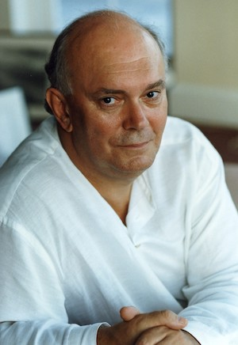

**[\<\<\< Previous page](/life/chronology/1999)**

**[Next page \>\>\>](/life/chronology/2001)**

### Notable Events

<aside>

*© Tony Bartholomew*

</aside>

During 2000, Alan Ayckbourn…

○ directed ***[House & Garden](/plays/house-and)*** at the **[National Theatre](/career/national-theatre)**; his first non 'family' play at the venue since 1987.

○ saw ***[Comic Potential](/plays/comic-potential)*** receive its New York premiere with the actress Janie Dee reprising her Olivier Award winning role of Jacie Triplethree.

○ saw *Comic Potential* nominated for Best Comedy at the Olivier Awards.

○ collaborated with the composer Denis King on their first full length musical, ***[Whenever](/plays/whenever)***.

○ revived ***[Bedroom Farce](/plays/bedroom-farce)*** at the **[Stephen Joseph Theatre](/career/ayckbourn-and-the-sjt/sjt-venues/stephen-joseph-theatre)** marking the first time he had directed it in-the-round and also the first production to be staged in both The Round and The McCarthy auditoriums at the venue.

○ had ***[Woman In Mind](/plays/woman-in-mind)*** broadcast by BBC Radio.

○ saw ***[The Boy Who Fell Into A Book](/plays/the-boy-who-fell-into-a-book)***, *House & Garden* and ***[Gizmo](/plays/gizmo)*** published by Faber & Faber. ***[The Champion Of Paribanou](/plays/the-champion-of-paribanou)*** and *Gizmo* published by Samuel French.

○ had ***[Just Between Ourselves](/plays/just-between-ourselves)*** adapted as an audio play by LA Theatre Works.

○ was featured in the Artsworld documentary *Biography: Alan Ayckbourn*.

### World Premieres

○ ***Virtual Reality***  
8 February: Stephen Joseph Theatre  
○ ***Whenever***  
5 December: Stephen Joseph Theatre

### Notable Ayckbourn Productions

○ ***Virtual Reality*** (Tour)  
15 February: UK tour produced by Stephen Joseph Theatre  
○ ***House & Garden*** (West End premiere)  
9 August: National Theatre  
○ ***Bedroom Farce*** (Revival: in-the-round)  
26 September: Stephen Joseph Theatre  
○ ***Comic Potential*** (New York premiere)  
16 November: Manhattan Theatre Club  
○ ***Bedroom Farce*** (Revival: end-stage)  
19 December: Stephen Joseph Theatre

### Professional Directing

○ ***House & Garden***  
National Theatre, London  
○ ***Virtual Reality*** \*  
○ ***Whenever*** \*  
○ ***Bedroom Farce*** \*  
○ ***Virtual Reality***  
(UK tour)  
\* Stephen Joseph Theatre, Scarborough

### Plays In Other Media

○ ***Woman In Mind***  
Radio: 14 May, BBC Radio 3  
○ ***Whenever***  
Original cast recording (Scarborough)

### Quotes

"There's no point in filming my stuff because they're stage plays. I love the movies - I go to the cinema more often than I do the theatre - but it's like getting a fish to tap-dance. You can't. They belong in the pond."  
*(Artscene, January 2000)*

"Science Fiction is a very good medium for allegory, for tackling issues that we're confronted with today, but doing so in a rather more interesting way."  
*(Yorkshire Evening Press, 28 January 2000)*

"My father married the Second Violinist from the London Symphony Orchestra and it was not until I was about 11 or 12 that he decided he ought to see me regularly. I can remember thinking it was funny that you could meet someone who was so like you and had your own sense of humour."  
*(The Lady, 11 April 2000)*

"Chris \[his first wife, Christine\] and I separated in the late sixties; we knew we had married too young. Then I met Heather, who was acting at the time. When Chris and I eventually divorced, Heather and I had a tiny wedding in the Lake District in 1997."  
*(The Lady, 11 April 2000)*

"Theatre has supposedly been dying for years, yet it survives and it always will - as long as we remember that it is a live event that depends on the reaction of the audience sitting out there."  
*(Chester Chronicle, 9 June 2000)*

"I'm a great film buff, and I love movies, though I've never wanted to work in them. For me, they're magic. But what I do get from them often is a feeling that I'd like to do that on stage. I like to reinvent things for the stage."  
*(Plays International, July 2000)*

"Stephen Joseph believed very strongly in new drama, but he also believed in it in the sense that he wanted the dramatist to be a part of the company and within the fabric of it. He carried it to the extreme in that practically everyone at one stage seemed to be writing plays, from the box office manager onwards. It was daring, especially at a time when I joined the theatre where it was still quite rare to see a living dramatist. They were usually odd people who turned up looking rather white on the first night, shocked at what had been done to their play. In a sense, Joseph said that the writer is part of the process. They are not that special, except that they originate the text. But in the end he would always underline that the theatre was really about the actor and the audience, and the rest of us served that."  
*(Plays International, July 2000)*

"The open stage is a constant challenge, and you are in the end looking for imaginative scenery quite often, which brings into play the major ingredients of light and sound which can help an actor to tell the story no end."  
*(Plays International, July 2000)*

"It is no coincide that a lot of dramatists began as actors, or at some stage worked in the practical side of theatre. I worked at that probably more than most, and I still do; I do my own sound, and did my own lighting for a bit as well. That has made me more than a little fascinated by the technical workings of theatre and how to do things."  
*(Plays International, July 2000)*

"I'm slightly different from a number of other writers, in that I am a director as well as writer and I'm not just taking on the directing mantle occasionally to do my own work only. That is probably not the best choice - it is difficult to separate yourself unless you're very, very practised. I can now stand way back, I hope, and I hope also that the advantage of me is that I know enough not to out-guess what actors might want to do, but I can also just shut doors for them as well. Please don't go down that corridor, I can say, though it's very tempting, because it leads nowhere; and I know that because I wrote it. If you don't know the play and you're just the director and the actor, you may explore it, and then realise it was a waste of three days."  
*(Plays International, July 2000)*

"After I finish a play, an awful emptiness follows - is that it, I feel? Which is obviously going to happen as you've emptied the whole vat. But then, with any luck, the germ of a thing arrives and by the time I'm naturally due to write again, hopefully that's formulated into something quite concrete. I like to have the whole thing set in my head before I start. I have to have the whole structure - the shape of it - and a considerable knowledge of the characters before I start, then I write very, very fast. I know the journey, I know the people who are taking it, and then it's just a matter of getting it down. The dialogue is the easy bit."  
*(Plays International, July 2000)*

"I remember being asked by someone, 'Have you ever wanted to write a serious play?' And I snapped, 'I beg your pardon? My plays are serious.' But this person insisted, 'No, they can't be because there are jokes in them.' Well, all good, serious plays have jokes in them. The serious play without jokes is a very boring evening. The jokes are there to make the shadows. I mean, my play *A Small Family Business* ended with a girl dying of a heroin addiction, but perhaps people chose to ignore that.'  
*(Mail On Sunday, 16 July 2000)*

"I'm a great believer that theatre needs the odd event. Something unusual to make people aware that it's still there."  
*(What's On, 26 July 2000)*

"People in the theatre like problems. They love a challenge. Oh, they'll give you a box set with two doors, French windows and a chandelier if they have to, but they're much more interested in trying to create the inside of a space capsule that's supposed to spin in the middle of the stage, because that's really fun."  
*(What's On, 26 July 2000)*

"The most significant and sudden change in our society is the advent of the mobile phone, the fax machine, the e-mail. Communication has been made increasingly simple, but what has it done to our lives? Everybody seems to talk on the mobile phone all the time, and mostly telling other people where they are, especially on trains."  
*(Sunday Times, 30 July 2000)*

"Today, families talk much less to each other, partly because there's so much pressure to spend more and more time working. The telly dominates the home, and today mum and dad and the kids rarely sit down for the family meal. My plays always used to have a meal at one point. Not so much now, because not so many meals take place, except for rather pretentious dinner parties."  
*(Sunday Times, 30 July 2000)*

"Even women who are happily married seem to become unhappy if they don't have time with their women friends. A woman dramatist friend told me that there are certain things men cannot provide, and one of them is to genuinely listen. She gave me this wonderful analogy. She said: 'If I have a problem, I talk to one of my women friends and she will listen for about an hour. At the end of that time the woman friend will say 'I'm so sorry'. And that, for me, is enough. If I talk to a man he will try to fix my problem. He will present solutions that I have already rejected. I then feel bound to listen until I can say, 'No that is not the answer'. The man will then come out with another solution that I have rejected, and I'll say 'No'. The man will then genuinely lose his temper, because man is Mr Fix-it. If your problem is a leaking pipe, talk to a man, but if you are in a bit of emotional turmoil talk to a woman."  
*(Sunday Times, 30 July 2000)*

"We are not going to be the most intelligent beings on the planet very much longer; soon we will have a machine that can out-think us. This is a sleeping time-bomb problem. The two qualities that make us unique as human beings are the ability to love each other and the ability to laugh. We need to look at our common humanity, what separates us from a machine."  
*(Sunday Times, 30 July 2000)*

"You'll notice in my plays that anyone who mistreats, misbehaves or deceives tends to get their comeuppance. \[However\] I am probably guilty of tidying up the world a bit because things tend to happen rather quicker in plays than in the real world."  
*(The Guardian, 5 August 2000)*

"If you live with your mother after a succession of men have left her, you tend to be slightly biased. Men are pretty unreliable."  
*(The Guardian, 5 August 2000)*

"My Housemaster called me in before I left school and said 'What do you want to be?'. I said 'an actor': I remember him slamming the careers book shut and saying, 'Well, my friend, if you want to make a howling ass of yourself, who am I to stop you?'"  
*(The Guardian, 5 August 2000)*

"Theatre is constantly being questioned these days - people ask what its relevance is when we've got such good virtual reality machines. Essentially the thing that distinguishes it is that it's live."  
*(Financial Times, 5 August 2000)*

"I don't have a lot of faith in plays about happy marriages. What you really want to see in theatre, I think, is some relationship a little bit worse than your own. Then you feel encouraged.”  
*(Financial Times, 5 August 2000)*
