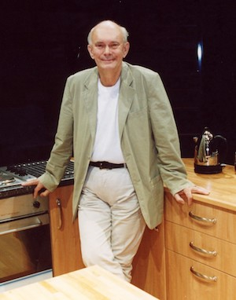

**[\<\<\< Previous page](/life/chronology/2000)**

**[Next page \>\>\>](/life/chronology/2002)**

### Notable Events

<aside>

*© Tony Bartholomew*

</aside>

During 2001, Alan Ayckbourn…

○ received the Sunday Times Award For Literary Excellence.

○ directed on Broadway for the first time with a production of ***[By Jeeves](/plays/jeeves)*** at the Helen Hayes Theatre in New York.

○ directed the World premiere of the ***[Damsels In Distress](/plays/damsels-in-distress)*** trilogy (***[GamePlan](/plays/gameplan)***, ***[FlatSpin](/plays/flatspin)*** and ***[RolePlay](/plays/roleplay)***) at the **[Stephen Joseph Theatre](/career/ayckbourn-and-the-sjt/sjt-venues/stephen-joseph-theatre)**.

○ had his first authorised biography, *Alan Ayckbourn*: *Grinning At The Edge* by Paul Allen, published.

○ took part in The first *Ayckbourn And The Round* event at the Stephen Joseph Theatre.

○ saw *House & Garden* nominated for Best Comedy at the Olivier Awards.

○ saw **[www.alanayckbourn.net](/)** launched by **[Simon Murgatroyd](http://archiving.alanayckbourn.net/)** as The Alan Ayckbourn Resource Guide.

○ redirected his 2000 production of ***[Bedroom Farce](/plays/bedroom-farce)*** for the end-stage and touring. It became the first play at the Stephen Joseph Theatre to be staged in both The Round and the end-stage The McCarthy spaces.

○ directed *By Jeeves* for Canadian television and home video release.

○ saw *Sweet Revenge* (***[The Revengers' Comedies](/plays/the-revengers-comedies)***) released on DVD in North America.

○ featured in the Artsworld documentaries *Masterclass: Alan Ayckbourn* and *Ayckbourn's GamePlan*.

### World Premieres

○ ***GamePlan***  
29 May: Stephen Joseph Theatre  
○ ***FlatSpin***  
3 July: Stephen Joseph Theatre  
○ ***RolePlay***  
4 September: Stephen Joseph Theatre

### Notable Ayckbourn Productions

○ ***By Jeeves*** (New York premiere)  
29 October: Helen Hayes Theatre, New York  
○  ***This Is Where We Came In*** (Revival)  
4 December: Stephen Joseph Theatre  
○  ***Bedroom Farce*** (Tour)  
16 December: UK tour produced by Stephen Joseph Theatre

### Professional Directing

○ ***By Jeeves***  
Helen Hayes Theatre, New York  
○ ***GamePlan*** \*  
○ ***FlatSpin*** \*  
○ ***RolePlay*** \*  
○ ***This Is Where We Came In*** \*  
○ ***Bedroom Farce*** \*  
○ ***Bedroom Farce***  
UK Tour  
\* Stephen Joseph Theatre, Scarborough

### Plays In Other Media

○ ***By Jeeves***  
DVD / Video  
○ ***By Jeeves***  
Original cast recording (New York)

### Awards

○ Sunday Times Award for Literary Excellence

### Quotes

"\`I think comedy and drama are always more effective when they co-exist on the stage. I think without that balance it's like a meal in which there is no strong meat, just bland vegetables; one offsets the other. I view comedy as a way of bringing an audience to a subject they wouldn't normally go near."  
*(Metro, 15 January 2001)*

"I'm entirely a theatre animal. My contemporaries write for many media, but I've almost exclusively written for theatre. And I've directed theatre. I consider myself primarily a director, since I spend more of my year doing that."  
*(Playbill, 6 February 2001)*

"I don't want to be just a dark dramatist. In a rich play, comedy and drama belong side by side, they can co-exist. I mean, not to compare myself to Shakespeare, but I wonder if he was regarded as comic or serious."  
*(Playbill, 6 February 2001)*

"Farces are difficult. Any fool can write a drama; it takes a real craftsman to write a farce. Technique, construction and skill. And there's no such thing as an 'interesting' farce; It's funny or not funny. I don't belong in that area, but I admire it very much."  
*(Playbill, 6 February 2001)*

"I think my plays are about the way people relate to people. How we live within a family. How fathers treat daughters, mothers treat sons. And how husbands treat wives and wives treat husbands, of course. They're an exploration of how drawn we are to each other."  
*(Playbill, 6 February 2001)*

"I honestly think that live theatre is the last remaining place where complete strangers can exchange ideas. All the electronic gadgets aimed at bringing us closer together just seem to drive us further apart."  
*(Northern Echo, 10 May 2001)*

"My advice to new playwrights is not to sit back and wait for the offers to roll in after completing their first play. A first-time success can be a hell of a job to repeat. My response was to have a clutch of plays ready."  
*(Northern Echo, 10 May 2001)*

“I live outside London so I'm not really at the forefront of culture - more clinging on to the rear end of it."  
*(Play, 26 May 2001)*

"The myth that you have to write simplistically for the masses is so patronising. Audiences love to be challenged."  
*(Play, 26 May 2001)*

"What I write is serious comedy. I just explore people and aspects of the society they live in. The human race is often at its funniest when it's at its most pompous or serious and I'm interested in how comedy and drama can co-exist at the same time."  
*(Metro, 26 June 2001)*

"I stopped being an actor because my writing was steadily improving, but my acting wasn't."  
*(Metro, 26 June 2001)*

"The secret of directing is knowing where to draw the line between the god-like author, who knows everything about his work, and the director who is prepared to explore a play with the actors. You're got to let the actors interpret the material."  
*(Metro, 26 June 2001)*

"I always say for a play, casting is enormously important, it can make or break a play. It's not just that you get bad actors, you get actors who are wrong."  
*(Scarborough Evening News, 12 July 2001)*

"When I look back there are certain things I would have done differently. One is always slightly critical of what one does. That's why you keep going. If you work hard then you get better at it."  
*(Scarborough Evening News, 12 July 2001)*

"The question people always ask is, 'Where do you get your ideas from?' I have two answers. The first is, 'I don't know', and the second is, 'If I did, I wouldn't tell you.'"  
*(The Guardian, 22 August 2001)*

"I am - rather unsurprisingly - a text-based director. I like to get the actors on their feet as soon as possible. There are some directors who will sit and discuss a play for days. Others perceive great value in ball games and trust exercises. My trust exercise is letting the actors loose on my play in the first place."  
*(The Guardian, 22 August 2001)*

"I decided a year or so back I'd stop directing new plays by other people, on the grounds that if my energy were finite - it's no use pretending I'm 25 any more - I should cut the things off that I know other people can do. Anyone can direct other people's plays. What they can't do is write my plays and probably not direct them the first time."  
*(Yorkshire Post, 25 August 2001)*

"I do still get nervous on my opening nights. If you are not getting nervous you know something is wrong - you must be retreading old ground."  
*(Bolton Evening News, 11 October 2001)*

"I am surprised how successful I have been. All I have tended to do was write what kept coming into my head. But I would never get carried away by the plaudits. Every now and then I stop for 10 seconds to enjoy it all, but then I become worried about the next one that I am going to write."  
*(Bolton Evening News, 11 October 2001)*

"I think the plays are popular because people do not tend to laugh at just the jokes, more at the recognition they glean from the characters and the way they react."  
*(Bolton Evening News, 11 October 2001)*
