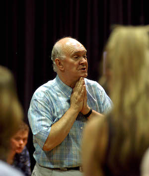

**[\<\<\< Previous page](/life/chronology/2002)**

**[Next page \>\>\>](/life/chronology/2004)**

### Notable Events

<aside>

*© Tony Bartholomew*

</aside>

During 2003, Alan Ayckbourn…

○ announced he was quitting the West End following the closure of ***[Damsels In Distress](/plays/damsels-in-distress)*** and the way he perceived the production was treated, alongside a disappointing West End revival of ***[Bedroom Farce](/plays/bedroom-farce)***. He announced his new plays will no lower be allowed to be produced in the West End.

○ wrote ***[Orvin - Champion Of Champions](/plays/orvin-champion-of-champions)*** with the composer Denis King for the National Youth Music Theatre; a musical featuring more than 40 young people presented at the **[Stephen Joseph Theatre](/career/ayckbourn-and-the-sjt/sjt-venues/stephen-joseph-theatre)**.

○ directed his final play not written by himself with a revival of Tim Firth's ***[The Safari Party](/career)*** at Hampstead Theatre, London.

○ saw a production of ***[Things We Do For Love](/plays/things-we-do-for-love)*** in Paris wins a Molière Award for Best Comedy.

○ saw *[RolePlay](/plays/roleplay)* nominated for Best Comedy at the Olivier Awards.

○ saw ***[My Sister Sadie](/plays/my-sister-sadie)*** and *Orvin - Champion Of Champions* published by Faber & Faber and ***[House & Garden](/plays/house-and)*** published by Samuel French.

○ saw the actor Martin Jarvis's experiences in ***[By Jeeves](/plays/jeeves)*** published in *Broadway, Jeeves?*

### World Premieres

○ ***The Ten Magic Bridges*** (Play for children)  
5 July: Stephen Joseph Theatre  
○ ***Sugar Daddies***  
22 July: Stephen Joseph Theatre  
○ ***Orvin - Champion of Champions***  
8 August: Stephen Joseph Theatre  
○ ***My Sister Sadie***  
2 December: Stephen Joseph Theatre

### Notable Ayckbourn Productions

○ ***Snake In The Grass*** (Tour)  
15 January: UK tour produced by Stephen Joseph Theatre

### Professional Directing

○ ***The Safari Party***  
Hampstead Theatre, London  
○ ***Orvin - Champion Of Champions*** \*  
○ ***Sugar Daddies*** \*  
○ ***My Sister Sadie*** \*  
○ ***The Ten Magic Bridges*** \*  
○ ***Snake In The Grass***  
UK tour  
\* Stephen Joseph Theatre, Scarborough

### Awards

○ Molière Award for Best Comedy  
*Things We Do For Love*

### Quotes

"As you get older you get more anxieties and neuroses."  
*(RSA Journal, February 2003)*

"All the characters are a part of me. I'd say I know myself pretty well now, I've spent the years prowling the corridors looking at myself. It's a much more fun way than going to psychologist and confronting them, God forbid."  
*(RSA Journal, February 2003)*

"I always advise any actor to start with the truth. I've seen more plays of mine wrecked than I care to remember because actors have decided to underline the humour - often encouraged, I may say, by the panicking director. Trust the material. It's only funny if we continue to believe in the characters and the situation."  
*(Denver Post, 3 March 2003)*

"If I've gone to the trouble to get the lines right, I expect the actors to get them right too."  
*(Yorkshire Post, 14 June 2003)*

"I have written an awful lot of plays - 64, I think - so I stand a good chance of getting performed. The funny thing is that it is not like having your movies showing everywhere. You have no idea what some of the productions are like, or how good they are."  
*(The Independent, 7 May 2003)*

"There is still an extraordinary reluctance for the Arts Council to accept fully their responsibilities to the regional theatres, which are and always have been the producers of the new work. It is very rare you will discover something new and exciting in the West End, in fact never."  
*(The Independent, 7 May 2003)*

"Most actors know that they would be far better off going to a good company in the regions. The best work is down out of London now - but then I am slightly biased in that belief."  
*(The Stage, 17 July 2003)*

"I always tell aspiring playwrights that if they are not sure of their narrative, don't bother to put an interval in. Let the thing run straight through. An interval gives the audience an opportunity to discuss what is going on and whether they want to return."  
*(The Stage, 17 July 2003)*

"I've walked out of productions of my plays quite a lot. I walked out of one terrible matinee performance of *Family Circles* halfway through the first act. It was like watching someone drawing a moustache on your baby. As I stood up, a man sitting behind me got up as well and said, 'Are you leaving, too? I don't blame you.' I didn't have the heart to tell him I was the writer."  
*(The Independent, 10 July 2003)*

"The death of all plays is scholastic analysis. Academics are always finding meanings in my plays that don't exist. One phoned me up and said, 'I've been doing my thesis on *Absurd Person Singular* and I hope you agree with my theory on what the title means in relation to the play' I didn't have the heart to say that I'd thought of the title years before while talking to my wife and thought, 'If I ever get stuck for a title, I'll use that.' It has no relevance to the play whatsoever."  
*(The Independent, 10 July 2003)*

"I conceive the play over a period of about nine months to a year. It just grows in my head, nothing is written down. I write it in about 10 days, on average. If I hit a serious block, I tend to just throw the thing away. I don't work all night. I don't eat much in the day so at 6pm, it's time to stop work for a glass of wine and a good meal."  
*(The Independent, 10 July 2003)*

"I was a competent actor. I was pretty good at villains - guys with staring eyes, saying things like, "You're in deadly danger in this house, my dear". I wasn't trained, so I didn't have a full repertoire of arm movements. Instead, I used to stand very still, which gave me great authority and a certain mysteriousness."  
*(The Independent, 10 July 2003)*

"Every writer's fear is writer's block. Every time you finish a play, you feel empty. You've given birth and it's gone. There are some days when I have no discernible play in my head. It's a very bleak feeling because I've always been 'with play'. But something always pops up."  
*(The Independent, 10 July 2003)*

"I always get nervous on first nights. You just have to hope that, somehow, everything is going to simultaneously come together."  
*(Crawley News, 31 July 2003)*

"If you're going to work in theatre, then you might as well choose somewhere nice to work rather than a huge urban conurbation. Looking out the window, I can see the sea now and it's lovely because you can always hear the seagulls. I mean you could even walk to work on the beach, if you wanted to."  
*(Crawley News, 31 July 2003)*

"Finding the initial idea is the tricky bit. And usually, once I've had the idea, I'll mull it over for up to a year before starting to write. Once I'm writing though, I'll do about 20 pages a day."  
*(Crawley News, 31 July 2003)*

"The West End has become a very hostile environment for the average one-off play. The sad fact is that the theatre has become reliant on television names and latterly with film names."  
*(Daily Telegraph, 12 August 2003)*

"The author in me would prefer to hide in the bar at premieres, and I used to do that before I directed them, but now I need to watch them. The skipper has to stay with the ship and its crew, even if it's sinking or flooding."  
*(Sunday Sentinel, 12 October 2003)*

"When writing comedy, there is a tendency to try to make things funny, to try to make the audience laugh. I don't think that is the way to do it. The characters in my plays, I hope, should always be true to themselves."  
*(Sunday Sentinel, 12 October 2003)*

"I remember my first Christmas in the hall at the Potteries \[Stoke-on-Trent\] because it was so cold. The audiences would come with blankets and hot water bottles it was so cold."  
*(Sunday Sentinel, 12 October 2003)*

"I think the theatre has always been very important to society, but it is becoming increasingly so. Theatre will eventually be the places, rather than churches which are now somewhat deserted, where people will go to discuss the nature of human beings and feelings."  
*(Sunday Sentinel, 12 October 2003)*

"I like watching people. As a kid, I used to watch adults because children were never invited to join in the conversations. I got used to listening."  
*(Livewire, December 2003)*
