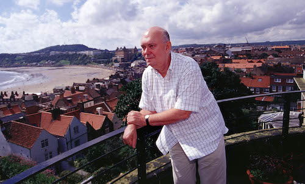

**[\<\<\< Previous page](/life/chronology/2003)**

**[Next page \>\>\>](/life/chronology/2005)**

### Notable Events

During 2004, Alan Ayckbourn…

○ received the Variety Club Of Great Britain Lifetime Achievement Award.

○ wrote ***[Drowning On Dry Land](/plays/drowning-on-dry-land)*** for the summer season at the **[Stephen Joseph Theatre](/career/ayckbourn-and-the-sjt/sjt-venues/stephen-joseph-theatre)**, but is so inspired by his company he also writes ***[Private Fears In Public Places](/plays/private-fears-in-public-places)*** which is rushed into the summer season schedule.

○ directed ***[Season's Greetings](/plays/seasons-greetings)*** for the Stephen Joseph Theatre and the Yvonne Arnaud Theatre in a short-lived initiative to produce end-stage specific productions of his work for touring to larger UK venues.

○ saw *The Crafty Art Of Playmaking* published in softcover.

○ saw ***[GamePlan](/plays/gameplan)***, ***[FlatSpin](/plays/flatspin)***, ***[RolePlay](/plays/roleplay)*** and ***[Snake In The Grass](/plays/snake-in-the-grass)*** published by Samuel French.

○ saw the second edition of *A Guided Tour Through Ayckbourn Country* by Albert-Reiner Glaap published.

*© Tony Bartholomew*

### World Premieres

○ ***Drowning On Dry Land***  
4 May: Stephen Joseph Theatre  
○ ***Miranda's Magic Mirror*** (Play for children)  
19 June: Stephen Joseph Theatre  
○ ***Private Fears In Public Places***  
17 August: Stephen Joseph Theatre  
○ ***Miss Yesterday***  
2 December: Stephen Joseph Theatre

### Notable Ayckbourn Productions

○ ***Sugar Daddies*** (Tour)  
14 January: UK tour produced by Stephen Joseph Theatre  
○ ***A Chorus Of Disapproval*** (Revival)  
19 July: Stephen Joseph Theatre  
○ ***Season's Greetings*** (Tour)  
6 October: UK tour produced by Stephen Joseph Theatre & Yvonne Aranud Theatre

### Professional Directing

○ ***Drowning On Dry Land*** \*  
○ ***Private Fears In Public Places*** \*  
○ ***Miss Yesterday*** \*  
○ ***A Chorus Of Disapproval*** \*  
○ ***Season's Greetings***  
UK Tour  
○ ***Sugar Daddies***  
UK Tour

\* Stephen Joseph Theatre, Scarborough

### Awards

○ Variety Club Of Great Britain Lifetime Achievement Award

### Quotes

"My biographer pointed out to me how often I had used the theme of broken marriages in my plays. I hadn't realised before how much that part of my life influenced me. For a time I was actually known in the theatre as 'The Scourge of Marriage.'  
*(Woking Lifestyle, January 2004)*

"Theatre is the ultimate disposable format. If you miss it, you miss it, you can't video it. There is immediacy to it, where everyone is gathered that night in a specific ceremony, giving matters their due time. Theatre doesn't have to worry about a build-up to a commercial break; it has respect for its own format, and it works in real time."  
*(Yorkshire Evening Press, 30 April 2004)*

"I was talking to the actor Matthew Kelly the other day and he suggested the need for celebrity all came down to a feeling of anonymity; he said people didn't have a role to play any more where once we all had a place, as a bank manager or a butcher or a teacher, whatever. I think there is truth in what he says. There is a feeling that we can all be famous, which is an awful blind alley. Like Erika Roe streaking across Twickenham; that was a sort of fame, but she's not as famous as the players were, though we don't remember what the match was."  
*(Yorkshire Evening Press, 30 April 2004)*

"It is a disposable culture; there will be a day not long ahead when everyone has their own website with pictures that say 'here's me in my bath'. That's just what we want at breakfast."  
*(Yorkshire Evening Press, 30 April 2004 - and predicting the rise of Facebook, Twitter et al.)*

"I don't write in the David Hare style about the railways, although I think there's a very good place for that. If I'd have done that, I'd have written about the station master and his wife, because I like to focus on the people outwards, rather than from outwards to the people."  
(Ink, May 2004)

"The trouble with building two million pound sets on stage is that, generally speaking, George Lucas and Steven Spielberg do it better - they have more money and more technical resources. We've got a trap door with a bloke popping up. But what we do have and what they don't have, is an incredible one-to-one audience-actor relationship, and I think that's the strength of theatre."  
*(Ink, May 2004)*

"There an awful habit of drawing people into the West End on the strength of being in *Friends* or whatever. Some of them are wondrous, but a lot of them you can't hear beyond row two because they've never been on stage before."  
*(Ink, May 2004)*

"It seems to me that in a civilised society you should find space for a theatre and a library and an art gallery - something in your community. Otherwise what the hell are you hanging around for?"  
*(Ink, May 2004)*

"I think Stephen Joseph thought that if I valued my reputation as an actor, I wouldn't submit a play that would show me badly. As it was I wrote myself an incredibly good part. To go on stage acting in a play I had written is the most frightening thing I have ever done. It took a lot of bottle - something only a 19 year-old would have. At the time it was a fantastic way to learn because you see the whole process, I began watching audiences, as I still do, and this is how you learn to improve as a playwright."  
*(Scarborough Evening News, 20 May 2004)*

"My writing and directing are completely seamless, which makes it quite easy on the actors as there is just one voice."  
*(Scarborough Evening News, 20 May 2004)*

"Casting is at least 80 percent of a play's success. If you write a brilliant play and cast it wrongly you are doomed. The actors have to catch the essence of the character's personality."  
*(Scarborough Evening News, 20 May 2004)*

"I always want to write things that I've not done before. It's hard not to write the same characters, or characters that seem to be related in some way to those that have gone before. In a sense writers are the victim of their own back catalogue. A lot of people know a lot about my plays and there's a lot of expectation and I feel that. I do try and certainly feel the need to better myself with every new piece of work."  
*(Artscene, August 2004)*

"Stephen Joseph was a revolutionary, and if you're 17 years old you like revolutionaries. When people knew you worked for him they scowled a bit. He was very vociferous about what he liked and didn't like and he believed in opening up potential in people. He encouraged me to write and to direct and he discouraged me from acting. He was a guardian uncle."  
*(Coast, August 2004)*

"Theatre is still magical, even though there's a lot more for children to be entertained by than when I was a child, when our entertainment was a black-and-white TV in the corner, which we rarely watched. Theatre has that appeal of being a live show created in front of you: look, no strings."  
*(Yorkshire Evening Press, 3 December 2004)*

"I read a lot of science-fiction when I was young. I quickly realised that the best writers always used their futuristic or fantasy landscapes as metaphors for today. The scenarios they described were often those that warned against or proposed alternative existences. The parables of our time."  
*(2004)*

"I do sometimes feel that Theatre has a bad habit of taking itself terribly seriously. I think it can say serious things, indeed it must, but a little humour really helps to say them."  
*(2004)*
