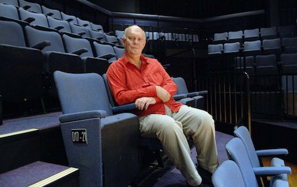

**[\<\<\< Previous page](/life/chronology/2004)**

**[Next page \>\>\>](/life/chronology/2006)**

### Notable Events

During 2005, Alan Ayckbourn…

○ wrote ***[Improbable Fiction](/plays/improbable-fiction)*** to celebrate the 50th anniversary of the **[Stephen Joseph Theatre](/career/ayckbourn-and-the-sjt/sjt-venues/stephen-joseph-theatre)**.

○ toured ***[Private Fears In Public Places](/plays/private-fears-in-public-places)*** to the *Brits Off Broadway* festival in New York; this marked the first time he had directed his own company in New York. It received a Drama Desk Award nomination for Outstanding Director.

○ received the Yorkshire Awards Arts & Entertainments Personality of the Year.

○ hosted and wrote the week long *Fifty Years New* event to mark the 50th anniversary of the Stephen Joseph Theatre; it climaxed with the first and only performance of his one act ***[Untitled Farce](/plays/untitled-farce)***, written specially for the occasion.

○ saw ***[Absurd Person Singular](/plays/absurd-person-singular)*** revived on Broadway at the Biltmore Theatre.

○ saw the 1977 television adaptation of ***[The Norman Conquests](/plays/the-norman-conquests)*** released on DVD in the UK for the first time.

○ saw the collection *Alan Ayckbourn - Plays 3* published by Faber.

○ saw the Stephen Joseph Theatre publish *A Round 50* by Simon Murgatroyd to mark the company's 50th anniversary.

○ began negotiations with the University of York to acquire his archive; this would eventually be achieved in 2011.

*© Tony Bartholomew*

### World Premieres

○ ***Improbable Fiction***  
31 May: Stephen Joseph Theatre  
○ ***The Girl Who Lost Her Voice*** (Children's play)  
23 July: Stephen Joseph Theatre  
○ ***Untitled Farce*** ('Grey' play)  
13 August: Stephen Joseph Theatre

### Notable Ayckbourn Productions

○ ***Drowning On Dry Land*** (Tour)  
19 January: UK tour produced by Stephen Joseph Theatre  
○ ***Private Fears In Public Places*** (London premiere)  
5 May: Orange Tree Theatre, Richmond  
○ ***Private Fears In Public Places*** (New York premiere)  
9 June: 59E59 Theaters, New York  
○ ***Time & Time Again*** (Revival)  
2 August: Stephen Joseph Theatre  
○ ***Absurd Person Singular*** (Revival)  
18 October: Biltmore Theatre, New York  
○ ***The Champion Of Paribanou*** (Revival)  
7 December: Stephen Joseph Theatre

### Professional Directing

○ ***Private Fears In Public Places***  
59E59 Theaters, New York  
○ ***Private Fears In Public Places***  
The Orange Tree, Richmond  
○ ***Improbable Fiction*** \*  
○ ***The Girl Who Lost her Voice*** \*  
○ ***Untitled Farce***\*  
○ ***The Champion Of Paribanou*** \*  
○ ***Time & Time Again*** \*  
○ ***Drowning On Dry Land***  
UK tour

\* Stephen Joseph Theatre, Scarborough

### Awards

○ Yorkshire Awards Arts & Entertainments Personality of the Year

### Quotes

"The worst thing that can happen to you is to believe your own publicity and what people - particularly your press agent - say about you. One must resist because that way madness lies."  
*(The Independent, 3 January 2005)*

"The British have always loved losers really, they're much more fond of them in a way than big mega-successes, because mega-successes are out of their reach, and they feel a twinge of envy"  
*(Western Daily Press, 27 January 2005)*

"I sit in Scarborough with the wind howling, my coffee machine within reach and occasional visits from the cat. But it actually is a wonderful life I have. And I'm lucky, because although I've made an impact in my career, it's an interesting sort of fame that I have. I'd hate to be a known face, like these poor *Coronation Street* actors who can't go anywhere without somebody coming up to them. I can normally walk into most places they wouldn't know who the hell I was - they would spend a month trying to spell my name."  
*(Western Daily Press, 27 January 2005)*

"A hundred years ago dramatists used to fall back on sex, but nobody's shocked by sex anymore, so you have to look into other things. In the middle of my career I wrote a lot about death. People have difficulties dealing with it, and it is a source of acute social embarrassment. You can puncture that and create dark comedy from it."  
*(Venue, 28 January 2005)*

"A lot of my stuff is about people trying to cope with each other. We still try, misguidedly, to set up house and share our life with complete strangers with whom we fall briefly in love. We start out so optimistic, before deciding about five years down the line that the person we're with is the most unbearable person on earth. By that time we've committed to children and mortgages and so on.  
*(Venue, 28 January 2005)*

"I'm interested in that very narrow line between the painful and painfully funny. We walk that line a lot, and if you can achieve both, you've got great drama."  
*(Venue, 28 January 2005)*

"I grew up in the late 50s, an interesting time in the theatre. A generation of playwrights a little older than me - Osborne, Pinter, Wesker - were starting to upend the establishment figures like Coward and Rattigan. I was also influenced, though, by Laurel and Hardy and Buster Keaton, and I think my stuff is often quite cinematic. You start by writing other people's plays: one day you wake up and you've written something you don't recognise, and you know is yours."  
*(Venue, 28 January 2005)*

"My great good fortune is that I'm very prolific. If I had a repertoire of seven plays, I would be jealously guarding them all, and I'd never want anyone to stage them but me. But there are 69 of the buggers now. Some of them I never want to see again, and others are like old friends. They've occasionally been distorted over the years by mad directors, but they're like those bendy toys which always spring back into shape."  
*(Artscene, February 2005)*

"I've tried to steer between those two courses ever since - and it's quite difficult. Occasionally I get a little too dark and the audience drifts away slightly; and occasionally I get a little too jolly, and the cast looks strangely disappointed. But sometimes I hit it just right, and I know I've said something quite important and relevant, and yet I've had them laughing, too."  
*(Artscsene, February 2005)*

"I don't consider a text message or a one minute telephone call a good conversation. Theatre, however, by its very nature invites the audience to interact. You're putting something of yourself into the show just by being there. There's a lot of talk of theatre being written off. Certainly in listings in the Sunday papers it comes way down the scale after TV, film and radio, but there's actually a growing interest among our younger generations. Theatre needs to keep re-inventing itself and keep moving to keep attracting its audiences. We're doing our damnedest to excite. I'm very aware that if you sit around and wait for your audience they'll grow old like you and there won't be anyone under 40 in the building."  
*(Yorkshire Life, April 2005)*

"I just hope I continue to have ideas. It's just a question of having something exciting enough that I want to write it. I can happily keep reviving my old stuff, after all there's a whole audience out there who weren't even born when they were first shown, but I'd miss the buzz of something new."  
*(Yorkshire Life, April 2005)*

"I think writing is mostly a form of therapy."  
*(Yorkshire Evening Press, 27 May 2005)*

"I remember an Irish playwright once said to me 'Don't let's get logical' and as long a play is not illogical to the extent that it doubles back on itself, then if it just deviates people will enjoy being taken by surprise."  
*(Yorkshire Evening Press, 27 May 2005)*

"Stephen Joseph's maxim is still ringing in my ears. He said every theatre should self-destruct in seven years. That sums him up. I think he meant literally put dynamite in the building on the very last day. I try to take the spirit of that if not the letter. I think what he means is - reinvent yourself. And I like to think we do. Actors who come to work here do remark on how friendly the atmosphere here is. That is something we've retained." (2005)  
*(The Stage, 28 July 2005)*

"Stephen Joseph was an enormous influence. He was instrumental in turning my life around. He never encouraged my acting, probably wisely, but he always encouraged my writing and directing."  
*(Yorkshire Post, 8 August 2005)*

"That's why I work so fast. What I do is have five, six, up to 10 characters all at different levels in my head - I end up becoming a multiple personality for a short period. I know what all the characters are up to, but I can only do that for a few days at a time."  
*(Yorkshire Post, 9 August 2005)*

"My early plays are an object lesson in someone having confidence in someone - I was just delighted that someone would put my plays on. I remember at the end of the first season I got a cheque for £33 - that was a bloody fortune."  
*(Yorkshire Post, 9 August 2005)*

"If you are fortunate in life you meet key figures - who I call my guardian uncles and aunts who were there at that point, and you are lucky to see them. But you have to have the wit to listen to them, and engage with them and sometimes ignore them."  
*(2005)*
