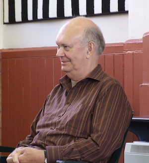
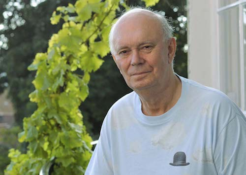

**[\<\<\< Previous page](/life/chronology/2007)**

**[Next page \>\>\>](/life/chronology/2009)**

### Notable Events

<aside>

*© James Drawneek*

</aside>

During 2008, Alan Ayckbourn…

○ saw ***[The Norman Conquests](/plays/the-norman-conquests)*** revived at the Old Vic, London. It is directed by Matthew Warchus and critically acclaimed. The Old Vic is converted into an in-the-round space for the production.

○ directed ***[Life & Beth](/plays/life-and-beth)*** at the **[Stephen Joseph Theatre](/career/ayckbourn-and-sjt/sjt-venues/stephen-joseph-theatre)**; the first play he has written since his stroke in February 2006.

○ fulfilled a long-term ambition to revive ***[Woman In Mind](/plays/woman-in-mind)*** at the SJT with Janie Dee in the lead role of Susan.

○ directed the musical ***[Awaking Beauty](/plays/awaking-beauty)*** at the Stephen Joseph Theatre; his final play to be produced whilst Artistic Director.

○ saw the Stephen Joseph Theatre dedicate its summer season to his supernatural plays to mark his final year as Artistic Director.

○ saw ***[Just Between Ourselves](/plays/just-between-ourselves)*** broadcast by BBC Radio.

*© Tony Bartholomew*

### World Premieres

○ ***Life & Beth***  
22 July:  
Stephen Joseph Theatre  
○ ***Awaking Beauty***  
16 December:  
Stephen Joseph Theatre

### Notable Ayckbourn Productions

○ ***Relatively Speaking*** (Tour)  
23 January: UK tour produced by Stephen Joseph Theatre  
○ ***Snake In The Grass*** (Revival)  
15 June: Stephen Joseph Theatre  
○ ***Haunting Julia*** (Revival)  
27 May: Stephen Joseph Theatre  
○ ***Absurd Person Singular*** (Tour)  
1 September: UK tour produced by Bill Kenwright  
○ ***Woman In Mind*** (Revival)  
9 September: Stephen Joseph Theatre  
○ ***The Norman Conquests*** (Revival)  
6 October: The Old Vic, London  
○ ***A Trip To Scarborough*** (Tour)  
UK tour produced by Stephen Joseph Theatre

### Professional Directing

○ ***Life & Beth*** \*  
○ ***Awaking Beauty*** \*  
○ ***Woman In Mind*** \*  
○ ***Snake In The Grass*** \*  
○ ***Relatively Speaking***  
UK tour  
○ ***A Trip To Scarborough***  
UK tour  
\* Stephen Joseph Theatre, Scarborough

### Plays In Other Media

○ ***Just Between Ourselves***  
Radio: 13 September, BBC Radio 4  
○ ***Awaking Beauty***  
Original cast recording (Scarborough)

### Quotes

"In hospital, I thought as long as one arm worked, I could write. I'd probably need a leg and an arm to direct."  
*(Yorkshire Post, 11 January 2008)*

"I have none of the arrogance or confidence I had when I was 25, 30. There is always an increasing nervousness each time I start, because I know what might go wrong."  
*(Yorkshire Post, 11 January 2008)*

"The thing you realise though, is that it doesn't matter who you are, if you are an integral part of something and you leave, it will carry on. You're anxious about how something will survive without you, but the simple fact is, that it just does."  
*(Yorkshire Post, 11 January 2008)*

"When I started, I was quite vulnerable to adverse criticism, and the way that I solved that was to keep ahead of the game. So when one of my plays opened, I had another one already written."  
*(Venue, 22 February 2008)*

"I once said to an author if I knew where I got my ideas, I wouldn't tell you! But unfortunately, there is no ready-made formula. Sometimes it's a news item, sometimes just a thought that occurs to me. But most characters start from oneself. They're all aspects of me, really. Then you add somebody's nose, somebody's mouth and somebody's irritating mannerisms. To find truth in your characters, they have to come from you."  
*(Venue, 22 February 2008)*

"It’s a fact that I’ve now got so used to writing that if there was a day went by with no play in me, even a glimmer of the play, I’d feel incredibly, spiritually lonely and so I go from highs of beginning a play to finishing it, which is very high, to a sheer drop to low and it’s gone. I’ve said goodbye to the play. Then I move to a growing sense of excitement that I’m going to have another go at it with other people when I direct it."  
*(Official Website interview, 14 April 2008)*

"It's being in the rehearsal room with a group of actors - most of them these days younger than I am - that keeps me going. That and writing keeps me going these days. I've always loathed holidays."  
*(Morning After, 15 April 2008)*

"I attribute my understanding of women to a one parent childhood spent in the company of mostly women, strong and eccentric (especially my mother) for the most part. I also tap into my 'feminine side' when I write. Secretly, I've come to the conclusion that if you exclude the so called alpha males and omega women - whom I rarely write about, anyway - most men and most women are a lot closer than we think. It's just that, though they have a lot in common, they approach things from entirely different directions. All I do if I want to change the sexual viewpoint is run out of the room and come in through another door."  
*(Morning After, 15 April 2008)*

"I'm first and foremost a playwright. I think that encompasses the storytelling role (or in my case it does, certainly) which is essentially trying to keep several hundred people's attention for two hours without getting bored. I've done this job long enough and have this passionate obsession not to repeat myself that I'm always seeking out new ways to tell the stories. Experimental, therefore. I think the evolution was from the simple (learning stage), then becoming increasingly complex as I grew technically more confident and recently, simpler again, as I learn more what to throw away and what to keep."  
*(Morning After, 15 April 2008)*

"I'm delighted to have got away with so much. Theatrically. Trilogies, plays with alternative endings, shows taking place in two auditoria simultaneously. Flooding the stage and then getting it really to rain during the action. Plays, when at times you only see people's feet or the top of their heads. And generally, to have caused so many people to have had so much fun - actors, techies and audiences. I hope, over the years, to have given a few really good parties."  
*(Morning After, 15 April 2008)*

"Scarborough has given me the chance to pursue what I've wanted to do; to write, to form companies with like-minded souls around me, to direct and to generally have fun."  
*(New Vic interview, April 2008)*

"I never question where the inspiration comes from, nor do I analyse where the ideas comes from. I'm just so grateful that it keeps on coming - I'd really be a lost soul without a play somewhere in my head."  
*(New Vic interview, April 2008)*

"I think it will be strange, having thought of the Stephen Joseph Theatre as my theatre, to come and have it be someone else's."  
*(BBC, 8 July 2008)*

“Before the stroke I had a blithe confidence in immortality - I thought, 'Maybe He'll miss me out'."  
*(The Times, 12 July 2008)*

“I came to Scarborough in 1957 as a sprog assistant stage manager playing small parts. I remember I got off the train packed with holidaymakers and this bracing air and smell of chips. I said, 'Wow!' Because I was an inland child living in north Sussex, one of the great treats as a child was a trip to the seaside - so, dear reader, I bought the sweet shop. I came to the seaside and stayed. I thought, 'This can't get better'.”  
*(The Times, 12 July 2008)*

“Two things I live for. One is being in a rehearsal room. The other is writing a new play. As soon as a new play comes out there's a terrible moment of post-partum emptiness - and then another idea comes in, sometimes two or three. I just can't imagine being alive without a play in me somewhere.”  
*(The Times, 12 July 2008)*

"I've spent as much time as possible since the stroke in a rehearsal room. Undoubtedly the theatre is a family, and the rehearsal room is my real home. I'm happiest when I'm there."  
*(Independent on Sunday, 24 August 2008)*

"I never really knew my father. He died when I was 14, so he missed me. The only thing I remember distinctly is sitting with him once, in Norfolk where he lived. I've never laughed with anybody else as I laughed with him.  
*(Independent on Sunday, 24 August 2008)*

"Some of my best writing comes from serendipity. Unexpected things drop in."  
*(Times, 29 September 2008)*

"I think, apart from the writing, obviously, I'd like my time as Artistic Director of the Stephen Joseph Theatre to be remembered for the new plays we put on. That and the fact that I took on Stephen Joseph's work and his dream of performing theatre in the round. And long may it continue."  
*(Yorkshire Life, September 2008)*
