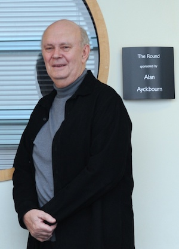
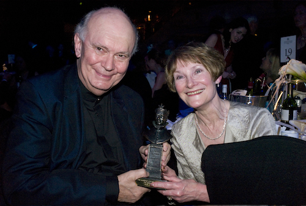

**[\<\<\< Previous page](/life/chronology/2008)**

**[Next page \>\>\>](/life/chronology/2010)**

### Notable Events

<aside>

*© Tony Bartholomew*

</aside>

During 2009, Alan Ayckbourn…

○ stepped down as Artistic Director of the **[Stephen Joseph Theatre](/career/ayckbourn-and-sjt/sjt-venues/stephen-joseph-theatre)** in Scarborough, having held the position since 1972.

○ received the Olivier Awards Special Award.

○ was inducted into the American Theater's Hall Of Fame.

○ celebrated his 70th birthday with the BBC marking the occasion with a season of plays and documentaries on BBC Radio. The plays included new adaptations of ***[Man Of The Moment](/plays/man-of-the-moment)*** and ***[A Small Family Business](/plays/a-small-family-business)*** and he was featured in the documentaries *With Great Pleasure*, *The Strand*, *Front Row* and *Nightwaves*

○ directed a revival of *Man Of The Moment* at the Royal & Derngate in Northampton as part of its major retrospective season, *Ayckbourn At 70*.

○ saw the Old Vic's acclaimed 2008 production of ***[The Norman Conquests](/plays/the-norman-conquests)*** transfer to the Circle In The Square theatre, New York.

○ saw *The Norman Conquests* become the first Ayckbourn play to win a Tony Award; it also wins several other major awards.

○ directed ***[My Wonderful Day](/plays/my-wonderful-day)*** at the Stephen Joseph Theatre and at the *Brits Off Broadway* festival. It is nominated for Outstanding Production and Outstanding Actress (Ayesha Antoine).

○ directed the London transfer of ***[Woman In Mind](/plays/woman-in-mind)***, starring Janie Dee; the first time he has directed in the West End since 2002.

○ saw ***[Sight Unseen](/publications)*** by Alan Ayckbourn's Archivist **[Simon Murgatroyd](http://www.simon-murgatroyd.com/)** published.

○ saw Sir Peter Hall revive ***[Bedroom Farce](/plays/bedroom-farce)*** at the Rose Theatre in London to acclaim.

*Alan Ayckbourn & Heather Stoney at the Olivier Awards.  
© To be confirmed*

### World Premieres

○  ***My Wonderful Day***  
13 October: Stephen Joseph Theatre

### Notable Ayckbourn Productions

○ ***Life & Beth*** (Tour)  
31 January: UK tour produced by Stephen Joseph Theatre  
○ ***Woman In Mind*** (Revival)  
6 February: Vaudeville Theatre, London  
○ ***Just Between Ourselves*** (Revival)  
22 May: Royal & Derngate, Northampton  
○ ***How The Other Half Loves*** (Revival)  
9 June: Stephen Joseph Theatre  
○ ***Private Fears In Public Places*** (Revival)  
22 June: Royal & Derngate, Northampton  
○ ***Man Of The Moment*** (Revival)  
27 July: Royal & Derngate, Northampton  
○ ***Absurd Person Singular*** (Tour)  
14 September: UK you produced by Bill Kenwright  
○ ***Bedroom Farce*** (Revival)  
1 October: Rose Theatre, London  
○ ***My Wonderful Day*** (New York premiere)  
11 November: 59E59 Theaters, New York

### Professional Directing

○ ***Woman In Mind***  
Vaudeville Theatre, London  
○ ***My Wonderful Day***  
59E59 Theaters, New York  
○ ***Man Of The Moment***  
Royal & Derngate, Northampton  
○ ***My Wonderful Day*** \*  
○ ***How The Other Half Loves*** \*  
○ ***Life & Beth***  
UK tour

\* Stephen Joseph Theatre, Scarborough

### Plays In Other Media

○ ***Man Of The Moment***  
Radio: 11 April, BBC Radio 4  
○ ***A Small Family Business***  
Radio: 12 April, BBC Radio 3

### Awards

○ The Olivier Awards Special Award  
○ Hall Of Fame For Achievements In American Theatre  
○ Tony Award for Best Revival of a Play  
*The Norman Conquests*  
○ Outer Critics Circle Award For Outstanding Revival  
*The Norman Conquests*  
○ The New York Drama Critics' Circle Special Citation  
*The Norman Conquests*  
○ Drama Desk Award For Outstanding Revival  
*The Norman Conquests*

### Quotes

"I don't take anything for granted anymore. My latest stuff does tend to hover around death a bit. Maybe my brush with mortality has something to do with it."  
*(Time Out, 29 January 2009)*

"I never look back too much, really. I’m always running from the first night eager to get on with the new play, partly as protective covering. But, as Michael Bogdanov once said to me, if you keep running they can’t hit you."  
*(What's On Stage, 5 February 2009)*

"I started out as an actor / writer and, as the flagrant self-publicist that I was, I wrote all the best parts for myself. But the writing improved while the acting didn't. One of those two personas had to go, so I fired the actor."  
*(Sunday Telegraph, 8 February 2008)*

"You mine yourself a lot. I have a sum of human failings. I lie, cheat and dissemble - so most of the characters spring from me. I've used my loved ones quite flagrantly and shamelessly. I remember sitting next to my first wife in one of my plays, and after a scene she said: 'That was a private conversation!'"  
*(Sunday Telegraph, 8 February 2008)*

"Being in the rehearsal room is the most rejuvenating force for me. I thrive on their \[actors'\] energy like some old emotional vampire, and that brought me round."  
*(Sunday Telegraph, 8 February 2008)*

"I’ve got a terrible mixture of total confidence when attacked, and total lack of confidence when praised. The more people praise me, the more depressed I become, and the more uncertain I get of what my own work is like. And the more people go knocking it, the more confident I become that it’s OK. I’m just cussed, really."  
*(The Stage, 17 March 2009)*

"I treat every play as if it might be my last but every time I finish one, I look around to see if there's a sign for another."  
*(Sunday Express, 22 March 2009)*

"The directing is obviously the gregarious part of the job, when you share the experience with a group of like-minded people - the writing is rather a lonely thing."  
*(BBC, 30 July 2009)*

"For a brand new play I still get very nervous, because that's completely untried. I worry for the actors, it's a bit like sending your platoon over the top and saying: 'I wish I could go with you chaps'. All you can do is sit back in the stalls and wait and watch, which is always very frightening. If you're an actor, at least you have your destiny in your own hands, but if you're a writer it's in their hands."  
*(BBC, 30 July 2009)*

"I would like to carry on writing for as long as I'm able, that's my biggest ambition."  
*(BBC, 30 July 2009)*

"The British in general don't like people who are too prolific. They think it's a bit facile, but there's no reason why you should write slowly. There are some terrible plays that have been written over 10 years and there are some very good ones that have been written over 24 hours. The point is that the play is, for me, a rung on the ladder to the next one. Hopefully what you learn from one play will lead you to the next play. It's a learning curve."  
*(The Sentinel, 4 September 2009)*

"For the future, I’m always wanting to identify ideas I haven’t tried before. New areas that are new to me, that’s all I can do. I can plough a new furrow and I’m quite excited by moving on now."  
*(Yorkshire Post, 9 October 2009)*

"I got a very jaundiced view of men because my mother's views of men were pretty much unprintable and I've been influenced by that ever since. I think female disappointment ran through my blood pretty early in my life and I have to say I prefer women's company en bloc."  
*(The Press, 16 October 2009)*
