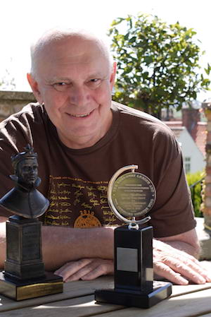

**[\<\<\< Previous page](/life/chronology/2009)**

**[Next page \>\>\>](/life/chronology/2011)**

### Notable Events

<aside>

*Alan Ayckbourn with his Olivier & Tony Awards  
© Andrew Higgins*

</aside>

During 2010, Alan Ayckbourn…

○ received the Special Tony Award for Lifetime Achievement in the Theatre.

○ received the Critics Circle Award For Services To The Arts.

○ saw the **[National Theatre](/career/national-theatre)** stage its first Ayckbourn play since 2000 with a revival of ***[Season's Greetings](/plays/seasons-greetings)***, directed by Marianne Elliott.

○ directed ***[Taking Steps](/plays/taking-steps)*** in London for the first time since its disastrous West End premiere in 1980. Staged at the Orange Tree Theatre, it is a critical and commercial success.

○ saw *Season's Greetings* become the first Ayckbourn play to be published as an ebook, when it is republished by Faber.

○ saw Peter Hall's much praised revival of ***[Bedroom Farce](/plays/bedroom-farce)*** transfer into the West End to the Duke Of York's Theatre.

○ saw Matthew Warchus's acclaimed revival of ***[The Norman Conquests](/plays/the-norman-conquests)*** nominated for Best Revival and Best Company performance at The Olivier Awards.

○ participated in the first Ayckbourn Weekend event, organised by his Official Website and run by **[Simon Murgatroyd](http://www.simon-murgatroyd.com/)** with proceeds going to the Stephen Joseph Theatre OutReach.

○ saw Samuel French publish ***[Awaking Beauty](/plays/awaking-beauty)***.

○ saw Vintage Classics republish *Alan Ayckbourn - Three Plays*.

○ had the BBC's 1990 radio adaptation of ***[The Norman Conquests](/plays/the-norman-conquests)*** published on CD and as a digital download for the first time.

### World Premieres

***Life Of Riley***  
21 September: Stephen Joseph Theatre

### Notable Ayckbourn Productions

○ ***My Wonderful Day*** (Tour)  
20 January: UK tour produced by Stephen Joseph Theatre  
○ ***Taking Steps*** (Revival)  
24 March: Orange Tree Theatre, Richmond  
○ ***Bedroom Farce*** (Revival)  
30 March: Duke Of York's Theatre, London  
○ ***Bedroom Farce*** (Tour)  
July: UK tour produced by Bill Kenwright  
○ ***Communicating Doors*** (Revival)  
10 August: Stephen Joseph Theatre  
○ ***Season's Greetings*** (Revival)  
8 December: National Theatre, London  
○ ***If I Were You*** (Tour)  
TBC: UK tour produced by Bill Kenwright

### Professional Directing

○ ***Taking Steps***  
Orange Tree, Richmond  
○ ***Life Of Riley*** \*  
Stephen Joseph Theatre, Scarborough  
○ ***Communicating Doors*** \*  
Stephen Joseph Theatre, Scarborough  
○ ***My Wonderful Day***  
UK tour

### Awards

○ The Special Tony Award for Lifetime Achievement in Theatre  
○ Critics' Circle Award For Services To The Arts

### Quotes

"Writing and directing is my life. A life-long love affair, I suppose."  
*(Elmbridge Magazine, 10 January 2010)*

"I don’t self-consciously try and write things with a 'funny' slant. All my characters are generally doing their very serious best - my heart goes out to them. Sadly, their best is often not quite good enough."  
*(Boston Globe, 14 February 2010)*

"A comedy is a tragedy interrupted, and vice versa. Depends where you choose to stop the narrative. Good writing should always give a sense that A) things have happened before we set out on page one, and B) when we reach the final page, that life goes on."  
*(Boston Globe, 14 February 2010)*

"Far from being unkind about and to my characters, I feel worry for them and I think I've become more humane."  
*(Bath Magazine, February 2010)*

"Because I was reasonably able as an actor, I had a reasonable career, which then moved into directing and writing, with great encouragement from Stephen Joseph. I was eventually given the chance to direct my open work - which I've been doing ever since."  
*(Bath Magazine, February 2010)*

"Peter Hall once told me: 'You can do without the National Theatre, but can the National Theatre do without you?' I left feeling a little glow. But it was daunting."  
*(The Times, 22 March 2010)*

"Peter Hall gave me respectability. He was from the RSC, the posh side of the tracks. Like all clowns who want to play Hamlet, I was anxious to be taken seriously. He told me: 'You belong at the National Theatre.' He took me off the streets."  
*(The Times, 22 March 2010)*

"Writing is one thing, but when I go into a rehearsal room, the entire cast is mostly much younger than me, and their energies just lift me. I come out with my batteries recharged. Directing is wonderful."  
*(The Times, 22 March 2010)*

"It’s the natural expression of the way I write and I guess it is just my view of the world. I just happen to see the funnier side of things."  
*(Surrey Comet, 26 March 2010)*

"I don’t write about topical issues - I couldn’t have written about an event like the Miners’ Strike. Instead, I’ve tended to try to reflect people’s attitudes. If I was going to compare myself to anyone it would be a cross between Charles Dickens and Jane Austen as I tend to write plays purely from a human perspective. It’s almost the reverse of what David Hare does. He writes plays about issues."  
*(Surrey Comet, 26 March 2010)*

"I think theatre works best on an intimate scale. Theatre is made up of two ingredients, actor and audience, and with that we can outdo anyone with that live experience - movies, TV or radio. It’s ironic that movies are trying to become more live and interactive, but we’ve got that already, it’s called theatre."  
*(Surrey Comet, 26 March 2010)*

I"'m a great lover of the Web, but I never go on things like Twitter and Facebook."  
*(Broadway World, 10 June 2010)*

"My agent Peggy Ramsay once told me never to believe my own publicity: if it's good it goes to your head, and if it's bad it will just depress you. So I keep aloof from what's written about me. People sometimes come up to me and say, 'I'm so glad you're back in fashion,' like I'm an old double-breasted suit."  
*(The Guardian, 4 October 2010)*

“I always say to new writers to go and see their play more than once and not just on the opening night when all your friends are there and it is bound to be well received.”  
*(North West Evening Mail, 12 November 2010)*

“It is no coincidence that a lot of the writers I reckon, Shakespeare, Pinter, were all actors at some stage. It gives you a great sense of the reality of things and the visualness of theatre. It helped me to realise that a good play is not just about the dialogue but about the visual side of being on stage. These days I realise the importance of allowing actors space to act and my plays are sparser for it. When I look back to some of the early works some plays are so dense with lines and monologues that there is no room for acting.”  
*(North West Evening Mail, 12 November 2010)*

“A true farce takes you on a journey. It’s very akin to thriller writing, where you distract and convince the audience something is possible. It’s a conjuring trick. It’s often dismissed, but it requires a lot of skill. I think pure farce is really hard. You need a slightly strange brain to do it. And there’s no such thing as an interesting farce. It’s either funny, or it isn’t.”  
*(Financial Times, 3 December 2010)*

"If you paint a picture, you rarely paint all dark or all light. The lightness serves to emphasise the darkness and vice versa. Playwriting is at heart storytelling. And good story telling relies on contrast - fast and slow, loud and soft and light and shade. It’s not a deliberate or calculating thing. It’s born of instinct. It might, arguably, be possible to teach the craft of playwriting. But the art of storytelling can never be taught."  
*(2010)*

"If the most inexperienced amateur company finds the truth of the scene, it is far better than the most experienced professional company who think they know everything just working it without any truth at all. The worst thing that can happen with my plays is you don’t care. You don’t care about any of them."  
*(2010)*

"The writers among you will know that there is nothing worse than writing for a vacuum. If you sit down and write a play with no idea of where it will go or who will do it, it’s very hard to finish it - unless it’s a really burning idea. But once someone says I would like to do a play of yours, you set to with a passion. The deadline is never a bad thing. Some people look down on deadlines slightly - Alan Plater called them amateur writers, as professional writers like deadlines. They curse them at the time, but they’re the only way you actually stop and make the work finite."  
*(2010)*

"When you start writing, you can’t read or watch enough. All you can teach is theory and I remember David Edgar invited me to Birmingham to talk about playwriting, which I did for an hour and at the end of it there was a long pause and this woman looked at me and said: 'You make it sound extremely difficult.' I said 'Well, it is.' She said: 'Well, you’re making it sound more difficult than it really is, I’m sure.' I think everyone has a play in them. But writing is difficult. It’s easy enough to write, it’s more difficult to write successfully."  
*(2010)*
