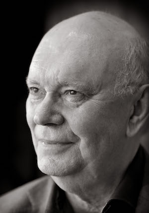

**[\<\<\< Previous page](/life/chronology/2011)**

**[Next page \>\>\>](/life/chronology/2013)**

### Notable Events

<aside>

*© Andrew Higgins*

</aside>

During 2012, Alan Ayckbourn…

○ directed the world premiere of ***[Surprises](/plays/surprises)***, a co-production between the **[Stephen Joseph Theatre](/career/ayckbourn-and-the-sjt/sjt-venues/stephen-joseph-theatre)** and Chichester Festival Theatre; it is promoted as part of the 2012 Festival celebrating the 2012 London Olympics.

○ revived ***[Absurd Person Singular](/plays/absurd-person-singular)*** at the SJT to mark its 40th anniversary.

○ saw Faber publish *Surprises* - both in softback and as an ebook - to coincide with the original production.

○ was once more listed in The Stage 100 of leading theatre practitioners over the past 12 months.

○ came top in a What's On Stage poll to find the Jubilee Playwright (the most popular playwright to have worked during Queen Elizabeth II's reign).

○ saw two major West End revivals take place with ***[Absent Friends](/plays/absent-friends)***, directed by Jeremy Herrin, and ***[A Chorus Of Disapproval](/plays/a-chorus-of-disapproval)***, directed by Trevor Nunn, both at the Harold Pinter Theatre.

○ had ***[Henceforward…](/plays/henceforward)***broadcast by the BBC in a new adaptation directed by Martin Jarvis and starring Jared Harris.

○ directed ***[Neighbourhood Watch](/plays/neighbourhood-watch)*** at the Tricycle Theatre, London; his first Scarborough production to transfer to both London and New York.

○ saw the BBC publish *Alan Ayckbourn - In His Own Words*, a digital audiobook containing broadcast interviews with him.

○ was interviewed by BBC *HARDtalk*, Sky Arts' *In Conversation* and *One On One* on Radio Leeds about his life and career in theatre.

○ saw Vintage Classics republish *Three Plays* including - for the first time - in an ebook format.

### World Premieres

○ ***Surprises***  
17 July: Stephen Joseph Theatre

### Notable Ayckbourn Productions

○ ***Neighbourhood Watch*** (Tour)  
18 January: UK tour produced by Stephen Joseph Theatre  
○ ***Absent Friends*** (Revival)  
9 February: Harold Pinter Theatre, London  
○ ***Neighbourhood Watch*** (London premiere)  
11 April: Tricycle Theatre, London  
○ ***Absurd Person Singular*** (Revival)  
12 June: Stephen Joseph Theatre  
○ ***Surprises*** (Transfer)  
8 August: Chichester Festival Theatre  
○ ***Absurd Person Singular*** (Transfer)  
10 August: Chichester Festival Theatre  
○ ***Relatively Speaking*** (Tour)  
28 August: UK tour produced by Danny Moar  
○ ***Haunting Julia*** (Tour)  
29 August: UK tour produced by Hall & Childs  
○ ***A Chorus Of Disapproval*** (Revival)  
27 September: Harold Pinter Theatre, London

### Professional Directing

○ ***Neighbourhood Watch***  
Tricycle Theatre, London  
○ ***Surprises***  
Stephen Joseph Theatre, Scarborough  
○ ***Surprises***  
Chichester Festival Theatre  
○ ***Absurd Person Singular***  
Chichester Festival Theatre  
○ ***Absurd Person Singular***  
Stephen Joseph Theatre, Scarborough  
○ ***Neighbourhood Watch***  
UK Tour

### Plays In Other Media

○ ***Henceforward…***  
Radio: 10 June, BBC Radio 3

### Quotes

“I have got quite fixated lately on those Danish programmes, *The Killing* and now *Borgen*. One of their joys is you don’t know the actors, you don’t know if they’re supposed to be good or bad, you just take them on their own terms. You go to the Smiley film \[*Tinker Tailor Soldier Spy*\], and you see Colin Firth sitting in the corner and you think, 'what’s Colin Firth doing sitting in the corner, he’s got nothing to say?' And then you think, 'oh yeah, I remember' ... it’s like the Agatha Christie factor - what’s so-and-so doing playing the butler?”  
*(The Times, 14 January 2012)*

“There are some plays that fell by the wayside and are mentioned in hushed tones, but there are many, many that deserve to be better treated. In the way that your most precocious children get pushed forward and you go, don’t do that, let the others through.”  
*(The Times, 14 January 2012)*

“I realise I’ve had a long innings. I’ve got a sense of urgency on me now. I’ve got that naive feeling that as long as I’ve got an idea, no one’s going to tread on me. I used to have this game: well, if they don’t like this one, I’ve got another one. It’s that little thought that the play you haven’t written yet is always going to be the best one. Until you spoil it by writing it.”  
*(The Times, 14 January 2012)*

"I like the idea of the film director Ridley Scott’s worlds where everything is a bit off - things fall off the technology and break. These are worlds which are slightly battered and everything is not human proof. The fact is our machines are affectionately created with the best of intentions, but then we get our hands on them."  
*(Official Website interview, 14 February 2012)*

"Writing prose is absolute torture for me. I spend longer on the programme note for a play I’ve written in quarter of the time!"  
*(BBC Radio Leeds, 29 June 2012)*

“I think the thing that has surprised me most (and I know this may sound, if taken in the wrong way, to be falsely modest) is the success of the plays over the years. People come up to me these days and say thank you, not for a single individual play but thank you for the whole shooting match, dating back years sometimes. The plays have obviously chimed with them on a very personal level and it gives me a very warm feeling to know that they have responded in this way.”  
*(The Press, 13 July 2012)*

"My mother never mentioned I was illegitimate. I thought, this is rather fine, it's rather romantic really."  
*(The Independent, 2 September 2012)*

"I'm such a control freak the only time I enjoy a party is when I give it."  
*(The Independent, 2 September 2012)*

"I need the challenge of the new idea: the one person I'm terrified of is myself because there's a limited number of characters you can write, and a limited amount of dialogue you can write, without absolutely becoming incessantly repetitive. The only way forward is a new idea."  
*(The Independent, 2 September 2012)*

"My interests today remain very much as they were when I started. To write entertaining plays which bring in large audiences."  
*(2012)*

"I was a passionate reader of science fiction when I was a lad. I loved the premise of good science fiction which is to take a logical trend and to take and extend it to a possible conclusion."  
*(2012)*

"The more I've written, the more I've become aware that I’m writing for a particular musical instrument which is the human being, the actor. Once I acknowledged I was scoring for the actor and writing for a three dimensional living breathing instrument. I then became interested in exploiting what their potential is physically and emotionally. In the silences they leave, it’s sometimes quite tricky to encourage actors to be silent, as they don’t really trust it at least not initially. But once they sense it’s a tight-rope towards another moment."  
*(2012)*

"Most writers will tell you the most difficult moment in any literary work is waiting for the initial idea. It’s probably the same with any art form."  
*(2012)*

"I've been very fortunate in that I've rarely experienced writer's block except for extremely brief periods like the time I had the stroke a year or two back. Paradoxically, the only thing you can do to get over it is to write through it. Writing anything. Poetry, prose, programme notes, just don't lose the habit of writing. And don't expect every time you sit down to write to produce a grand magnum opus. Nobody does that, not even Shakespeare!"  
*(2012)*

"I have always concentrated throughout my life on what I term Basic Theatre. Defined by Stephen Joseph as, at heart, being a live meeting between two groups of people - the actors and audience; the one there to tell a story, the other to listen and react to it. The other trimmings, design, direction, lighting, sound, costume and props are options available to support, enhance and enrich this story-telling ritual, but never, never should they attempt to overshadow or obscure it."  
*(2012)*

"The Cultural Olympiad promised us an awful lot, but have come up with zilch so we’re very proud to be part of that and financing the Cultural Olympiad." \*  
*(2012)*

\* *This refers to the London 2012 Festival which accompanied the 2012 London Olympics. It was initially suggested that arts venues around the country might receive funding to participate in the festival. What actually happened was the majority of events were existing events which received a London 2012 label with no support or funding from the festival itself.*
